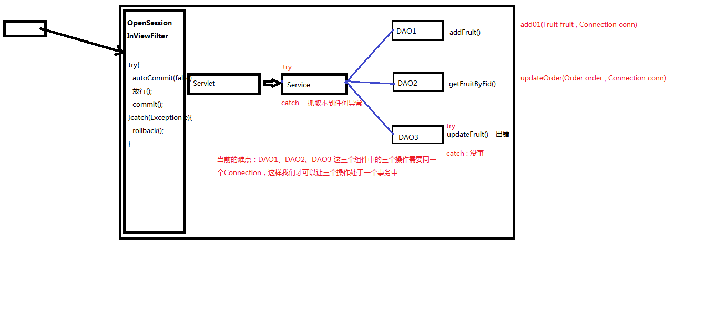

# 2022Javaweb笔记

##### 1、增添和修改方法

对FruitDAOImpl中的获取连接操作以及释放连接操作做了提取

**addFruit:**
1.获取连接2.编写sql ：insert3.psmt4.填充参数 ： 4个参数5.执行更新6.释放资源

 **updateFruit:**1.获取连接2.编写sql ： update3.psmt4.填充参数 ： 2个参数5.执行更新6.释放资源

##### 2、JDBC常规操作：

1). JDBC连接MySQL数据库
2). JDBC对数据库进行增、删、改
3). JDBC对数据库进行查询操作
4). 添加操作时获取自增列主键值
5). 批处理

##### 项目实战 - 水果库存系统

1) DAO的概念和角色（设计理念）： DAO-称之为数据访问对象，其中的方法都是单精度方法。
什么叫单精度，单精度指的是这个方法的粒度不能再分了，已经非常细了（因此也称之为细粒度）

##### 3、JDBC优化

1). 数据源连接池
2). JDBC的优化 - 难点

##### 4、设置编码

tomcat8之前，设置编码：
  1)get请求方式：
    //get方式目前不需要设置编码（基于tomcat8）
    //如果是get请求发送的中文数据，转码稍微有点麻烦（tomcat8之前）
    String fname = request.getParameter("fname");
    //1.将字符串打散成字节数组
    byte[] bytes = fname.getBytes("ISO-8859-1");
    //2.将字节数组按照设定的编码重新组装成字符串
    fname = new String(bytes,"UTF-8");
  2)post请求方式：*
    request.setCharacterEncoding("UTF-8");
tomcat8开始，设置编码，只需要针对post方式
    request.setCharacterEncoding("UTF-8");
注意：
    需要注意的是，设置编码(post)这一句代码必须在所有的获取参数动作之前

##### 5、Servlet的继承关系 - 重点查看的是服务方法（service()）

1. **继承关系**
    javax.servlet.Servlet接口
      javax.servlet.GenericServlet抽象类
          javax.servlet.http.HttpServlet抽象子类

2. **相关方法**
    javax.servlet.Servlet接口:
    void init(config) - 初始化方法
    void service(request,response) - 服务方法
    void destory() - 销毁方法

  javax.servlet.GenericServlet抽象类：
    void service(request,response) - 仍然是抽象的

  javax.servlet.http.HttpServlet 抽象子类：
    void service(request,response) - 不是抽象的
- String method = req.getMethod(); 获取请求的方式

- 各种if判断，根据请求方式不同，决定去调用不同的do方法**
  if (method.equals("GET")) {
   this.doGet(req,resp);
  } else if (method.equals("HEAD")) {
   this.doHead(req, resp);
  } else if (method.equals("POST")) {
   this.doPost(req, resp);
  } else if (method.equals("PUT")) {

- 在HttpServlet这个抽象类中，do方法都差不多:
  protected void doGet(HttpServletRequest req, HttpServletResponse resp) throws ServletException, IOException {
  String protocol = req.getProtocol();
  String msg = lStrings.getString("http.method_get_not_supported");
  if (protocol.endsWith("1.1")) {
      resp.sendError(405, msg);
  } else {
      resp.sendError(400, msg);
  }
      }

  3. **小结**

  1) 继承关系： HttpServlet -> GenericServlet -> Servlet
  2) Servlet中的核心方法： init() , service() , destroy()
  3) 服务方法： 当有请求过来时，service方法会自动响应（其实是tomcat容器调用的）
  在HttpServlet中我们会去分析请求的方式：到底是get、post、head还是delete等等
  然后再决定调用的是哪个do开头的方法
  那么在HttpServlet中这些do方法默认都是405的实现风格-要我们子类去实现对应的方法，否则默认会报405错误
  4) 因此，我们在新建Servlet时，我们才会去考虑请求方法，从而决定重写哪个do方法

##### 6、Servlet的生命周期

1） 生命周期：从出生到死亡的过程就是生命周期。对应Servlet中的三个方法：init(),service(),destroy()

2） 默认情况下：

​    第一次接收请求时，这个Servlet会进行实例化(调用构造方法)、初始化(调用init())、然后服务(调用service())
​    从第二次请求开始，每一次都是服务
​    当容器关闭时，其中的所有的servlet实例会被销毁，调用销毁方法
3） 通过案例我们发现：
​    - Servlet实例tomcat只会创建一个，所有的请求都是这个实例去响应。
​        - 默认情况下，第一次请求时，tomcat才会去实例化，初始化，然后再服务.这样的好处是什么？ 提高系统的启动速度 。 这样的缺点是什么？ 第一次请求时，耗时较长。
​        - 因此得出结论： 如果需要提高系统的启动速度，当前默认情况就是这样。如果需要提高响应速度，我们应该设置Servlet的初始化时机。
4） Servlet的初始化时机：
​        - 默认是第一次接收请求时，实例化，初始化
​        - 我们可以通过<load-on-startup>来设置servlet启动的先后顺序,数字越小，启动越靠前，最小值0
​        - 默认情况只有第一次收到第一次请求的时候，才回去实例化，初始化，然后服务，这样节省了启动时间，因为不用启动所有的Servlet
而设置Servlet启动的顺序，则tomcat容器启动的时候就需要把所有的Servlet实例化，初始化，大大增加了启动时间。好处是用户发第一次请求不需要实例化初始化，直接服务。响应速度快，体验好
5） Servlet在容器中是：单例的、线程不安全的（不管哪个浏览器哪个客户端） 
​        - 单例：所有的请求都是同一个实例去响应
​        - 线程不安全：一个线程需要根据这个实例中的某个成员变量值去做逻辑判断。但是在中间某个时机，另一个线程改变了这个成员变量的值，从而导致第一个线程的执行路径发生了变化
​        - 我们已经知道了servlet是线程不安全的，给我们的启发是： 尽量的不要在servlet中定义成员变量。如果不得不定义成员变量，那么不要去：①不要去修改成员变量的值 ②不要去根据成员变量的值做一些逻辑判断

##### 7、Http协议

1） Http 称之为 超文本传输协议

2） Http是无状态的
3） Http请求响应包含两个部分：请求和响应

  - 请求：
    请求包含三个部分： 1.请求行 ； 2.请求消息头 ； 3.请求主体
    1)请求行包含是三个信息： 1. 请求的方式 ； 2.请求的URL ； 3.请求的协议（一般都是HTTP1.1）
    2)请求消息头中包含了很多客户端需要告诉服务器的信息，比如：我的浏览器型号、版本、我能接收的内容的类型、我给你发的内容的类型、内容的长度等等
    3)请求体，三种情况
      get方式，没有请求体，但是有一个queryString
      post方式，有请求体，form data
      json格式，有请求体，request payload
  - 响应：
    响应也包含三本： 1. 响应行 ； 2.响应头 ； 3.响应体
    1)响应行包含三个信息：1.协议 2.响应状态码(200) 3.响应状态(ok)
    2)响应头：包含了服务器的信息；服务器发送给浏览器的信息（内容的媒体类型、编码、内容长度等）
    3)响应体：响应的实际内容（比如请求add.html页面时，响应的内容就是<html><head><body><form....）

##### 8、会话

1） Http是无状态的
    - HTTP 无状态 ：服务器无法判断这两次请求是同一个客户端发过来的，还是不同的客户端发过来的
    - 无状态带来的现实问题：第一次请求是添加商品到购物车，第二次请求是结账；如果这两次请求服务器无法区分是同一个用户的，那么就会导致混乱
    - 通过会话跟踪技术来解决无状态的问题。

2） 会话跟踪技术
    - 客户端第一次发请求给服务器，服务器获取session，获取不到，则创建新的，然后响应给客户端
    - 下次客户端给服务器发请求时，会把sessionID带给服务器，那么服务器就能获取到了，那么服务器就判断这一次请求和上次某次请求是同一个客户端，从而能够区分开客户端
    - 常用的API：
      request.getSession() -> 获取当前的会话，没有则创建一个新的会话
      request.getSession(true) -> 效果和不带参数相同
      request.getSession(false) -> 获取当前会话，没有则返回null，不会创建新的

```
  session.getId() -> 获取sessionID
  session.isNew() -> 判断当前session是否是新的
  session.getMaxInactiveInterval() -> session的非激活间隔时长，默认1800秒
  session.setMaxInactiveInterval()
  session.invalidate() -> 强制性让会话立即失效
  ....
```

3） session保存作用域
  - session保存作用域是和具体的某一个session对应的
  - 不同的浏览器session ID不同
  - 常用的API：
    void session.setAttribute(k,v)
    Object session.getAttribute(k)
    void removeAttribute(k)

##### 9、服务器内部转发以及客户端重定向

 1）

 服务器内部转发 : request.getRequestDispatcher("...").forward(request,response);

  - 一次请求响应的过程，对于客户端而言，内部经过了多少次转发，客户端是不知道的
  - 地址栏没有变化
2） 客户端重定向： response.sendRedirect("....");
  - 两次请求响应的过程。客户端肯定知道请求URL有变化
  - 地址栏有变化

##### 10、Thymeleaf - 视图模板技术

1） 添加thymeleaf的jar包
2） 新建一个Servlet类ViewBaseServlet
3） 在web.xml文件中添加配置

   - 配置前缀 view-prefix

   - 配置后缀 view-suffix

  4）  使得我们的Servlet继承ViewBaseServlet

 5） 根据逻辑视图名称 得到 物理视图名称
//此处的视图名称是 index
//那么thymeleaf会将这个 逻辑视图名称 对应到 物理视图 名称上去
//逻辑视图名称 ：   index
//物理视图名称 ：   view-prefix + 逻辑视图名称 + view-suffix
//所以真实的视图名称是：      /       index       .html
super.processTemplate("index",request,response);
6） 使用thymeleaf的标签
  th:if   ,  th:unless   , th:each   ,   th:text

// 200 : 正常响应
// 404 : 找不到资源
// 405 : 请求方式不支持
// 500 : 服务器内部错误

##### 11、post提交方式下的设置编码，防止中文乱码

request.setCharacterEncoding("utf-8");
get提交方式，tomcat8开始，编码不需要设置
tomcat8之前，get方式设置比较麻烦：
String fname = request.getParameter("fname");
byte[] bytes = fname.getBytes("iso-8859-1");
fname = new String(bytes,"UTF-8");

##### 12、Servlet继承关系以及生命周期

1） Servlet接口 ： init() , service() , destroy()
    GenericServlet抽象子类： abstract service();
    HttpServlet抽象子类：实现了service方法，在service方法内部通过request.getMethod()来判断请求的方式，
         然后根据请求的方式去调用内部的do方法。每一个do方法进行了简单实现，主要是如果请求方式不符合，则报405错误。
         目的是让我们的Servlet子类去重写对应的方法（如果重写的不对，则使用父类的405错误实现）
2） 生命周期：实例化、初始化、服务、销毁
     - Tomcat负责维护Servlet实例的生命周期
          - 每个Servlet在Tomcat容器中只有一个实例，它是线程不安全的
          - Servlet的启动时机：<load-on-startup>
               - Servlet3.0开始支持注解: @WebServlet

##### 13、HTTP协议：

1） 由 Request 和 Response 两部分组成
2） 请求包含了三部分：请求行、请求消息头、请求主体： 普通的get方式请求-query string；post方式- form data ； json格式 - request payload
3） 响应包含了三部分：响应行、响应消息头、响应主体

###### 14、HttpSession

1） HttpSession ：表示 会话
2） 为什么需要HttpSession ， 原因是因为 Http协议是无状态的
3） Session保存作用域 ：一次会话范围都有效 ； void session.setAttribute(k,v) ,Object session.getAttribute(k)
4） 其他的API： session.getId() , session.isNew() , session.getCreationTime() , session.invalidate() 等等

##### 15、服务器端转发和客户端重定向

1) 服务器端转发 ： request.getRequestDispatcher("index.html").forward(request,response);
2) 客户端重定向： response.sendRedirect("index.html");

##### 16、thymeleaf的部分标签

1） 使用步骤： 添加jar ， 新建ViewBaseServlet(有两个方法） ， 配置两个<context-param> : view-prefix , view-suffix
2） 部分标签： <th:if> , <th:unless> , <th:each> , <th:text>

##### 17、保存作用域

原始情况下，保存作用域我们可以认为有四个： page（页面级别，现在几乎不用） , request（一次请求响应范围） , session（一次会话范围） , application（整个应用程序范围）
1） request：一次请求响应范围
2） session：一次会话范围有效
3） application： 一次应用程序范围有效

##### 18、路径问题

1） 相对路径 @{}
2） 绝对路径

##### 19、实现库存系统的功能

水果数据库笔记：

1. web.xml的方式和注解方式是等同的
2. pro10实现了展示，添加，删除，编辑，修改水果系统的功能，

- 在执行**展示**功能的时候，浏览器发起请求，tomcat建立对象，对应的indexServlet完成实例化初始化服务，new一个水果实现对象，对象实现功能获取水果列表，并且定义一个session，将session属性设定为水果列表，再用thymeleaf进行渲染，
  这样前端得到的字符串数据，是经过渲染的页面，thymeleaf函数库会讲html中的th表达式识别出来并且转化为相应的html语句，发给前端进行显示。
- 在执行**删除**的功能的时候，点击删除的图标完成删除，实现流称为点击操作，执行js函数delFruit函数，（在index 经过渲染返回前端的字符串，fruit.属性都是以真实值存在的而没有任何的th表达式，原因是thymeleaf渲染之后要在浏览器显示必须为浏览器可以解释的语句，
  比如，第一个水果返回前端的语句为delfruit（1），）函数拿到想要删除的水果id之后，发起对del.do的请求，对应的delServlet接收到请求，接收删除的水果id，用new的水果实现对象在jdbc层面进而在数据库完成对指定id水果的删除，然后response重定向index，让浏览器对index再重新发起请求，展示页面。
- **添加**操作，点击添加新库存记录，浏览器向发出向add.html的请求，返回前端展示页面，输入添加的数据，添加提交按钮，访问add.do,对应的addServlet完成实例化初始化服务，service方法里面读取方法的类型为doPost,调用重写的doPost方法，（如果调用方法错误，HttpServlet的父类方法会显示405，子类重写doPost后就不会出现）
  doPost方法，设置字符集，接受前端的数据，添加数据库数据，重定向（response.sendRedirect("index");）index，让浏览器重新发index的请求访问。
  经过thymeleaf表达式 th:href="@{/add.html}，渲染之后发给浏览器如后面所示，点击即可访问add.html<a href="/pro10_fruit1_5_thymeleaf_war_exploded/add.html" style="border:0px solid blue;margin-bottom:4px;">添加新库存记录</a>，
- **编辑**操作，点击水果名字的标签，向指定的id的水果进行编辑操作，前端访问editServlet组件，将前端返回的id从数据库中进行读取，并将其设置session属性，（不能从前端读取名称单价等数据因此要修改要从数据库中进行修改），
  相对于添加操作需要先转向访问add.html，然后再经过提交按钮访问add.do获得前端的水果数据，编辑按钮先访问edit.do，通获取数据库指定id的水果，并设置为session属性，再将thymeleaf渲染过后的edit.html返回给前端，前端修改完毕，点击修改按钮，
  访问updat.do组件，将前端获取的修改完的水果数据读取并在数据库进行更新操作，然后重定向index，让浏览器访问index.do。thymeleaf表达式，th:href="@{/edit.do(fid=${fruit.fid})  返回前端的html字符串： href="/pro10_fruit1_5_thymeleaf_war_exploded/edit.do?fid=1"

##### 20、pro11实现了分页的操作

1.  分页操作：首先最开始请求的时候session的页数属性设为1，然后通过点击首页上一页下一页尾页的操作，在html实现session.pageNo逻辑变化，
   再通过js函数拿到变化后的页数也控制当面页面的url发生变化，Servlet的request获取变化后的session.pageNo，设置tomcat层面的页数逻辑变化（session.pageNo），
   然后通过jdbc获取指定页面的数据并设置session.fruitlist，最后通过thymeleaf 进行模板渲染。

   ##### 21、pro12实现了查询并分页的操作

   查询并分页的操作：通过输入的关键字oper不为null还是空字符串l判断是否是查询键点击过来的，不是null说明是查询，并接受request的keyword的值，
   获取完毕，如果keyword是空，将keyword赋值为空字符串（没有keyword点击查询，这时候Servlet查询可能为%null%，所以需要设为空字符串防止以上错误）；为空是分页操作键，获取页面数，并获取此时的keyword。最后tomcat层面
   设置页面数，获取指定页面数指定keyword的fruitlist，并设置session属性，获取总记录条数计算总页面数值。最后进行thymeleaf渲染。 

   ##### 22、编译性语言和解释性语言

   编译性语言例如c语言：用c语言开发了程序后，需要通过编译器把程序编译成机器语言（即计算机识别的二进制文件，因为不同的操作系统计算机识别的二进制文件是不同的），所以c语言程序进行移植后，要重新编译。（如windows编译成ext文件，linux编译成erp文件）。
   解释性语言例如java语言，java程序首先通过编译器编译成class文件，如果在windows平台上运行，则通过windows平台上的java虚拟机（VM）进行解释。如果运行在linux平台上，则通过linux平台上的java虚拟机进行解释执行。所以说能跨平台，前提是平台上必须要有相匹配的java虚拟机。如果没有java虚拟机，则不能进行跨平台。
   **编译型与解释型的共同点**
          他们都要弄成二进制代码才能执行，两类编程语言的源代码都是英文，但是我们的计算机并不认识英文，所以都要转化成二进制才能执行。
   **编译型与解释型的不同点**
          1.从运行效果上来看。编译型语言要等全部写完后通过编译器去生成一个类似*.exe的二进制文件，然后双击这个文件才可以看到效果。而解释型语言并没生成*.exe文件，而是直接生成效果，这就是我之前提到的的那个C语言和MATLAB的例子
          2.运行的时候是否需要编译器的伴随。编译型语言运行的是最终生成的二进制代码，所以不需要编译器伴随。而解释型语言则一边解释一边运行，所以运行的时候很可能还有部分代码没有解释好，所以需要编译器伴随（解释型语言把该工具叫做解释器）。
          3.执行的速度对比。编译型语言运行的已经是完全的二进制内容，运行起来十分干净利落，所以速度很快。而解释型语言运行的不一定是完全的二进制内容，因为它是一边解释成二进制一边运行。所以当它执行看出效果的时，程序后半部分还不一定解释成二进制，它就像一个“三心二意”的男人。
   所以像那种三心二意的男人说话有时吞吞吐吐的，速度没有前者快，但是CPU的运行速度如果很快，可能看不出来，只是偶尔会看到“有点卡”的效果。原因就是它一边解释一边运行，你看到效果的后面可能还有一少半的代码没解释成二进制，所以看到的效果会是残缺的。这就是为什么有时候查看网页，先是出现一堆没有布局的文字，然后才出现那种布局好的效果。
          4.可移植性对比。编译型语言是运行二进制内容，所以一旦CPU指令系统改变，那么之前的二进制文件可能运行不了。比如，如果到其他硬件平台上运行，就可能出现错误，就需要根据该平台重新编译出新的二进制文件。所以可移植性、平台兼容性比价差。
   而解释型语言则没有弄成什么二进制内容，而是在需要的时候才开始编译、运行。所以它自然具有可移植性，即在任何平台都可以马上运行起来。
   要注意的是它的解释工具如：浏览器，本身就是编译型语言解释出来的二进制代码，所以浏览器本身不具备可移植性，是需要针对不同的平台弄出对应的浏览器最终二进制文件的，这里可别混淆。
         5.升级上对比。编译型语言弄出来的二进制文件若要升级，自然要重新下载一个新的二进制文件。所以重新下载、安装、覆盖是最大的特点。比如微信的升级，就是要重新下载、重新安装、重新覆盖，等个半天而且很耗费CPU资源，体验性就不大好。
   而解释型的语言只要重新写好源代码即可，用户想要最新的效果，只要刷新一下即可，所以体验性好。比如：某网站平台升级了，用户只要重新刷新一下。
          6.应用领域，编译型语言应用领域通常是那些安装软件，例如桌面上的安装软件。解释型的语言的应用领域通常是互联网、网站等那种刷新了一下就可以看到最新效果的领域。
   编译型语言代表有：C语言和C++。
   解释型语言代表有：js,php，MATLAB，java和javascript。

   ##### 23、

   - mvc-Servlet优化1--pro13：将全部的Servlet（index，add，edit等等）写成一个FruitServlet的所有方法，通过前端的参数operate用Switch case选择执行的方法，减少了Servlet的数量。

   - mvc-Servlet优化2--pro14：用反射的方法获取FruitServlet的所有方法，因为是service方法所有可以调用私有的方法，不需要爆破，循环所有的方法， m.invoke(this,request,response);调用与operate相同的方法。

   - mvc-Servlet优化3--pro15：init()方法：①解析加载配置文件，applicationContext.xml，读取一个个的bean标签，扔到map容器里面，封装成一个个的beanMap中的对象。service方法：②根据请求的url获取Servletpath，解析出字符串作为名字，③根据得到的Servletpath解析的名字在map中找到对应的处理类的对象（是FruitController还是UserController等等），调用controllerBeanObj对象中operate对应方法（是index还是edit还是等等）。
     好处在于采用了中央控制器，**不需要面对不同的controller**，比如FruitController，UserController等编写重复的反射代码
     出现的空指针问题：FruitController不再作为一个Servlet存在，因此tomcat得到请求不会进行init()初始化，因此不会调用继承来的ViewBaseServlet的init()方法，

   - mvc-Servlet优化3--pro15-官方readme：在上一个版本中我们使用了反射技术，但是其实还是存在一定的问题：每一个servlet中都有类似的反射技术的代码。因此继续抽取，设计了中央控制器类：DispatcherServlet
        DispatcherServlet这个类的工作分为两大部分：

     1.根据url定位到能够处理这个请求的controller组件：
          1)从url中提取servletPath : /fruit.do -> fruit
         2)根据fruit找到对应的组件:FruitController ， 这个对应的依据我们存储在applicationContext.xml中
           <bean id="fruit" class="com.atguigu.fruit.controllers.FruitController/>
           通过**DOM技术**我们去解析XML文件，在中央控制器中形成一个beanMap容器，用来存放所有的Controller组件
         3)根据获取到的operate的值定位到我们FruitController中需要调用的方法

   - mvc-Servlet优化4--pro16：将FruitController中的重定向和资源转发，改为返回字符串，供中央控制器使用；将向方法传递的参数改为中央控制器传递，而不是传递request，response

      1) 获取参数
            获取即将要调用的方法的参数签名信息: Parameter[] parameters = method.getParameters();通过parameter.getName()获取参数的名称；准备了Object[] parameterValues 这个数组用来存放对应参数的参数值。另外，我们需要考虑参数的类型问题，需要做类型转化的工作。通过parameter.getType()获取参数的类型。
       2) 执行方法
            Object returnObj = method.invoke(controllerBean , parameterValues);
      3) 视图处理
            String returnStr = (String)returnObj;
            if(returnStr.startWith("redirect:")){
             ....
            }else if.....

     流程为：1，处理请求参数、2、调用目标方法、3、渲染页面(视图处理)

   - mvc-Servlet优化4--pro17：之前的情况都是FruitController直接连接FruitDAO进行数据库连接，和增删改查操作，现在加入了一个service层，也叫业务层，下面为业务层的解释，并加入了IOC和DI 的思想

     ```
     IOC
     IOC - 控制反转 / DI - 依赖注入
     控制反转：
         1) 之前在Servlet中，我们创建service对象 ， FruitService fruitService = new FruitServiceImpl();这句话如果出现在servlet中的某个方法内部，那么这个fruitService的作用域（生命周期）应该就是这个方法级别；
     如果这句话出现在servlet的类中，也就是说fruitService是一个成员变量，那么这个fruitService的作用域（生命周期）应该就是这个servlet实例级别
         2) 之后我们在applicationContext.xml中定义了这个fruitService。然后通过解析XML，产生fruitService实例，存放在beanMap中，这个beanMap在一个ClassPathXmlApplicationContext（BeanFactory接口的实现类）中，为其一个属性存在，其类的构造方法为解析xml，获取所有的（父节点子节点都获取这种关系仅存在xml文件中，Java层面并没进行设置）bean节点，用反射的方法将beanMap中子节点的对象设置为beanMap中父节点的对象的属性，组装bean之间的依赖关系。因此，我们转移（改变）了之前的service实例、dao实例等等他们的生命周期。控制权从程序员转移到BeanFactory接口。这个现象我们称之为控制反转。
         
     <!--
     Node 节点
         Element 元素节点
         Text 文本节点
     <sname>jim</sname-->
     <!--
     1.概念
     HTML : 超文本标记语言
     XML : 可扩展的标记语言
     HTML是XML的一个子集
     2.XML包含三个部分：
     1) XML声明 ， 而且声明这一行代码必须在XML文件的第一行
     2) DTD 文档类型定义
     3) XML正文-->
     ```

     

     ```
     依赖注入：
     1) 之前我们在控制层出现代码：FruitService fruitService = new FruitServiceImpl()；那么，控制层和service层存在耦合。
     2) 之后，我们将代码修改成FruitService fruitService = null ;
        然后，在配置文件中配置:
        <bean id="fruit" class="FruitController">
             <property name="fruitService" ref="fruitService"/>
        </bean>
     ```


```
什么是业务层？
1) Model1和Model2
    MVC : Model（模型）、View（视图）、Controller（控制器）
    视图层：用于做数据展示以及和用户交互的一个界面
    控制层：能够接受客户端的请求，具体的业务功能还是需要借助于模型组件来完成
    模型层：模型分为很多种：有比较简单的pojo/vo(value object)，有业务模型组件，有数据访问层组件
        1) pojo/vo : 值对象
        2) DAO ： 数据访问对象
        3) BO ： 业务对象
```


    2) 区分业务对象和数据访问对象：
      1） DAO中的方法都是单精度方法或者称之为细粒度方法。什么叫单精度？一个方法只考虑一个操作，比如添加，那就是insert操作、查询那就是select操作....
      2） BO中的方法属于业务方法，也实际的业务是比较复杂的，因此业务方法的粒度是比较粗的
          注册这个功能属于业务功能，也就是说注册这个方法属于业务方法。
          那么这个业务方法中包含了多个DAO方法。也就是说注册这个业务功能需要通过多个DAO方法的组合调用，从而完成注册功能的开发。
          注册：
                1. 检查用户名是否已经被注册 - DAO中的select操作
                2. 向用户表新增一条新用户记录 - DAO中的insert操作
                3. 向用户积分表新增一条记录（新用户默认初始化积分100分） - DAO中的insert操作
                4. 向系统消息表新增一条记录（某某某新用户注册了，需要根据通讯录信息向他的联系人推送消息） - DAO中的insert操作
                5. 向系统日志表新增一条记录（某用户在某IP在某年某月某日某时某分某秒某毫秒注册） - DAO中的insert操作
                6. ....
    3) 在库存系统中添加业务层组件
- mvc-Servlet优化4--pro18 -- 再次学习Servlet的初始化方法
  1) Servlet生命周期：实例化、初始化、服务、销毁
  2) Servlet中的初始化方法有两个：**init() , init(config)**
  其中带参数的方法代码如下：
  public void init(ServletConfig config) throws ServletException {
    this.config = config ;
    init();
  }
  另外一个无参的init方法如下：
  public void init() throws ServletException{
  }
  如果我们想要在Servlet初始化时做一些准备工作，那么我们可以重写init方法
  我们可以通过如下步骤去获取初始化设置的数据

  - 获取config对象：ServletConfig config = getServletConfig();

  - 获取初始化参数值： config.getInitParameter(key);
  
  3) 在web.xml文件中配置Servlet
      <servlet>
       <servlet-name>Demo01Servlet</servlet-name>
       <servlet-class>com.atguigu.servlet.Demo01Servlet</servlet-class>
       <init-param>
           <param-name>hello</param-name>
           <param-value>world</param-value>
       </init-param>
       <init-param>
           <param-name>uname</param-name>
           <param-value>jim</param-value>
    </init-param>
   </servlet>
      <servlet-mapping>
       <servlet-name>Demo01Servlet</servlet-name>
    <url-pattern>/demo01</url-pattern>
   </servlet-mapping>
   4) 也可以通过注解的方式进行配置：
     @WebServlet(urlPatterns = {"/demo01"} ,
    initParams = {
        @WebInitParam(name="hello",value="world"),
        @WebInitParam(name="uname",value="jim")
    })

  - mvc-Servlet优化4--pro18 --学习Servlet中的ServletContext和<context-param>
    1) 获取ServletContext上下文的参数，有很多方法
       在初始化方法中： ServletContxt **servletContext** = getServletContext();
       在服务方法中也可以通过request对象获取，也可以通过session获取：
       request.getServletContext(); session.getServletContext()
    2) 获取初始化值：
       servletContext.getInitParameter();

  - 过滤器Filter--pro19

    1) Filter也属于Servlet规范
    2) Filter开发步骤：新建类实现Filter接口，然后实现其中的三个方法：init、doFilter、destroy
    配置Filter，可以用注解@WebFilter，也可以使用xml文件 <filter> <filter-mapping>
    3) Filter在配置时，和servlet一样，也可以配置通配符，例如 @WebFilter("*.do")表示拦截所有以.do结尾的请求
    4) 过滤器链
       1）执行的顺序依次是： A B C demo03 C2 B2 A2
       2）如果采取的是注解的方式进行配置，那么过滤器链的拦截顺序是按照全类名的先后顺序排序的
        3）如果采取的是xml的方式进行配置，那么按照配置的先后顺序进行排序

    - pro-20：




- 从实现的角度来看，之前的DAO中每一个操作用的Connection都是彼此独立的，想要实现事务的管理，多个DAO操作在一个事务当中实现共享，使用了threadLocal的方法实现set，get连接，从而实现多个DAO操作的共享连接，
- 需要确保DAO1、DAO2、DAO3三个操作使用一个Connection，处于同一个事务中，connection使用threadlocal存储（threadLocal.set(conn)），然后同一个线程使用同一个conn（通过threadLocal.get()），最后在filter里面进行提交和关闭资源，（ThreadLocal要做两件事来保证内存不泄露：1.把key设为弱引用 2.一定要写remove()）。
- 过滤器中实现开启事务，内部对DAO方法的异常进行封装并抛出运行时异常，如果过滤器中的trycatch捕捉到异常，就回滚事务；如果没有异常抛出，就正常提交事务。


##### 24、事务管理

1) 涉及到的组件：

  - OpenSessionInViewFilter
  - TransactionManager
  - ThreadLocal
  - ConnUtil
  - BaseDAO

2) ThreadLocal
  - get() , set(obj)
  - ThreadLocal称之为本地线程 。 我们可以通过set方法在当前线程上存储数据、通过get方法在当前线程上获取数据
  - set方法源码分析：
    public void set(T value) {
      Thread t = Thread.currentThread(); //获取当前的线程
      ThreadLocalMap map = getMap(t);    //每一个线程都维护各自的一个容器（ThreadLocalMap），通过线程获取Map，Map相当于一个公司，公司有几个履带，相当于有几个ThreaLocal对象。也就实现了一个事务一个履带的效果，与线程进行绑定。
      if (map != null)
          map.set(this, value);          //这里的key对应的是ThreadLocal（相当于一个履带，履带上放置工具箱，也就是Connection），因为我们的组件中需要传输（共享）的对象可能会有多个（不止Connection）
      else
          createMap(t, value);           //默认情况下map是没有初始化的，那么第一次往其中添加数据时，会去初始化
    }
    -get方法源码分析：
    public T get() {
      Thread t = Thread.currentThread(); //获取当前的线程
      ThreadLocalMap map = getMap(t);    //获取和这个线程（企业）相关的ThreadLocalMap（也就是工作纽带的集合）
      if (map != null) {
          ThreadLocalMap.Entry e = map.getEntry(this);   //this指的是ThreadLocal对象，通过它才能知道是哪一个工作纽带
          if (e != null) {
              @SuppressWarnings("unchecked")
              T result = (T)e.value;     //entry.value就可以获取到工具箱了
              return result;
          }
      }
      return setInitialValue();
    }

#### 二、javaweb项目--QQZone

##### 25、熟悉QQZone业务需求

  1) 用户登录
  2) 登录成功，显示主界面。左侧显示好友列表；上端显示欢迎词。如果不是自己的空间，显示超链接：返回自己的空间；下端显示日志列表
  3) 查看日志详情：

        - 日志本身的信息（作者头像、昵称、日志标题、日志内容、日志的日期）
                - 回复列表（回复者的头像、昵称、回复内容、回复日期）
        - 主人回复信息
    4) 删除日志
    5) 删除特定回复
    6) 删除特定主人回复
    7) 添加日志、添加回复、添加主人回复
    8) 点击左侧好友链接，进入好友的空间

##### 26、数据库设计

  1） 抽取实体 : 用户登录信息、用户详情信息 、 日志 、 回贴  、 主人回复
  2） 分析其中的属性：
    - 用户登录信息：账号、密码、头像、昵称
        - 用户详情信息：真实姓名、星座、血型、邮箱、手机号.....
        - 日志：标题、内容、日期、作者
        - 回复：内容、日期、作者、日志
        - 主人回复：内容、日期、作者、回复
    3） 分析实体之间的关系
        - 用户登录信息 ： 用户详情信息      1：1 PK
        - 用户 ： 日志                   1：N
        - 日志 ： 回复                   1：N
        - 回复 ： 主人回复                1：1 UK
        - 用户 ： 好友                   M ： N

##### 27、数据库的范式：

-   1） 第一范式：列不可再分
    2） 第二范式：一张表只表达一层含义（只描述一件事情）
    3） 第三范式：表中的每一列和主键都是直接依赖关系，而不是间接依赖

- 数据库设计的范式和数据库的查询性能很多时候是相悖的，我们需要根据实际的业务情况做一个选择：

  1.查询频次不高的情况下，我们更倾向于提高数据库的设计范式，从而提高存储效率

  2.查询频次较高的情形，我们更倾向于牺牲数据库的规范度，降低数据库设计的范式，允许特定的冗余，从而提高查询的性能。

##### 28.QQZone登录功能实现出现的四个错误：

 1) URL没修改，用的还是fruitdb
 2）
 3）rsmd.getColumnName() 和 rsmd.getColumnLabel()

4)	Can	not	set	com.atguigu.qqzone.pojo.UserBasic	field com.atguigu.qqzone.pojo.Topic.author to java.lang.Integer
 5) left.html页面没有样式，同时数据也不展示，原因是：我们是直接去请求的静态页面资源，那么并没有执行super.processTemplate()，也就是thymeleaf没有起作用
    (之前的表单也是这个原因)
    解决方法：

    - 新增PageController，添加page方法:
        public String page(String page){
        return page ;       // frames/left
        }
        目的是执行super.processTemplate()方法，让thymeleaf生效

##### 29、MVC的含义

MVC ： V：view 视图 ； C：Controller 控制器  ； M：Model 模型
模型有很多种类：数据访问模型（DAO）；业务逻辑模型（BO）；值对象模型（POJO）；数据传输对象（DTO）

中央控制器：接收请求，将对应的请求找到对应的controller

IOC容器：是控制层，业务逻辑层，数据访问层，这些层的依赖关系的注入。

##### 30、pro21-QQZone登录并展示日志功能流程

首先访问page.do，不能直接访问login.html 因为无法启用thymeleaf表达式，访问page.do？operate=page&page=login，解析出login，并返回login.html，点击提交登录根据user.do定位到UserController的login方法，login方法调用UserBasicService，TopicService的方法分别获取对应登录人的好友信息和相关的日志列表信息，并保存在session作用域，返回index字符串，共中央控制器使用，并经过thymeleaf渲染返回到前端，前端展示页面，点击按钮访问page.do?operate=page&page=frames/left，根据xml文件找到对应的PageController，反射调用page方法，返回读取frames/left，并返回left.html

- page.do？operate=page&page=login page.do对应控制器，operate=page对应控制器的方法，page=login对应方法的参数

##### 31、pro22-点击左侧链接，修改top页面信息

1. ###### top.html页面显示登录者昵称、判断是否是自己的空间
   
   1)显示登录者昵称： ${session.userBasic.nickName}
   2)判断是否是自己的空间 : ${session.userBasic.id!=session.friend.id}
    如果不是期望的效果，首先考虑将两者的id都显示出来
   
2. ###### 点击左侧的好友链接，进入好友空间
   
   1) 根据id获取指定userBasic信息，查询这个userBasic的topicList，然后覆盖friend对应的value
   2) main页面应该展示friend中的topicList，而不是userBasic中的topicList
   3) 跳转后，在左侧（left）中显示整个index页面
   
   - 问题：在left页面显示整个index布局
      - 解决：给超链接添加target属性：   target="_top" 保证在顶层窗口显示整个index页面
   
   4) top.html页面需要修改： "欢迎进入${session.friend}"
      top.html页面的返回自己空间的超链接需要修改：
      <a th:href="@{|/user.do?operate=friend&id=${session.userBasic.id}|}" target="_top">
   
   ###### 3.日志详情页面实现
   
   1) 已知topic的id，需要根据topic的id获取特定topic
   2) 获取这个topic关联的所有的回复
   3) 如果某个回复有主人回复，需要查询出来
   
   - 在TopicController中获取指定的topic
   
   - 具体这个topic中关联多少个Reply，由ReplyService内部实现
   
   4) 获取到的topic中的author只有id（数据库表中日志表只有作者id信息），那么需要在topicService的getTopic方法中封装，在查询topic本身信息时，根据topic id查询到作者的id，同时调用userBasicService中的获取getUserBasicById方法，获取到作者的对象，最后给topic的author属性赋值，解决了查询到的topic 的author只有id属性没有其他属性的问题。
   
   5) 与4)同理，在reply类中也有author，而且查询reply表返回的reply的这个author属性也是只有id属性，那么我们也需要根据id查询得到author，最后设置reply的author属性。
   
   6)topiccontroller调用topicservice，查询日志，topicservice调用replyservice，查询日志的恢复，replyservice调用hostreplyservice，查询每一个好友回复对应的主人回复，如果主人回复过的话。特点是被调用模块作为属性存在于调用模块中，为null，需要applicationContext.xml文件进行依赖注入，
   
   7) applicationContext.xml文件中存在多个节点，可以进行**依赖注入**，DAO和具体的类进行映射作为节点；service和具体的service实现类进行映射，存在DAO的子节点（调用DAO模块，当然也可以调用其他的service模块作为子节点）；将url的*.do提取出来找到对应的controller类，也存在service的子节点。
   
   8) 一个service调用其他的service，不能调用其他的DAO因为其为单精度方法。
   
   ###### 4.删除回复
   
   1) 如果回复有关联的主人回复，需要先删除主人回复
   2) 删除回复
   Cannot delete or update a parent row: a foreign key constraint fails
   (`qqzonedb`.`t_host_reply`, CONSTRAINT `FK_host_reply` FOREIGN KEY (`reply`) REFERENCES `t_reply` (`id`))
    我们在删除回复表记录时，发现删除失败，原因是：在主人回复表中仍然有记录引用待删除的回复这条记录
    如果需要删除主表数据，需要首先删除子表数据
   
   ###### 5.删除日志
   
   1) 删除日志，首先需要考虑是否有关联的回复
   2) 删除回复，首先需要考虑是否有关联的主人回复
   3) 另外，如果不是自己的空间，则不能删除日志
   
   ##### 32、项目总结
   
   1. 日期和字符串之间的格式化
       /*
       // String -> java.util.Date
       String dateStr1 = "2021-12-30 12:59:59";
       SimpleDateFormat sdf = new SimpleDateFormat("yyyy-MM-dd HH:mm:ss");
       try {
           Date date1 = sdf.parse(dateStr1);
       } catch (ParseException e) {
           e.printStackTrace();
       }
   
       // Date -> String
       Date date2 = new Date();
       String dateStr2 = sdf.format(date2);
       */
       
   2. thymeleaf中使用#dates这个公共的内置对象
      ${#dates.format(topic.topicDate ,'yyyy-MM-dd HH:mm:ss')}
   
   3. 系统启动时，我们访问的页面是： http://localhost:8080/pro23/page.do?operate=page&page=login
      为什么不是： http://localhost:8080/pro23/login.html  ?
      答： 如果是后者，那么属于直接访问静态页面。那么页面上的thymeleaf表达式（标签）浏览器是不能识别的
          我们访问前者的目的其实就是要执行 ViewBaseServlet中的processTemplete()
   
   4. http://localhost:8080/pro23/page.do?operate=page&page=login 访问这个URL，执行的过程是什么样的？
      答：
      http://  localhost   :8080   /pro23	/page.do     ?  operate=page&page=login
      协议   ServerIP   port    context root    request.getServletPath()        query string
      1) DispatcherServlet -> urlPattern :  *.do  拦截/page.do
      2) request.getServletPath() ->  /page.do
      3) 解析处理字符串，将/page.do -> page
      4) 拿到page这个字符串，然后去IOC容器（BeanFactory）中寻找id=page的那个bean对象   -> PageController.java
      5) 获取operate的值 -> page    因此得知，应该执行 PageController中的page()方法
      6) PageController中的page方法定义如下：
         public String page(String page){
           return page ;
         }
      7) 在queryString:   ?operate=page&page=login 中 获取请求参数，参数名是page，参数值是login
         因此page方法的参数page值会被赋上"login"
         然后return "login" , return 给 谁？？
      8) 因为PageController的page方法是DispatcherServlet通过反射调用的
         method.invoke(....) ;
         因此，字符串"login"返回给DispatcherServlet
      9) DispatcherServlet接收到返回值，然后处理视图
         目前处理视图的方式有两种： 1.带前缀redirect:    2.不带前缀
         当前，返回"login"，不带前缀
         那么执行  super.processTemplete("login",request,response);
      10) 此时ViewBaseServlet中的processTemplete方法会执行，效果是：
         在"login"这个字符串前面拼接 "/"  (其实就是配置文件中view-prefixe配置的值)
         在"login"这个字符串后面拼接 ".html" (其实就是配置文件中view-suffix配置的值)
         最后进行服务器转发
   
   5. 目前我们进行javaweb项目开发的“套路”是这样的：
      1. 拷贝 myssm包
      2. 新建配置文件applicationContext.xml或者可以不叫这个名字，在web.xml中指定文件名
      3. 在web.xml文件中配置：
         1) 配置前缀和后缀，这样thymeleaf引擎就可以根据我们返回的字符串进行拼接，再跳转
           <context-param>
                                       <param-name>view-prefix</param-name>
                                       <param-value>/</param-value>
           </context-param>
           <context-param>
               <param-name>view-suffix</param-name>
               <param-value>.html</param-value>
           </context-param>
         2) 配置监听器要读取的参数，目的是加载IOC容器的配置文件（也就是applicationContext.xml）
           <context-param>
               <param-name>contextConfigLocation</param-name>
               <param-value>applicationContext.xml</param-value>
           </context-param>
      4. 开发具体的业务模块：
         1） 一个具体的业务模块纵向上由几个部分组成：
            - html页面
            - POJO类
            - DAO接口和实现类
            - Service接口和实现类
            - Controller 控制器组件
         2） 如果html页面有thymeleaf表达式，一定不能够直接访问，必须要经过PageController
         3） 在applicationContext.xml中配置 DAO、Service、Controller，以及三者之间的依赖关系
         4） DAO实现类中 ， 继承BaseDAO，然后实现具体的接口, 需要注意，BaseDAO后面的泛型不能写错。
         
             例如：
             public class UserDAOImpl extends BaseDAO<User> implements UserDAO{}
         5） Service是业务控制类，这一层我们只需要记住一点：
             - 业务逻辑我们都封装在service这一层，不要分散在Controller层。也不要出现在DAO层（我们需要保证DAO方法的单精度特性）
             - 当某一个业务功能需要使用其他模块的业务功能时，尽量的调用别人的service，而不是深入到其他模块的DAO细节
         6） Controller类的编写规则
             ① 在applicationContext.xml中配置Controller
             <bean id="user" class="com.atguigu.qqzone.controllers.UserController>
             那么，用户在前端发请求时，对应的servletpath就是   /user.do   , 其中的“user”就是对应此处的bean的id值
             ② 在Controller中设计的方法名需要和operate的值一致
             public String login(String loginId , String pwd , HttpSession session){
               return "index";
             }
             因此，我们的登录验证的表单如下：
             <form th:action="@{/user.do}" method="post">
               <inut type="hidden" name="operate" value="login"/>
             </form>
             ③ 在表单中，组件的name属性和Controller中方法的参数名一致
             <input type="text" name="loginId" />
             public String login(String loginId , String pwd , HttpSession session){
             ④ 另外，需要注意的是： Controller中的方法中的参数不一定都是通过请求参数获取的
             if("request".equals...) else if("response".equals....) else if("session".equals....){
               直接赋值
             }else{
               此处才是从request的请求参数中获取
               request.getParameter("loginId") .....
             }
         7）  DispatcherServlet中步骤大致分为：
             0. 从application作用域获取IOC容器
             1. 解析servletPath ， 在IOC容器中寻找对应的Controller组件
             2. 准备operate指定的方法所要求的参数
             3. 调用operate指定的方法
             4. 接收到执行operate指定的方法的返回值，对返回值进行处理 - 视图处理
         8) 为什么DispatcherServlet能够从application作用域获取到IOC容器？
            ContextLoaderListener在容器启动时会执行初始化任务，而它的操作就是：
            1. 解析IOC的配置文件，创建一个一个的组件，并完成组件之间依赖关系的注入
            2. 将IOC容器保存到application作用域
   
   6. 修改BaseDAO，让其支持properties文件以及druid数据源连接池
      讲解了两种方式：
      1) 直接自己配置properties，然后读取，然后加载驱动.....
      2) 使用druid连接池技术，那么properties中的key是有要求的

##### 		三、书城项目

##### 33、需求分析

##### 34、数据库设计

​	1） 实体分析

- 图书                Book
- 用户                User
- 订单                OrderBean
- 订单详情             OrderItem
- 购物车项             CartItem
 2） 实体属性分析
- 图书 : 书名、作者、价格、销量、库存、封面、状态
- 用户 : 用户名、密码、邮箱
- 订单 : 订单编号、订单日期、订单金额、订单数量、订单状态、用户
- 订单详情 : 图书、数量、所属订单
- 购物车项 : 图书、数量、所属用户

##### 35、显示主页面(index页面)

  - 新建BookDAO 、 BookDAOImpl ： getBookList()
  - 新建BookService 、 BookServiceImpl : getBookList()
  - 新建BookController : index()
  - 编辑index.html

##### 36、首页上登录成功之后显示欢迎语和购物车数量

##### 37、点击具体图书的添加到购物车按钮

##### 38、购物车详情

##### 39、结账

1) 订单表添加一条记录
2) 订单详情表添加7条记录
3) 购物车项表中需要删除对应的7条记录

##### 40、关于订单信息中的订单数量问题

##### 41、编辑购物车

##### 42、关于金额的精度问题

##### 43、过滤器判断是否是合法用户：

- 解决方法：新建SessionFilter ， 用来判断session中是否保存了currUser
- 如果没有currUser，表明当前不是一个登录合法的用户，应该跳转到登录页面让其登录
- 现在添加了过滤器之后，出现了如下错误：
  localhost 将您重定向的次数过多。
  尝试清除 Cookie.
  ERR_TOO_MANY_REDIRECTS
  - 在过滤器设置WebFilter，和其初始参数（访问的RequestURI+QueryString），初始化init方法，定义白名单，过滤器方法拿到request，response，filterchain，如果白名单包括url那么就放行（比如一开始发送的page.do?operate=page&page=user/login的登录请求），如果不包括，检验session作用域是否存在currUserObj，如果存在则放行，说明已经登录并且校验完成，如果不存在，则重定向让前端发送登录请求，显示登录页面。其中user.do?null一样可以通过，让不登录的用户可以 访问index页面，对其进行放行，吸引用户，但是不登录的用户点击别的操作，因为白名单既没有URl也没有session的currUser，因此重定向让其访问登录界面。

##### 44、 Cookie

   1. 创建Cookie对象
   2. 在客户端保存Cookie
   3. 设置Cookie的有效时长
      cookie.setMaxAge(60)  ， 设置cookie的有效时长是60秒
      cookie.setDomain(pattern);
      cookie.setPath(uri);
   4. Cookie的应用：

     4-1: 记住用户名和密码十天 setMaxAge(60 * 60 * 24 * 10)
     前端发送给服务器的将用户和密码保存为两个cookie，分别保存name和pwd，设置maxage，为十天。
     4-2: 十天免登录
     前端保存cookie，下一次前端发送请求，服务器读取用户名和密码，并且进行验证，直接跳转到页面
##### 45、验证码--Kaptcha

前端发出请求url，在webxml文件找到对应的Servlet，启动对应的KaptchaServlet，初始化，服务，在session中保存验证码的值，然后返回验证码到前端。

1. 为什么需要验证码
2. kaptcha如何使用:
   - 添加jar
   - 在web.xml文件中注册KaptchaServlet，并设置验证码图片的相关属性
   - 在html页面上编写一个img标签，然后设置src等于KaptchaServlet对应的url-pattern
3. kaptcha验证码图片的各个属性在常量接口：Constants中
4. KaptchaServlet在生成验证码图片时，会同时将验证码信息保存到session中
   因此，我们在注册请求时，首先将用户文本框中输入的验证码值和session中保存的值进行比较，相等，则进行注册。

##### 46、JS - Exp

###### 1)正则表达式的使用三步骤：	

    1. 定义正则表达式对象
       正则表达式定义有两个方式：
       1) 对象形式
          var reg = new RegExp("abc")
       2) 直接量形式
          var reg = /abc/;
       3) 匹配模式：
        - g 全局匹配
        - i 忽略大小写匹配
        - m 多行匹配
        - gim这三个可以组合使用，不区分先后顺序
          例如： var reg = /abc/gim , var reg = new RegExp("abc","gim");
 2. 定义待校验的字符串
 3. 校验

###### 2)元字符

  . , \w , \W , \s , \S , \d , \D , \b , ^ , $

###### 3)[]表示集合

  [abc] 表示 a或者b或者c
  [^abc] 表示取反，只要不是a不是b不是c就匹配
  [a-c] 表示a到c这个范围匹配

###### 4) 出现的次数

 *表示多次 （0 ~ n ）

+至少一次 ( >=1 )
? 最多一次 (0 ~ 1)
  {n} 出现n次
  {n,} 出现n次或者多次
  {n,m} 出现n到m次

##### 47、注册页面表单验证

1) <form>有一个事件 onsubmit ,
    onsubmit="return false" , 那么表单点击提交按钮时不会提交
    onsubmit="return true" ,  那么表单点击提交按钮时会提交

2) 获取文档中某一个节点的方式：
    //DOM:Document
    //var unameTxt = document.getElementById("unameTxt");
    //BOM:Browser
    //document.forms[0].uname

##### 48、原生的Ajax（了解）

第一步： 客户端发送异步请求；并绑定对结果处理的回调函数
1) <input type="text" name="uname" onblur="ckUname()"/>
2) 定义ckUname方法：

   - 创建XMLHttpRequest对象
   - XMLHttpRequest对象操作步骤：
     - open(url,"GET",true)
     - onreadyStateChange 设置回调
     - send() 发送请求
   - 在回调函数中需要判断XMLHttpRequest对象的状态:
     readyState(0-4) , status(200)

第二步：服务器端做校验，然后将校验结果响应给客户端

##### 49、Ajax作用和步骤

  Ajax : 异步的JavaScript and XML
    目的： 用来发送异步的请求，然后当服务器给我响应的时候再进行回调操作
    好处： 提高用户体验；局部刷新：降低服务器负担、减轻浏览器压力、减轻网络带宽压力
    开发步骤：
      1) 创建XMLHttpRequest
      2) 调用open进行设置："GET" , URL , true
      3) 绑定状态改变时执行的回调函数 - onreadystatechange
      4) 发送请求 - send()
      5) 编写回调函数，在回调函数中，我们只对XMLHttpRequest的readystate为4的时候感兴趣，我们只对XMLHttpRequest的status为200的时候感兴趣

    0: (Uninitialized) the send( ) method has not yet been invoked.
    1: (Loading) the send( ) method has been invoked, request in progress.
    2: (Loaded) the send( ) method has completed, entire response received.
    3: (Interactive) the response is being parsed.
    4: (Completed) the response has been parsed, is ready for harvesting.
    
    0 － （未初始化）还没有调用send()方法
    1 － （载入）已调用send()方法，正在发送请求
    2 － （载入完成）send()方法执行完成，已经接收到全部响应内容
    3 － （交互）正在解析响应内容
    4 － （完成）响应内容解析完成，可以在客户端调用了
##### 50、Vue--pro28

​    1) {{}} - 相当于innerText
​    2) v-bind:attr 绑定属性值。例如，v-bind:value - 绑定value值
​       简写：    :value
​    3) v-model 双向绑定
​       v-model:value   , 简写  v-model
​    4) v-if , v-else , v-show
​       v-if和v-else之间不能有其他的节点
​       v-show是通过样式表display来控制节点是否显示
​    5) v-for 迭代
​       v-for={fruit in fruitList}
​    6) v-on 绑定事件
​    7) 其他：

- trim:去除首尾空格 , split() , join()

- watch表示侦听属性
- 生命周期 vue对象创建、数据装载、数据更新。

##### 51、Axios

Axios是Ajax的一个框架,简化Ajax操作
Axios执行Ajax操作的步骤：

1. 添加并引入axios的js文件

2-1. 客户端向服务器端异步发送普通参数值

 - 基本格式： axios().then().catch()
 - 示例：
   axios({
     method:"POST",
     url:"....",
     params:{
         uname:"lina",
         pwd:"ok"
     }
   })
   .then(function(value){})          //成功响应时执行的回调        value.data可以获取到服务器响应内容
   .catch(function(reason){});       //有异常时执行的回调          reason.response.data可以获取到响应的内容

   ​                                                         reason.message / reason.stack 可以查看错误的信息

 2-2. 客户端向服务器发送JSON格式的数据
 - 什么是JSON
   JSON是一种数据格式
   XML也是一种数据格式
   XML格式表示两个学员信息的代码如下：
   <students>
     <student sid="s001">
         <sname>jim</sname>
         <age>18</age>
     </student>
     <student sid="s002">
         <sname>tom</sname>
         <age>19</age>
     </student>
   </students>
   JSON格式表示两个学员信息的代码如下：
   [{sid:"s001",age:18},{sid:"s002",age:19}]
   
 - JSON表达数据更简洁，更能够节约网络带宽

 - 客户端发送JSON格式的数据给服务器端
 1) 客户端中params需要修改成：  data:
 2) 服务器获取参数值不再是 request.getParameter()...
    而是：
    StringBuffer stringBuffer = new StringBuffer("");
    BufferedReader bufferedReader = request.getReader();
    String str = null ;
    while((str=bufferedReader.readLine())!=null){
        stringBuffer.append(str);
    }
    str = stringBuffer.toString() ;
    
    //已知 String
    //需要转化成 Java Object
    
    Gson gson = new Gson();
    //Gson有两个API
    //1.fromJson(string,T) 将字符串转化成java object
    //2.toJson(java Object) 将java object转化成json字符串，这样才能响应给客户端
    
    User user = gson.fromJson(str, User.class);
    
    System.out.println(user);

 3) 我们会发现 str的内容如下：
    {"uname":"lina","pwd":"ok"}

 - 服务器端给客户端响应JSON格式的字符串，然后客户端需要将字符串转化成js Object

   ```html
   .then(function (value) {
       var data = value.data;
       // data对应的数据：
       // {uname:"鸠摩智",pwd:"ok"}
       vue.uname=data.uname;
       vue.pwd=data.pwd;
   
       //此处value中的data返回的是 js object，因此可以直接点出属性
       //如果我们获取的是一个字符串：  "{uname:\"鸠摩智\",pwd:\"ok\"}"
   
       //js语言中 也有字符串和js对象之间互转的API
       //string JSON.stringify(object)     object->string
       //object JSON.parse(string)         string->object
   })
   ```

   ```html
   //1. js string - > js object
   var str = "{\"uname\":\"lina\",\"age\":20}";
   var user = JSON.parse(str);
   alert(typeof user);
   alert(user.uname+"_"+user.age);
   */
   
   //2. js object -> js string
   var user = {"uname":"lina","age":99};
   alert(typeof user);
   var userStr = JSON.stringify(user);
   ```

   ##### 52、js，vue的语法 和 使用json字符串在客户端和服务器之前传送数据

   - 定义js对象的方式

   ```html
    <script language="JavaScript">
    function hello(){
               person.sayHello();
           }
   
           //定义js对象方式一：
           /*
           var person = new Object();
           person.pid = "p001";
           person.pname="jim";
           person.sayHello = function(){
               alert("HELLO world");
           }
           */
           //定义js对象方式二：
           var person = {
               "pid":"p001",
               "pname":"jim",
               "sayHello":function(){
                   alert("HELLO world");
               }
           };
           window.onload=function(){
               var vue = new Vue({
   
               });
           }
   </script>
   ```

-  v-bind:value表示绑定value属性

   ```html
   
   <head>
       <meta charset="UTF-8">
       <title>Title</title>
       <script language="JavaScript" src="script/vue.js"></script>
       <script language="JavaScript">
           window.onload=function(){
               var vue = new Vue({
                   "el":"#div0",
                   data:{
                       msg:"hello!!!",
                       uname:"鸠摩智"
                   }
               });
           }
       </script>
   </head>
   <body>
       <div id="div0">
           <span>{{msg}}</span>
           <!-- v-bind:value表示绑定value属性 , v-bind可以省略，也就是 :value -->
           <!--<input type="text" v-bind:value="uname"/>-->
           <input type="text" :value="uname"/>
       </div>
   </body>
   ```

-  v-model 不仅msg来控制input输入框，反过来，input输入框的内容也会改变msg的值

   ```html
   <head>
       <meta charset="UTF-8">
       <title>Title</title>
       <script language="JavaScript" src="script/vue.js"></script>
       <script language="JavaScript">
           window.onload=function(){
               var vue = new Vue({
                   "el":"#div0",
                   data:{
                       msg:"hello!!!"
                   }
               });
           }
       </script>
   </head>
   <body>
       <div id="div0">
           <span>{{msg}}</span><br/>
           <!--
               v-model指的是双向绑定，
               也就是说之前的v-bind是通过msg这个变量的值来控制input输入框
               现在 v-model 不仅msg来控制input输入框，反过来，input输入框的内容也会改变msg的值
            -->
           <!--<input type="text" v-model:value="msg"/>-->
           <!-- v-model:value 中 :value可以省略，直接写成v-model -->
           <!-- trim可以去除首尾空格 -->
           <input type="text" v-model.trim="msg"/>
       </div>
   </body>
   ```

-   v-if、v-else、v-show

   ```html
   <head>
       <meta charset="UTF-8">
       <title>Title</title>
       <script language="JavaScript" src="script/vue.js"></script>
       <script language="JavaScript">
           window.onload=function(){
               var vue = new Vue({
                   "el":"#div0",
                   data:{
                       num:2
                   }
               });
           }
       </script>
   </head>
   <body>
       <div id="div0">
           <input type="text" v-model="num"/>
   
           <!-- v-if和v-else之间不可以插入其他节点 -->
           <!--<div v-if="num%2==0" style="width:200px;height:200px;background-color: chartreuse;">&nbsp;</div>-->
           <!--<br/>-->
           <!--<div v-else="num%2==0" style="width:200px;height:200px;background-color: coral">&nbsp;</div>-->
   
   
           <!-- v-show -->
           <!-- v-show是通过display属性来控制这个div是否显示 -->
           <div v-show="num%2==0" style="width:200px;height:200px;background-color:blueviolet;">&nbsp;</div>
       </div>
   </body>
   ```

-   v-for

   ```html
   <head>
       <meta charset="UTF-8">
       <title>Title</title>
       <script language="JavaScript" src="script/vue.js"></script>
       <script language="JavaScript">
           window.onload=function(){
               var vue = new Vue({
                   "el":"#div0",
                   data:{
                       fruitList:[
                           {fname:"苹果",price:5,fcount:100,remark:"苹果很好吃"},
                           {fname:"菠萝",price:3,fcount:120,remark:"菠萝很好吃"},
                           {fname:"香蕉",price:4,fcount:50,remark:"香蕉很好吃"},
                           {fname:"西瓜",price:6,fcount:100,remark:"西瓜很好吃"}
                       ]
                   }
               });
           }
       </script>
   </head>
   <body>
       <div id="div0">
           <table border="1" width="400" cellpadding="4" cellspacing="0">
               <tr>
                   <th>名称</th>
                   <th>单价</th>
                   <th>库存</th>
                   <th>备注</th>
               </tr>
               <!-- v-for表示迭代 -->
               <tr align="center" v-for="fruit in fruitList">
                   <td>{{fruit.fname}}</td>
                   <td>{{fruit.price}}</td>
                   <td>{{fruit.fcount}}</td>
                   <td>{{fruit.remark}}</td>
               </tr>
           </table>
       </div>
   </body>
   ```

-  v-on:click

```html
<head>
    <meta charset="UTF-8">
    <title>Title</title>
    <script language="JavaScript" src="script/vue.js"></script>
    <script language="JavaScript">
        window.onload=function(){
            var vue = new Vue({
                "el":"#div0",
                data:{
                    msg:"hello world!"
                },
                methods:{
                    myReverse:function(){
                        this.msg = this.msg.split("").reverse().join("");
                    }
                }
            });
        }
    </script>
</head>
<body>
    <div id="div0">
        <span>{{msg}}</span><br/>
        <!-- v-on:click 表示绑定点击事件 -->
        <!-- v-on可以省略，变成 @click -->
        <!--<input type="button" value="反转" v-on:click="myReverse"/>-->
        <input type="button" value="反转" @click="myReverse"/>
    </div>
</body>
```


- watch 监听属性

  ```html
  <head>
      <meta charset="UTF-8">
      <title>Title</title>
      <script language="JavaScript" src="script/vue.js"></script>
      <script language="JavaScript">
          window.onload=function(){
              var vue = new Vue({
                  "el":"#div0",
                  data:{
                      num1:1,
                      num2:2,
                      num3:0
                  },
                  watch:{
                      //侦听属性num1和num2
                      //当num1的值有改动时，那么需要调用后面定义的方法 , newValue指的是num1的新值
                      num1:function(newValue){
                          this.num3 = parseInt(newValue) + parseInt(this.num2);
                      },
                      num2:function(newValue){
                          this.num3 = parseInt(this.num1) + parseInt(newValue) ;
                      }
                  }
              });
          }
      </script>
  </head>
  <body>
      <div id="div0">
          <input type="text" v-model="num1" size="2"/>
          +
          <input type="text" v-model="num2" size="2"/>
          =
          <span>{{num3}}</span>
      </div>
  </body>
  ```

- vue对象的生命周期

  ```html
  <head>
      <meta charset="UTF-8">
      <title>Title</title>
      <script language="JavaScript" src="script/vue.js"></script>
      <script language="JavaScript">
          window.onload=function(){
              var vue = new Vue({
                  "el":"#div0",
                  data:{
                      msg:1
                  },
                  methods:{
                      changeMsg:function(){
                          this.msg = this.msg + 1 ;
                      }
  
                  },
                  /*vue对象创建之前*/
                  beforeCreate:function(){
                      console.log("beforeCreate:vue对象创建之前---------------");
                      console.log("msg:"+this.msg);
                  },
                  /*vue对象创建之后*/
                  created:function(){
                      console.log("created:vue对象创建之后---------------");
                      console.log("msg:"+this.msg);
                  },
                  /*数据装载之前*/
                  beforeMount:function(){
                      console.log("beforeMount:数据装载之前---------------");
                      console.log("span:"+document.getElementById("span").innerText);
                  },
                  /*数据装载之后*/
                  mounted:function(){
                      console.log("mounted:数据装载之后---------------");
                      console.log("span:"+document.getElementById("span").innerText);
                  },
                  beforeUpdate:function(){
                      console.log("beforeUpdate:数据更新之前---------------");
                      console.log("msg:"+this.msg);
                      console.log("span:"+document.getElementById("span").innerText);
                  },
                  updated:function(){
                      console.log("Updated:数据更新之后---------------");
                      console.log("msg:"+this.msg);
                      console.log("span:"+document.getElementById("span").innerText);
                  }
              });
          }
      </script>
  </head>
  <body>
      <div id="div0">
          <span id="span">{{msg}}</span><br/>
          <input type="button" value="改变msg的值" @click="changeMsg"/>
      </div>
  </body>
  ```

- 01.演示Axios发送普通的参数值给服务器端,request.getParameter接收参数

  axios({
                              method:"POST",
                              url:"axios01.do",
                              params:{
                                  uname:vue.uname,
                                  pwd:vue.pwd		
                              }
                          })

  表示，post方式传递，请求的url和参数，params说明用reque.getParameter（）接受数据。

  then为客户端接受服务器端的响应，catch为捕获异常。

```html
<head>
    <meta charset="UTF-8">
    <title>01.演示Axios发送普通的参数值给服务器端</title>
    <script language="JavaScript" src="script/vue.js"></script>
    <script language="JavaScript" src="script/axios.min.js"></script>
    <script language="JavaScript">
        window.onload=function(){
            var vue = new Vue({
                "el":"#div0",
                data:{
                    uname:"lina",
                    pwd:"ok"
                },
                methods:{
                    axios01:function(){
                        axios({
                            method:"POST",
                            url:"axios01.do",
                            params:{
                                uname:vue.uname,
                                pwd:vue.pwd		
                            }
                        })
                            .then(function (value) {
                                console.log(value);
                            })
                            .catch(function (reason) {
                                console.log(reason);
                            });
                    }
                }
            });
        }
    </script>
</head>
<body>
    <div id="div0">
        uname:<input type="text" v-model="uname"/><br/>
        pwd:<input type="text" v-model="pwd"/><br/>
        <input type="button" @click="axios01" value="发送一个带普通请求参数值的异步请求"/>
    </div>
</body>
```

```java
protected void service(HttpServletRequest request, HttpServletResponse response) throws ServletException, IOException {
request.setCharacterEncoding("utf-8");

String uname = request.getParameter("uname");
String pwd = request.getParameter("pwd");

System.out.println("uname = " + uname);
System.out.println("pwd = " + pwd);

response.setCharacterEncoding("utf-8");
response.setContentType("text/html;charset=utf-8");
PrintWriter out = response.getWriter();
out.write(uname+"_"+pwd);

throw new NullPointerException("这里故意抛出一个空指针异常....");
}
```

- 02.演示Axios发送JSON格式的参数值给服务器端,request.getReader();得到字符流，字符流读取字符然后拼接成json字符串，再使用Gson类的fromJson方法得到对象。

   axios({
                              method:"POST",
                              url:"axios02.do",
                              data:{
                                  uname:vue.uname,
                                  pwd:vue.pwd
                              }
                          }) 
  
  data说明给服务端发送的是json格式的数据。
  
- ```html
<head>
      <meta charset="UTF-8">
      <title>02.演示Axios发送JSON格式的参数值给服务器端</title>
      <script language="JavaScript" src="script/vue.js"></script>
      <script language="JavaScript" src="script/axios.min.js"></script>
      <script language="JavaScript">
          window.onload=function(){
              var vue = new Vue({
                  "el":"#div0",
                  data:{
                      uname:"lina",
                      pwd:"ok"
                  },
                  methods:{
                      axios02:function(){
                          axios({
                              method:"POST",
                              url:"axios02.do",
                              data:{
                                  uname:vue.uname,
                                  pwd:vue.pwd
                              }
                          })
                              .then(function (value) {
                                  console.log(value);
                              })
                              .catch(function (reason) {
                                  console.log(reason);
                              });
                      }
                  }
              });
          }
      </script>
  </head>
  <body>
      <div id="div0">
          uname:<input type="text" v-model="uname"/><br/>
          pwd:<input type="text" v-model="pwd"/><br/>
          <input type="button" @click="axios02" value="发送JSON格式的参数值的异步请求"/>
      </div>
  </body>
  ```

```java
protected void service(HttpServletRequest request, HttpServletResponse response) throws ServletException, IOException {

    StringBuffer stringBuffer = new StringBuffer("");
    BufferedReader bufferedReader = request.getReader();
    String str = null ;
    while((str=bufferedReader.readLine())!=null){
        stringBuffer.append(str);
    }
    str = stringBuffer.toString() ;
    //已知 String
    //需要转化成 Java Object
    Gson gson = new Gson();
    //Gson有两个API
    //1.fromJson(string,T) 将字符串转化成java object
    //2.toJson(java Object) 将java object转化成json字符串，这样才能响应给客户端
    User user = gson.fromJson(str, User.class);
    System.out.println(user);
}
```

- 03.演示Axios发送异步请求给服务器端，服务器响应json格式的数据给客户端，使用的是gson类的tojson方法得到字符串，然后使用response.getWriter().write(userJsonStr);将字符串发给客户端。

  ```html
  <head>
      <meta charset="UTF-8">
      <title>03.演示Axios发送异步请求给服务器端，服务器响应json格式的数据给客户端</title>
      <script language="JavaScript" src="script/vue.js"></script>
      <script language="JavaScript" src="script/axios.min.js"></script>
      <script language="JavaScript">
          window.onload=function(){
              var vue = new Vue({
                  "el":"#div0",
                  data:{
                      uname:"lina",
                      pwd:"ok"
                  },
                  methods:{
                      axios03:function(){
                          axios({
                              method:"POST",
                              url:"axios03.do",
                              data:{
                                  uname:vue.uname,
                                  pwd:vue.pwd
                              }
                          })
                              .then(function (value) {
                                  var data = value.data;
                                  // data对应的数据：
                                  // {uname:"鸠摩智",pwd:"ok"}
                                  vue.uname=data.uname;
                                  vue.pwd=data.pwd;
  
                                  //此处value中的data返回的是 js object，因此可以直接点出属性
                                  //如果我们获取的是一个字符串：  "{uname:\"鸠摩智\",pwd:\"ok\"}"
  
                                  //js语言中 也有字符串和js对象之间互转的API
                                  //string JSON.stringify(object)     object->string
                                  //object JSON.parse(string)         string->object
                              })
                              .catch(function (reason) {
                                  console.log(reason);
                              });
                      }
                  }
              });
          }
      </script>
  </head>
  <body>
      <div id="div0">
          uname:<input type="text" v-model="uname"/><br/>
          pwd:<input type="text" v-model="pwd"/><br/>
          <input type="button" @click="axios03" value="服务器响应json格式的数据给客户端"/>
      </div>
  </body>
  ```

```java
protected void service(HttpServletRequest request, HttpServletResponse response) throws ServletException, IOException {

    StringBuffer stringBuffer = new StringBuffer("");
    BufferedReader bufferedReader = request.getReader();
    String str = null ;
    while((str=bufferedReader.readLine())!=null){
        stringBuffer.append(str);
    }
    str = stringBuffer.toString() ;

    //已知 String
    //需要转化成 Java Object

    Gson gson = new Gson();
    //Gson有两个API
    //1.fromJson(string,T) 将字符串转化成java object
    //2.toJson(java Object) 将java object转化成json字符串，这样才能响应给客户端

    User user = gson.fromJson(str, User.class);
    user.setUname("鸠摩智");
    user.setPwd("123456");

    //假设user是从数据库查询出来的，现在需要将其转化成json格式的字符串，然后响应给客户端
    String userJsonStr = gson.toJson(user);
    response.setCharacterEncoding("UTF-8");
    //MIME-TYPE
    response.setContentType("application/json;charset=utf-8");
    response.getWriter().write(userJsonStr);
}
```

