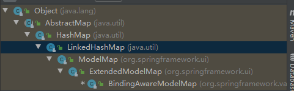
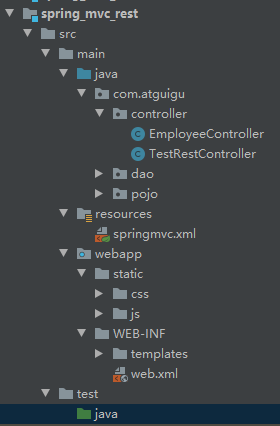
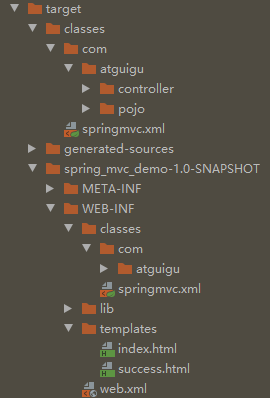
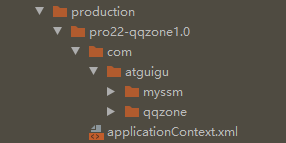
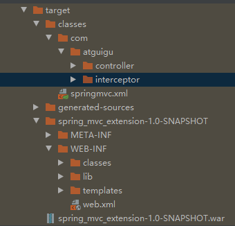

# SSM  2023.10.25--2023.11.15

（结合 SSM整合.pdf）

## 一、Mybatis

1. ### 通过Mybatis框架实现了数据库的插入操作

-  //获取mybatis核心配置文件的输入流
-  //获取SqlSessionFactoryBuilder对象
- //SqlSessionFactoryBuilder对象拿到输入流之后调用build方法得到SqlSessionFactory对象
- //通过SqlSessionFactory对象获取sql的会话对象SqlSession(不会自动提交事务)，是MyBatis提供的操作数据库的对象；添加参数autoCommit=true，获取sql的会话对象SqlSession(会自动提交事务)，是MyBatis提供的操作数据库的对象。
- //通过会话对象的方法，sqlSession.getMapper(UserMapper.class)得到接口代理类实现对象，实现过程为：通过**mapper的全类名**找到UserMapper.xml文件的**namespace**，通过**方法名找到id**，从而重写接口中的方法。实现具体的sql语句。**映射文件UserMapper.xml**文件相当于jdbc中的DAOimple，实现了接口的方法，并且可以调用BaseDAO的方法。


```java
 //获取mybatis核心配置文件的输入流
        InputStream is = Resources.getResourceAsStream("mybatis-config.xml");
        //获取SqlSessionFactoryBuilder对象
        SqlSessionFactoryBuilder sqlSessionFactoryBuilder = new SqlSessionFactoryBuilder();
        //获取SqlSessionFactory对象
        SqlSessionFactory sqlSessionFactory = sqlSessionFactoryBuilder.build(is);
        //SqlSession sqlSession = sqlSessionFactory.openSession();获取sql的会话对象SqlSession(不会自动提交事务)，是MyBatis提供的操作数据库的对象

 //添加参数autoCommit=true，获取sql的会话对象SqlSession(会自动提交事务)，是MyBatis提供的操作数据库的对象
        SqlSession sqlSession = sqlSessionFactory.openSession(true);
        //获取UserMapper接口的代理实现类对象
        UserMapper mapper = sqlSession.getMapper(UserMapper.class);
        //调用mapper接口中的方法，实现添加用户信息的功能
        //通过mapper的全类名找到UserMapper.xml文件的namespace，通过方法名找到id，从而重写接口中的方法。实现具体的sql语句。
        int result = mapper.insertUser();
        //提供sql以及的唯一标识找到sql并执行，唯一标识是namespace.sqlId
        /*int result = sqlSession.insert("com.atguigu.mybatis.mapper.UserMapper.insertUser");*/
        System.out.println("结果："+result);
        //提交事务
        //sqlSession.commit();
        //关闭SqlSession
        sqlSession.close();
```


### 2.**添加功能获取自增的主键**

- 在数据表users中添加一个user信息并得到其自增的主键id，其中在**jdbc**中相同的功能的代码为以下：

```java
try {
    Class.forName("");
    Connection connection = DriverManager.getConnection("","","");
    /*String sql = "select * from t_user where username like '%?%'";
    PreparedStatement ps = connection.prepareStatement(sql);*/
    //ps.setString(1, "a");
    String sql = "insert into t_user values()";
    PreparedStatement ps = connection.prepareStatement(sql, Statement.RETURN_GENERATED_KEYS);//Statement.RETURN_GENERATED_KEYS参数为1允许获得自动生成的主键
    ps.executeUpdate();//执行增删改操作
    ResultSet resultSet = ps.getGeneratedKeys();//得到主键的结果集
    resultSet.next();//把指针移向新生成的一行数据。
    int id = resultSet.getInt(1);//返回结果集的索引为1的列数也就是，由于添加数据 生成的自动递增主键值。
} catch (Exception e) {
    e.printStackTrace();
}
```

- Mybatis中实现获得添加 数据获得自增的主键代码：

```java
/**
\* 添加用户信息 
\* @param user 
\* @return 
\* useGeneratedKeys：设置使用自增的主键 
\* keyProperty：因为增删改有统一的返回值是受影响的行数，因此只能将获取的自增的主键放在传输的参 数user对象的某个属性中 
*/ 
int insertUser(User user); 
```

```java
<!--int insertUser(User user);--> 
<insert id="insertUser" useGeneratedKeys="true" keyProperty="id"> 
insert into t_user values(null,#{username},#{password},#{age},#{sex}) 

</insert> 
```

### 3.**MyBatis**的逆向工程 补充知识点

用到MyBatis3: 生成带条件的CRUD（奢华尊享版） 的时候，进行CRUD。

根据数据库自动生成的mapper接口，的修改方法

- updateByPrimaryKey（emp）当输入的字段存在null的时候，数据库的数据表相应的数据修改为null。
- updateByPrimaryKeySelective（emp）当输入的字段存在null的时候，数据库的数据表相应的数据依然为默认值，**不进行修改**。

## 	二、SpringMVC

1、@RequestMapping注解标识的位置

 * @RequestMapping标识一个类：设置映射请求的请求路径的初始信息
 * @RequestMapping标识一个方法：设置映射请求请求路径的具体信息

2、@RequestMapping注解value属性

 * 作用：通过请求的请求路径匹配请求
 * value属性是数组类型，即当前浏览器所发送请求的请求路径匹配value属性中的任何一个值
 * 则当前请求就会被注解所标识的方法进行处理

3、@RequestMapping注解的method属性

 * 作用：通过请求的请求方式匹配请求
 * method属性是RequestMethod类型的数组，即当前浏览器所发送请求的请求方式匹配method属性中的任何一中请求方式
 * 则当前请求就会被注解所标识的方法进行处理
 * 若浏览器所发送的请求的请求路径和@RequestMapping注解value属性匹配，但是请求方式不匹配
 * 此时页面报错：405 - Request method 'xxx' not supported
 * 在@RequestMapping的基础上，结合请求方式的一些派生注解,只能匹配指定请求方式的方法：
 * @GetMapping,@PostMapping,@DeleteMapping,@PutMapping

4、@RequestMapping注解的params属性

 * 作用：通过请求的请求参数匹配请求，即浏览器发送的请求的请求参数必须满足params属性的设置
 * params可以使用四种表达式：
 * "param"：表示当前所匹配请求的请求参数中必须携带param参数
 * "!param"：表示当前所匹配请求的请求参数中一定不能携带param参数
 * "param=value"：表示当前所匹配请求的请求参数中必须携带param参数且值必须为value
 * "param!=value"：表示当前所匹配请求的请求参数中可以不携带param，若携带值一定不能是value
 * 若浏览器所发送的请求的请求路径和@RequestMapping注解value属性匹配，但是请求参数不匹配
 * 此时页面报错：400 - Parameter conditions "username" not met for actual request parameters:

5、@RequestMapping注解的headers属性

 * 作用：通过请求的请求头信息匹配请求，即浏览器发送的请求的请求头信息必须满足headers属性的设置
 * 若浏览器所发送的请求的请求路径和@RequestMapping注解value属性匹配，但是请求头信息不匹配
 * 此时页面报错：404
 * 请求头和响应头中key不区分大小写，value区分大小写
 * referer为页面跳转的来源地址

6、SpringMVC支持ant风格的路径

 * 在@RequestMapping注解的value属性值中设置一些特殊字符
 * ?:任意的单个字符（不包括?和/）
 * *:任意个数的任意字符（不包括?和/）
 * ** :任意层数的任意目录，注意使用方式只能**写在双斜线中，前后不能有任何的其他字符

7、@RequestMapping注解使用路径中的占位符

 * 传统：/deleteUser?id=1
 * rest：/user/delete/1
 * 需要在@RequestMapping注解的value属性中所设置的路径中，使用{xxx}的方式表示路径中的数据
 * 在通过@PathVariable注解，将占位符所标识的值和控制器方法的形参进行绑定
 */

8、通过servletAPI获取

 * 只需要在控制器方法的形参位置设置HttpServletRequest类型的形参
 * 就可以在控制器方法中使用request对象获取请求参数

9、通过控制器方法的形参获取

 * 只需要在控制器方法的形参位置，设置一个形参，形参的名字和请求参数的名字一致即可

10、@RequestParam：将请求参数和控制器方法的形参绑定

 * @RequestParam注解的三个属性：value、required、defaultValue
 * value:设置和形参绑定的请求参数的名字
 * required:设置是否必须传输value所对应的请求参数
 * 默认值为true，表示value所对应的请求参数必须传输，否则页面报错：
 * 400 - Required String parameter 'xxx' is not present
 * 若设置为false，则表示value所对应的请求参数不是必须传输，若为传输，则形参值为null
 * defaultValue:设置当没有传输value所对应的请求参数时，为形参设置的默认值，此时和required属性值无关

```JAVA
@RequestMapping("/testParam") 
public String testParam(String username, String password){ 
System.out.println("username:"+username+",password:"+password); 
return "success"; 
}  //直接通过控制器形参获取参数。
```

```java
@RequestMapping("/param")
public String getParam(
        @RequestParam(value = "userName",required =false,defaultValue = "hello") String username,
        String password,
        @RequestHeader("referer") String referer,
        @CookieValue("JSESSIONID") String jsessionid
){
    System.out.println("jsessionId:"+jsessionid);
    System.out.println("referer:"+referer);
    System.out.println("username:"+username+",password:"+password);
    return "success";
}
@
```

11、@RequestHeader：将请求头信息和控制器方法的形参绑定

12、@CookieValue：将cookie数据和控制器方法的形参绑定

13、通过控制器方法的实体类类型的形参获取请求参数

 * 需要在控制器方法的形参位置设置实体类类型的形参，要保证实体类中的属性的属性名和请求参数的名字一致
 * 可以通过实体类类型的形参获取请求参数

14、解决获取请求此参数的乱码问题

 * 在web.xml中配置Spring的编码过滤器CharacterEncodingFilter
 */

15、域对象共享数据多种方法的形参类继承图。

Model、map、ModelMap



16、session的钝化和活化

(一)钝化

当服务器正常关闭时,还存活着的session(在设置时间内没有销毁) 会随着服务器的关闭被以文件(“SESSIONS.ser”)的形式存储在tomcat 的work 目录下,这个过程叫做Session 的钝化。

(二)活化

当服务器再次正常开启时,服务器会找到之前的“SESSIONS.ser” 文件，从中恢复之前保存起来的Session 对象，这个过程叫做Session的活化。

(三)注意事项

```
  1）想要随着Session 被钝化、活化的对象它的类（比如user类）必须实现Serializable 接口，（钝化的过程实际上是序列化的过程）还有要注意的是只有在服务器正常关闭的条件下，还未超时的Session 才会被钝化成文件。当Session 超时、调用invalidate 方法或者服务器在非正常情况下关闭时，Session 都不会被钝化，因此也就不存在活化。
  2）在被钝化成“SESSIONS.ser” 文件时，不会因为超过Session 过期时间而消失，这个文件会一直存在，等到下一次服务器开启时消失。
  3）当多个Session 被钝化时，这些被钝化的Session 都被保存在一个文件中，并不会为每个Session 都建立一个文件。
```

（四）序列化和反序列化

- 序列化

  把对象的状态信息转换为可以存储或传输的形式过程，简单说就是把对象转换为字节形式存储的过程称为对象的序列化。

- 反序列化

  把字节序列转化为对象的过程

（五）应用场景：

1.一般来说，服务器启动后，就不会再关闭了，但是如果逼不得已需要重启，而用户会话还在进行相应的操作，这时就需要使用序列化将session信息保存起来放在硬盘，服务器重启后，又重新加载。这样就保证了用户信息不会丢失，实现永久化保存

2.淘宝每年都会有定时抢购的活动，很多用户会提前登录等待，长时间不进行操作，一致保存在内存中，而到达指定时刻，几十万用户并发访问，就可能会有几十万个session，内存可能吃不消，这时就需要进行对象的活化、钝化，让其在闲置的时候离开内存，将信息保存至硬盘，等要用的时候，就重新加载进内存

（六）详细解释：https://blog.csdn.net/wjw0130/article/details/45766709?spm=1001.2101.3001.6650.12&utm_medium=distribute.pc_relevant.none-task-blog-2%7Edefault%7EBlogCommendFromBaidu%7ERate-12-45766709-blog-109440260.235%5Ev38%5Epc_relevant_default_base&depth_1-utm_source=distribute.pc_relevant.none-task-blog-2%7Edefault%7EBlogCommendFromBaidu%7ERate-12-45766709-blog-109440260.235%5Ev38%5Epc_relevant_default_base&utm_relevant_index=17

17、RESTful的实现

* 查询所有的用户信息-->/user-->get

* 根据id查询用户信息-->/user/1-->get

* 添加用户信息-->/user-->post

* 修改用户信息-->/user-->put

* 删除用户信息-->/user/1-->delete

  注意：浏览器目前只能发送get和post请求

* 若要发送put和delete请求，需要在web.xml中配置一个过滤器**HiddenHttpMethodFilter**

  配置了过滤器之后，发送的请求要满足两个条件，才能将请求方式转换为put或delete

  1、当前请求的请求方式必须为post

  2、当前请求必须传输请求参数_method，_method的值才是最终的请求方式

示例：

```html
<form th:action="@{/user}" method="post">
    <input type="hidden" name="_method" value="put"> 隐藏输入框，携带put数据 
    <input type="submit" value="修改用户信息">
</form>
<form th:action="@{/user/5}" method="post">
    <input type="hidden" name="_method" value="delete">
    <input type="submit" value="删除用户信息">
</form>
```

18、SrpingMVC中的web.xml

1. **DispatcherServlet:** SpringMVC封装了DispatcherServlet并在webxml配置文件中进行注册加载，作为前端控制器，对浏览器发送的请求统一进行处理 。初始参数要配置**SpringMVC的配置文件**，和**初始化时间**要提前，以免默认情况下第一次请求的时候，才初始化，降低用户体验。

2. **编码过滤器**：webxml还注册了多个过滤器，设置Spring的编码过滤器，保证request和response的数据不会出现乱码问题。

   org.springframework.web.filter.CharacterEncodingFilter

   ```xml
   <filter>
       <filter-name>CharacterEncodingFilter</filter-name>
       <filter-class>org.springframework.web.filter.CharacterEncodingFilter</filter-class>
       <init-param>
           <param-name>encoding</param-name>
           <param-value>UTF-8</param-value>
       </init-param>
       <init-param>
           <param-name>forceEncoding</param-name>
           <param-value>true</param-value>
       </init-param>
   
   </filter>
   <filter-mapping>
       <filter-name>CharacterEncodingFilter</filter-name>
       <url-pattern>/*</url-pattern>
   </filter-mapping>
   ```

3、设置处理**请求方式的过滤器**，因为前端不存在put，delete方法，只存在post，get，因此将其隐藏在post方法里面，在过滤器中进行转化。

SpringMVC 提供了 **HiddenHttpMethodFilter** 帮助我们**将** **POST** **请求转换为** **DELETE** **或** **PUT** **请求** 

**HiddenHttpMethodFilter** 处理put和delete请求的条件： 

a>当前请求的请求方式必须为post 

b>当前请求必须传输请求参数_method 

满足以上条件，**HiddenHttpMethodFilter** 过滤器就会将当前请求的请求方式转换为请求参数 __method的值，因此请求参数___method的值才是最终的请求方式 

在web.xml中注册**HiddenHttpMethodFilter** 

```xml
<filter>
    <filter-name>HiddenHttpMethodFilter</filter-name>
    <filter-class>org.springframework.web.filter.HiddenHttpMethodFilter</filter-class>
</filter>
<filter-mapping>
    <filter-name>HiddenHttpMethodFilter</filter-name>
    <url-pattern>/*</url-pattern>
</filter-mapping>
```

```java
protected void doFilterInternal(HttpServletRequest request, HttpServletResponse response, FilterChain filterChain)
      throws ServletException, IOException {

   HttpServletRequest requestToUse = request;

   if ("POST".equals(request.getMethod()) && request.getAttribute(WebUtils.ERROR_EXCEPTION_ATTRIBUTE) == null) {
      String paramValue = request.getParameter(this.methodParam);
      if (StringUtils.hasLength(paramValue)) {
         String method = paramValue.toUpperCase(Locale.ENGLISH);
         if (ALLOWED_METHODS.contains(method)) {
            requestToUse = new HttpMethodRequestWrapper(request, method);//当为post方法 将request中的method属性改变为put或者delete
         }
      }
   }

   filterChain.doFilter(requestToUse, response);
}
```

```java
private static class HttpMethodRequestWrapper extends HttpServletRequestWrapper {

   private final String method;

   public HttpMethodRequestWrapper(HttpServletRequest request, String method) {
      super(request);
      this.method = method;
   }

   @Override
   public String getMethod() {
      return this.method;
   }
}
```

CharacterEncodingFilter和HiddenHttpMethodFilter同样都继承了父类OncePerRequestFilter，通过doFilterInternal实现过滤操作。

19、文件结构：main文件夹存在**java源码**、**resource**，和**webapp**



**输出的文件夹：**编译时java文件夹生成的class文件会和resources文件加载在同目录。



20、Tomcat中存在一个web.xml文件，里面存在DefaultServlet，JspServlet的映射，存在着欢迎界面

```html
<welcome-file-list>
    <welcome-file>index.html</welcome-file>
    <welcome-file>index.jsp</welcome-file>
    <welcome-file>index.action</welcome-file>
</welcome-file-list>
```

- **welcome-file-list的工作原理：**
  - 按照welcome-file的.list一个一个去检查是否web目录下面存在这个文件，如果存在，继续下面的工作，先去webcontent(这里是Eclipse的工程目录根目录)下是否真的存在index.html这个文件，如果不存在去找是否存在index.jsp这个文件，以此类推。
  - 如果配置了servlet的url-pattern是/*，那么访问localhost:8080/会匹配到该servlet上，而不是匹配welcome-file-list；如果url-pattern是/（该servlet为默认servlet），如果其他匹配模式都没有匹配到，则会匹配welcome-file-list。如果访问到了welcome-file，项目会自动跳转到欢迎页（在webapp文件夹下的静态资源）！
- /和 /* 对于所用请求都拦截，但是 / 对于 .jsp 的不拦截，直接访问到真实的jsp页面。
- 工程的web.xml会完全继承Tomcat里面的web.xml,出现冲突的时候，比如url-pattern相同或者welcome-file-list存在，以工程的为准，相当于子类对父类的重写。直接访问静态资源webapp/static/index_work.css 访问失败，原因在于我们处理静态资源使用的是Tomcat中web.xml中的DefaultServlet（其url-pattern为/,可以匹配到除了.jsp的所有url），项目中的web.xml对url-pattern为/的映射，进行重写，匹配到的是DispatcherServlet，不能对静态资源进行处理。
- **静态资源无法访问的解决方法：**
  当前工程的web.xml配置的前端控制器DispatcherServlet的url-pattern是/
  tomcat的web.xml配置的DefaultServlet的url-pattern也是/
  此时，浏览器发送的请求会优先被DispatcherServlet进行处理，但是DispatcherServlet无法处理静态资源
  - 在springmvc.xml若配置了<mvc:default-servlet-handler />，此时浏览器发送的所有请求都会被DefaultServlet处理，自己的所写的控制器映射无法得到处理。
  - 若配置了<mvc:default-servlet-handler />和<mvc:annotation-driven />
    浏览器发送的请求会先被DispatcherServlet处理，无法处理在交给DefaultServlet处理。（DispatcherServlet映射在web.xml文件中被注册，spring.xml作为其映射的初始参数，在spring.xml文件中设置<mvc:default-servlet-handler />和<mvc:annotation-driven />标签）

-  <!--开启mvc的注解驱动-->
      **<mvc:annotation-driven />   标签的作用：**

  - 在springmvc.xml若配置了<mvc:default-servlet-handler />，此时浏览器发送的所有请求都会被DefaultServlet处理，自己的所写的控制器映射无法得到处理，这时配置<mvc:annotation-driven />使得浏览器发送的请求会先被DispatcherServlet处理，无法处理在交给DefaultServlet处理。

  - 当控制器方法中，仅仅用来实现页面跳转，即只需要设置视图名称时，可以将处理器方法使用view-controller标签进行表示，但是这样会导致其他控制器中的请求映射将全部失效，此时需 要在SpringMVC的核心配置文件中设置开启mvc注解驱动的标签<mvc:annotation-driven />  。

  - ```xml
    <!--
    
    path：设置处理的请求地址 
    
    view-name：设置请求地址所对应的视图名称 
    
    --> 
    
    <mvc:view-controller path="/testView" view-name="success"></mvc:view-controller>
    ```

21、Springmvc处理ajax请求

- vue

  ```html
  <tr th:each="employee : ${allEmployee}">
      <td th:text="${employee.id}"></td>
      <td th:text="${employee.lastName}"></td>
      <td th:text="${employee.email}"></td>
      <td th:text="${employee.gender}"></td>
      <td>
          <a @click="deleteEmployee()" th:href="@{'/employee/'+${employee.id}}">delete</a>
          <a th:href="@{'/employee/'+${employee.id}}">update</a>
      </td>
  </tr>
  ```

```javascript
<script type="text/javascript" th:src="@{/static/js/vue.js}"></script>
<script type="text/javascript">
    var vue = new Vue({
        el:"#app",//挂载容器
        methods:{
            deleteEmployee(){
                //获取form表单
                var form = document.getElementsByTagName("form")[0];
                //将超链接的href属性值赋值给form表单的action属性
                //event.target表示当前触发事件的标签
                form.action = event.target.href;
                //表单提交
                form.submit();
                //阻止超链接的默认行为
                event.preventDefault();
            }
        }
    });
</script>
```

- vue + axios参数发送ajax请求（异步请求）

```java
/**
 * axios({
       url:"",//请求路径
       method:"",//请求方式
       //以name=value&name=value的方式发送的请求参数
       //不管使用的请求方式是get或post，请求参数都会被拼接到请求地址后
       //此种方式的请求参数可以通过request.getParameter()获取//控制器形参直接获取
       params:{},
       //以json格式发送的请求参数
       //请求参数会被保存到请求报文的请求体传输到服务器，通过jar包将请求体转化为对象
       //作为请求主体被发送的数据，适用于put,post,patch（get不适用，因为没有请求体）
       //此种方式的请求参数不可以通过request.getParameter()获取
       data:{}
   }).then(response=>{
       console.log(response.data);//浏览器终端显示服务器的响应数据，封装在data中
   });
   
   axios.get(),axios.post()
   如果传输params格式的请求参数，直接拼接在url后面，get，post都可以
   如果传输json格式的参数，用post
 */

```

```html
<div id="app">
    <h1>index.html</h1>
    <input type="button" value="测试SpringMVC处理ajax" @click="testAjax()"><br>
    <input type="button" value="使用@RequestBody注解处理json格式的请求参数" @click="testRequestBody()"><br>
    <a th:href="@{/test/ResponseBody}">测试@ResponseBody注解响应浏览器数据</a><br>
    <input type="button" value="使用@ResponseBody注解响应json格式的数据" @click="testResponseBody()"><br>
    <a th:href="@{/test/down}">下载图片</a>
    <form th:action="@{/test/up}" method="post" enctype="multipart/form-data">
        头像：<input type="file" name="photo"><br>
        <input type="submit" value="上传">
    </form>
</div>
```

```javascript

var vue = new Vue({
    el:"#app",
    methods:{
        testAjax(){
            axios.post(
                "/SpringMVC/test/ajax?id=1001",
                {username:"admin",password:"123456"}//data数据原样发送到服务器端
            ).then(response=>{
                console.log(response.data);
            });
        },
        testRequestBody(){
            axios.post(
                "/SpringMVC/test/RequestBody/json",
                {username:"admin",password:"123456",age:23,gender:"男"}
            ).then(response=>{
                console.log(response.data);
            });
        },
        testResponseBody(){
            axios.post("/SpringMVC/test/ResponseBody/json").then(response=>{
                console.log(response.data);
            });
        }
    }
});
```

22、分析web工程和后面的ssm中的maven工程：

- idea 编译的时候java类文件和resource文件夹的springmvc.xml编译一个输出文件夹，2022web工程在out/production,ssm工程在每个module的target文件夹的classes文件夹，输出路径都是在project structure里面module设置的。

  


- 一个模块有了artifact才可以部署到web服务器上，2022web工程在out/artifact文件夹，ssm在target文件夹的子文件夹，输出路径是在project structure的artifact设置的。类文件连同库文件和web文件一同加载在WEB_INF文件夹下。



23、

23、Web Application:Exploded和Web Application:Archive的详细解释

web application archive：就是war包形式,将项目打成一个war包在指定位置；

web application exploded：这个是以文件夹形式发布项目，发布项目时就会自动生成文件夹在指定的output directory，不用每次修改文件重启才能生效，实现了热部署。

详细：

https://blog.csdn.net/qq_41918166/article/details/109490635

https://blog.csdn.net/ejiao1233/article/details/80444845

24、解决bug

1、redeploy 重新部署失败就重启服务器

2、重启服务器失败可以把artifact删去，重新打包。

25、

```html
<div style="text-align: center;">
    <a th:if="${page.hasPreviousPage}" th:href="@{/employee/page/1}">首页</a>
    <a th:if="${page.hasPreviousPage}" th:href="@{'/employee/page/'+${page.prePage}}">上一页</a>
    <span th:each="num : ${page.navigatepageNums}">
        <a th:if="${page.pageNum == num}" style="color: red;" th:href="@{'/employee/page/'+${num}}" th:text="'['+${num}+']'"></a>
        <a th:if="${page.pageNum != num}" th:href="@{'/employee/page/'+${num}}" th:text="${num}"></a>
    </span>
    <a th:if="${page.hasNextPage}" th:href="@{'/employee/page/'+${page.nextPage}}">下一页</a>
    <a th:if="${page.hasNextPage}" th:href="@{'/employee/page/'+${page.pages}}">末页</a>
</div>
```

th:href="@{'/employee/page/'+${page.pages}}

thymeleaf href表达式当**字符串和变量**在一起时，要使用**字符串拼接**，否则会将所有的字符解析为路径。

26、请求处理-@RequestAttribute、@RequestBody   https://blog.csdn.net/u012971900/article/details/129757797

**@RequestParam**注解则表示这个参数是通过前端传递过来的，如果请求里没有这个参数，则会报错400 Bad Request。这个注解用来解析请求路径里的参数（get请求没有请求体）或者post请求中form表单格式的请求参数（存在于请求体中）。

**@RequestBody**注解用来接收POST请求BODY里的参数，格式为JSON格式。


