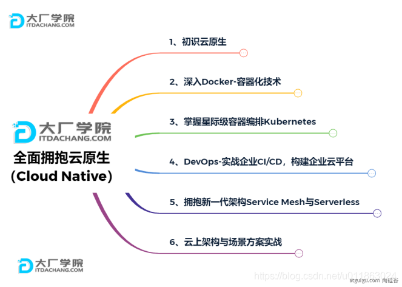
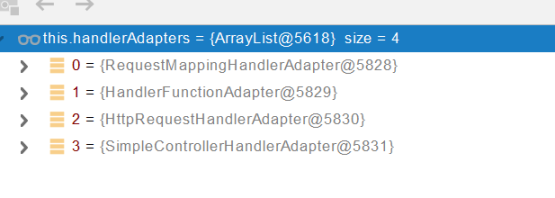
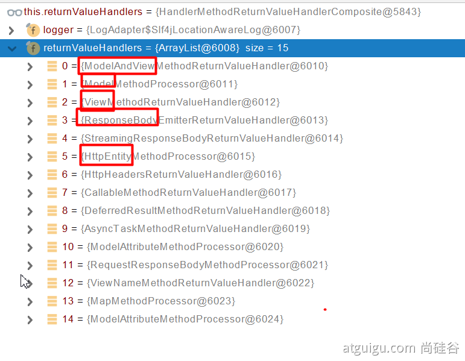

## 01、基础入门-SpringBoot2课程介绍

1. Spring Boot 2核心技术

2. Spring Boot 2响应式编程

- 学习要求
	-熟悉Spring基础
	-熟悉Maven使用
- 环境要求
	- Java8及以上
	- Maven 3.3及以上
- 学习资料
	- [Spring Boot官网](https://spring.io/projects/spring-boot)
	- [Spring Boot官方文档](https://docs.spring.io/spring-boot/docs/)
	- [本课程文档地址](https://www.yuque.com/atguigu/springboot)
	- [视频地址1](http://www.gulixueyuan.com/)、[视频地址2](https://www.bilibili.com/video/BV19K4y1L7MT?p=1)
	- [源码地址](https://gitee.com/leifengyang/springboot2)

## 02、基础入门-Spring生态圈

[Spring官网](https://spring.io/)

### Spring能做什么

#### Spring的能力


#### Spring的生态

覆盖了：

- web开发
- 数据访问
- 安全控制
- 分布式
- 消息服务
- 移动开发
- 批处理
- ......

#### Spring5重大升级

- 响应式编程


- 内部源码设计

基于Java8的一些新特性，如：接口默认实现。重新设计源码架构。


### 为什么用SpringBoot

> Spring Boot makes it easy to create stand-alone, production-grade Spring based Applications that you can "just run".[link](https://spring.io/projects/spring-boot)
> 
> 能快速创建出生产级别的Spring应用。

#### SpringBoot优点

- Create stand-alone Spring applications
	- 创建独立Spring应用
- Embed Tomcat, Jetty or Undertow directly (no need to deploy WAR files)
	- 内嵌web服务器
- Provide opinionated 'starter' dependencies to simplify your build configuration
	- 自动starter依赖，简化构建配置
- Automatically configure Spring and 3rd party libraries whenever possible
	- 自动配置Spring以及第三方功能
- Provide production-ready features such as metrics, health checks, and externalized configuration
	- 提供生产级别的监控、健康检查及外部化配置
- Absolutely no code generation and no requirement for XML configuration
	- 无代码生成、无需编写XML


- SpringBoot是整合Spring技术栈的一站式框架
- SpringBoot是简化Spring技术栈的快速开发脚手架


#### SpringBoot缺点

- 人称版本帝，迭代快，需要时刻关注变化
- 封装太深，内部原理复杂，不容易精通

## 03、基础入门-SpringBoot的大时代背景

### 微服务

> In short, the **microservice architectural style** is an approach to developing a single application as a **suite of small services**, each **running in its own process** and communicating with **lightweight** mechanisms, often an **HTTP** resource API. These services are built around **business capabilities** and **independently deployable** by fully **automated deployment** machinery. There is a bare minimum of centralized management of these services, which may be **written in different programming languages** and use different data storage technologies.——[James Lewis and Martin Fowler (2014)](https://martinfowler.com/articles/microservices.html)

- 微服务是一种架构风格
- 一个应用拆分为一组小型服务
- 每个服务运行在自己的进程内，也就是可独立部署和升级
- 服务之间使用轻量级HTTP交互
- 服务围绕业务功能拆分
- 可以由全自动部署机制独立部署
- 去中心化，服务自治。服务可以使用不同的语言、不同的存储技术

### 分布式


#### 分布式的困难

- 远程调用
- 服务发现
- 负载均衡
- 服务容错
- 配置管理
- 服务监控
- 链路追踪
- 日志管理
- 任务调度
- ......

#### 分布式的解决

- SpringBoot + SpringCloud


### 云原生

原生应用如何上云。 Cloud Native

#### 上云的困难

- 服务自愈
- 弹性伸缩
- 服务隔离
- 自动化部署
- 灰度发布
- 流量治理
- ......

#### 上云的解决




## 04、基础入门-SpringBoot官方文档架构

- [Spring Boot官网](https://spring.io/projects/spring-boot)
- [Spring Boot官方文档](https://docs.spring.io/spring-boot/docs/)

### 官网文档架构


[查看版本新特性](https://github.com/spring-projects/spring-boot/wiki#release-notes)


## 05、基础入门-SpringBoot-HelloWorld

### 系统要求

- Java 8
- Maven 3.3+
- IntelliJ IDEA 2019.1.2

#### Maven配置文件

新添内容：

```xml
<mirrors>
	<mirror>
		<id>nexus-aliyun</id>
		<mirrorOf>central</mirrorOf>
		<name>Nexus aliyun</name>
		<url>http://maven.aliyun.com/nexus/content/groups/public</url>
	</mirror>
</mirrors>

<profiles>
	<profile>
		<id>jdk-1.8</id>

		<activation>
			<activeByDefault>true</activeByDefault>
			<jdk>1.8</jdk>
		</activation>

		<properties>
			<maven.compiler.source>1.8</maven.compiler.source>
			<maven.compiler.target>1.8</maven.compiler.target>
			<maven.compiler.compilerVersion>1.8</maven.compiler.compilerVersion>
		</properties>
	</profile>
</profiles>
```

### HelloWorld项目

需求：浏览发送/hello请求，响应 “Hello，Spring Boot 2”

#### 创建maven工程


#### 引入依赖

```xml
<parent>
	<groupId>org.springframework.boot</groupId>
	<artifactId>spring-boot-starter-parent</artifactId>
	<version>2.3.4.RELEASE</version>
</parent>

<dependencies>
	<dependency>
		<groupId>org.springframework.boot</groupId>
		<artifactId>spring-boot-starter-web</artifactId>
	</dependency>
</dependencies>
```

#### 创建主程序

```java
import org.springframework.boot.SpringApplication;
import org.springframework.boot.autoconfigure.SpringBootApplication;

@SpringBootApplication
public class MainApplication {

    public static void main(String[] args) {
        SpringApplication.run(MainApplication.class, args);
    }
}

```

#### 编写业务

```java
import org.springframework.web.bind.annotation.RequestMapping;
import org.springframework.web.bind.annotation.RestController;

@RestController
public class HelloController {
    @RequestMapping("/hello")
    public String handle01(){
        return "Hello, Spring Boot 2!";
    }
}
```

#### 运行&测试

- 运行`MainApplication`类
- 浏览器输入`http://localhost:8888/hello`，将会输出`Hello, Spring Boot 2!`。

#### 设置配置

maven工程的resource文件夹中创建application.properties文件。

```properties
# 设置端口号
server.port=8888
```

[更多配置信息](https://docs.spring.io/spring-boot/docs/2.3.7.RELEASE/reference/html/appendix-application-properties.html#common-application-properties-server)

#### 打包部署

在pom.xml添加

```xml
<build>
	<plugins>
		<plugin>
			<groupId>org.springframework.boot</groupId>
			<artifactId>spring-boot-maven-plugin</artifactId>
		</plugin>
	</plugins>
</build>
```

在IDEA的Maven插件上点击运行 clean 、package，把helloworld工程项目的打包成jar包，

打包好的jar包被生成在helloworld工程项目的target文件夹内。

用cmd运行`java -jar boot-01-helloworld-1.0-SNAPSHOT.jar`，既可以运行helloworld工程项目。

将jar包直接在目标服务器执行即可。

## 06、基础入门-SpringBoot-依赖管理特性

- 父项目做依赖管理

```xml
依赖管理
<parent>
	<groupId>org.springframework.boot</groupId>
	<artifactId>spring-boot-starter-parent</artifactId>
	<version>2.3.4.RELEASE</version>
</parent>

上面项目的父项目如下：
<parent>
	<groupId>org.springframework.boot</groupId>
	<artifactId>spring-boot-dependencies</artifactId>
	<version>2.3.4.RELEASE</version>
</parent>

它几乎声明了所有开发中常用的依赖的版本号，自动版本仲裁机制
```

- 开发导入starter场景启动器
	1. 见到很多 spring-boot-starter-* ： *就某种场景
	2. 只要引入starter，这个场景的所有常规需要的依赖我们都自动引入
	3. [更多SpringBoot所有支持的场景](https://docs.spring.io/spring-boot/docs/current/reference/html/using-spring-boot.html#using-boot-starter)
	4. 见到的  *-spring-boot-starter： 第三方为我们提供的简化开发的场景启动器。

```xml
所有场景启动器最底层的依赖
<dependency>
	<groupId>org.springframework.boot</groupId>
	<artifactId>spring-boot-starter</artifactId>
	<version>2.3.4.RELEASE</version>
	<scope>compile</scope>
</dependency>
```

- 无需关注版本号，自动版本仲裁
	1. 引入依赖默认都可以不写版本
	2. 引入非版本仲裁的jar，要写版本号。

- 可以修改默认版本号
	1. 查看spring-boot-dependencies里面规定当前依赖的版本 用的 key。
	2. 在当前项目里面重写配置，如下面的代码。

```xml
<properties>
	<mysql.version>5.1.43</mysql.version>
</properties>
```

---

IDEA快捷键：

- ` ctrl + shift + alt + U`：以图的方式显示项目中依赖之间的关系。
- `alt + ins`：相当于Eclipse的 Ctrl + N，创建新类，新包等。

## 07、基础入门-SpringBoot-自动配置特性


- 自动配好Tomcat
	- 引入Tomcat依赖。
	- 配置Tomcat

```xml
<dependency>
	<groupId>org.springframework.boot</groupId>
	<artifactId>spring-boot-starter-tomcat</artifactId>
	<version>2.3.4.RELEASE</version>
	<scope>compile</scope>
</dependency>
```

- 自动配好SpringMVC
	- 引入SpringMVC全套组件
	- 自动配好SpringMVC常用组件（功能）

- 自动配好Web常见功能，如：字符编码问题
	- SpringBoot帮我们配置好了所有web开发的常见场景

```java
public static void main(String[] args) {
    //1、返回我们IOC容器
    ConfigurableApplicationContext run = SpringApplication.run(MainApplication.class, args);

    //2、查看容器里面的组件
    String[] names = run.getBeanDefinitionNames();
    for (String name : names) {
        System.out.println(name);
    }
}
```

- 默认的包结构
	- 主程序**所在包**及其下面的**所有子包**里面的组件都会被默认扫描进来 
	- 无需以前的包扫描配置
	- 想要改变扫描路径
		- @SpringBootApplication(scanBasePackages="com.lun")
		- @ComponentScan 指定扫描路径

```java
@SpringBootApplication
等同于
@SpringBootConfiguration
@EnableAutoConfiguration
@ComponentScan("com.lun")
```

- 各种配置拥有默认值
	- 默认配置最终都是映射到某个类上，如：`MultipartProperties`
	- 配置文件的值最终会绑定每个类上，这个类会在容器中创建对象

- 按需加载所有自动配置项
	- 非常多的starter
	- 引入了哪些场景这个场景的自动配置才会开启，按需加载
	- SpringBoot所有的自动配置功能都在 spring-boot-autoconfigure 包里面
	- 
- ......


## 08、底层注解-@Configuration详解

- 基本使用
	- Full模式与Lite模式
	- 示例
	- 启用代理，就是先创建bean，每次用的时候直接拿，不启用代理，就是什么时候用到bean，什么时候获取bean
	- //如果@Configuration(proxyBeanMethods = true)获取的是代理对象，代理对象调用方法。那么，SpringBoot总会检查这个组件是否在容器中有。若为false，拿到的不是代理对象，直接获取配置类对象，不去检查ioc容器是否存在这个组件，然后直接调用方法。

```java
/**
 * 1、配置类里面使用@Bean标注在方法上给容器注册组件，默认也是单实例的
 * 2、配置类本身也是组件
 * 3、proxyBeanMethods：代理bean的方法
 *      Full(proxyBeanMethods = true)（保证每个@Bean方法被调用多少次返回的组件都是单实例的）（默认）
 *      Lite(proxyBeanMethods = false)（每个@Bean方法被调用多少次返回的组件都是新创建的）
 */
@Configuration(proxyBeanMethods = false) //告诉SpringBoot这是一个配置类 == 配置文件
public class MyConfig {

    /**
     * Full:外部无论对配置类中的这个组件注册方法调用多少次获取的都是之前注册容器中的单实例对象
     * @return
     */
    @Bean //给容器中添加组件。以方法名作为组件的id。返回类型就是组件类型。返回的值，就是组件在容器中的实例
    public User user01(){
        User zhangsan = new User("zhangsan", 18);
        //user组件依赖了Pet组件
        zhangsan.setPet(tomcatPet());
        return zhangsan;
    }

    @Bean("tom")
    public Pet tomcatPet(){
        return new Pet("tomcat");
    }
}
```


@Configuration测试代码如下:

```java
@SpringBootConfiguration
@EnableAutoConfiguration
@ComponentScan("com.atguigu.boot")
public class MainApplication {

    public static void main(String[] args) {
    //1、返回我们IOC容器
        ConfigurableApplicationContext run = SpringApplication.run(MainApplication.class, args);

    //2、查看容器里面的组件
        String[] names = run.getBeanDefinitionNames();
        for (String name : names) {
            System.out.println(name);
        }

    //3、从容器中获取组件
        Pet tom01 = run.getBean("tom", Pet.class);
        Pet tom02 = run.getBean("tom", Pet.class);
        System.out.println("组件："+(tom01 == tom02));

    //4、com.atguigu.boot.config.MyConfig$$EnhancerBySpringCGLIB$$51f1e1ca@1654a892 获取的是代理对象
        MyConfig bean = run.getBean(MyConfig.class);
        System.out.println(bean);

    //如果@Configuration(proxyBeanMethods = true)获取的是代理对象，代理对象调用方法。那么，SpringBoot总会检查这个组件是否在容器中有，如果就返回单例的对象。若为false，拿到的不是代理对象，直接获取配置类对象，不去检查ioc容器是否存在这个组件，然后直接调用方法。
        //配置类对象，组件注册的方法，无论使用配置类对象调用多少次，都是拿到容器中的注册的单实例对象。
        //保持组件单实例
        User user = bean.user01();
        User user1 = bean.user01();
        System.out.println(user == user1);
// proxyBeanMethods = true时候为true，为false时候为false      
///////////////////////////////////
        User user01 = run.getBean("user01", User.class);
        Pet tom = run.getBean("tom", Pet.class);

        System.out.println("用户的宠物："+(user01.getPet() == tom));
        // proxyBeanMethods = true时候为true，为false时候为false  
    }
}
```

- 最佳实战
	- 配置 类组件之间**无依赖关系**用Lite模式加速容器启动过程，减少判断
	- 配置 类组件之间**有依赖关系**，方法会被调用得到之前单实例组件，用Full模式（默认）

> lite 英 [laɪt]   美 [laɪt]  
> adj. 低热量的，清淡的(light的一种拼写方法);类似…的劣质品

---

IDEA快捷键：

- `Alt + Ins`:生成getter，setter、构造器等代码。
- `Ctrl + Alt + B`:查看类的具体实现代码。

## 09、底层注解-@Import导入组件

@Bean、@Component、@Controller、@Service、@Repository，它们是Spring的基本标签，在Spring Boot中并未改变它们原来的功能。

@ComponentScan 在[07、基础入门-SpringBoot-自动配置特性](#)有用例。


@Import({User.class, DBHelper.class})给容器中**自动创建出这两个类型的组件**、默认组件的名字就是全类名

```java
@Import({User.class, DBHelper.class})
@Configuration(proxyBeanMethods = false) //告诉SpringBoot这是一个配置类 == 配置文件
public class MyConfig {
}
```

测试类：

```java

//1、返回我们IOC容器
ConfigurableApplicationContext run = SpringApplication.run(MainApplication.class, args);

//...

//5、获取组件
String[] beanNamesForType = run.getBeanNamesForType(User.class);

for (String s : beanNamesForType) {
    System.out.println(s);
}

DBHelper bean1 = run.getBean(DBHelper.class);
System.out.println(bean1);
```

## 10、底层注解-@Conditional条件装配

**条件装配：满足Conditional指定的条件，则进行组件注入**


用@ConditionalOnMissingBean举例说明

```java
@Configuration(proxyBeanMethods = false)
@ConditionalOnMissingBean(name = "tom")//没有tom名字的Bean时，MyConfig类的Bean才能生效。
public class MyConfig {

    @Bean
    public User user01(){
        User zhangsan = new User("zhangsan", 18);
        zhangsan.setPet(tomcatPet());
        return zhangsan;
    }

    @Bean("tom22")
    public Pet tomcatPet(){
        return new Pet("tomcat");
    }
}

public static void main(String[] args) {
    //1、返回我们IOC容器
    ConfigurableApplicationContext run = SpringApplication.run(MainApplication.class, args);

    //2、查看容器里面的组件
    String[] names = run.getBeanDefinitionNames();
    for (String name : names) {
        System.out.println(name);
    }

    boolean tom = run.containsBean("tom");
    System.out.println("容器中Tom组件："+tom);//false

    boolean user01 = run.containsBean("user01");
    System.out.println("容器中user01组件："+user01);//true

    boolean tom22 = run.containsBean("tom22");
    System.out.println("容器中tom22组件："+tom22);//true

}
```

## 11、底层注解-@ImportResource导入Spring配置文件

比如，公司使用bean.xml文件生成配置bean，然而你为了省事，想继续**复用bean.xml**，@ImportResource粉墨登场。

bean.xml：

```xml
<?xml version="1.0" encoding="UTF-8"?>
<beans ...">

    <bean id="haha" class="com.lun.boot.bean.User">
        <property name="name" value="zhangsan"></property>
        <property name="age" value="18"></property>
    </bean>

    <bean id="hehe" class="com.lun.boot.bean.Pet">
        <property name="name" value="tomcat"></property>
    </bean>
</beans>
```

使用方法：

```java
@ImportResource("classpath:beans.xml")
public class MyConfig {
...
}
```

测试类：

```java
public static void main(String[] args) {
    //1、返回我们IOC容器
    ConfigurableApplicationContext run = SpringApplication.run(MainApplication.class, args);

	boolean haha = run.containsBean("haha");
	boolean hehe = run.containsBean("hehe");
	System.out.println("haha："+haha);//true
	System.out.println("hehe："+hehe);//true
}
```

## 12、底层注解-@ConfigurationProperties配置绑定

如何使用Java读取到properties文件中的内容，并且把它封装到JavaBean中，以供随时使用

传统方法：

```java
public class getProperties {
     public static void main(String[] args) throws FileNotFoundException, IOException {
         Properties pps = new Properties();
         pps.load(new FileInputStream("a.properties"));
         Enumeration enum1 = pps.propertyNames();//得到配置文件的名字
         while(enum1.hasMoreElements()) {
             String strKey = (String) enum1.nextElement();
             String strValue = pps.getProperty(strKey);
             System.out.println(strKey + "=" + strValue);
             //封装到JavaBean。
         }
     }
 }
```

---

Spring Boot一种配置配置绑定：

@ConfigurationProperties + @Component

假设有配置文件application.properties

```properties
mycar.brand=BYD
mycar.price=100000
```

只有在容器中的组件，才会拥有SpringBoot提供的强大功能

```java
@Component
@ConfigurationProperties(prefix = "mycar")
public class Car {
    private String brand;
    private Integer price;
...
}
```

---

Spring Boot另一种配置配置绑定：

@EnableConfigurationProperties + @ConfigurationProperties

1. 开启Car配置绑定功能
2. 把这个Car这个组件自动注册到容器中
3. @EnableConfigurationProperties注解的作用：让使用 @ConfigurationProperties 注解的类生效
4. 如果Car类存在于第三方的jar包，无法手动加入@Component注解，可以使用@EnableConfigurationProperties，使得属性绑定生效。


```java
@EnableConfigurationProperties(Car.class)
public class MyConfig {
...
}
```

```java
@ConfigurationProperties(prefix = "mycar")
public class Car {
    private String brand;
    private Integer price;
...
}
```

## 13、自动配置【源码分析】-自动包规则原理

Spring Boot应用的启动类：

```java
@SpringBootApplication
public class MainApplication {

    public static void main(String[] args) {
        SpringApplication.run(MainApplication.class, args);
    }

}
```

分析下`@SpringBootApplication`

```java
@Target(ElementType.TYPE)
@Retention(RetentionPolicy.RUNTIME)
@Documented
@Inherited
@SpringBootConfiguration
@EnableAutoConfiguration
@ComponentScan(
    excludeFilters = {@Filter(
    type = FilterType.CUSTOM,
    classes = {TypeExcludeFilter.class}
), @Filter(
    type = FilterType.CUSTOM,
    classes = {AutoConfigurationExcludeFilter.class}
)}
)
public @interface SpringBootApplication {
    ...
}
```

@SpringBootApplication等同于@SpringBootConfiguration`，`@EnableAutoConfiguration`，`@ComponentScan`。

重点分析`@SpringBootConfiguration`，`@EnableAutoConfiguration`，`@ComponentScan`。

### @SpringBootConfiguration

```java
@Target(ElementType.TYPE)
@Retention(RetentionPolicy.RUNTIME)
@Documented
@Configuration
public @interface SpringBootConfiguration {
    @AliasFor(
        annotation = Configuration.class
    )
    boolean proxyBeanMethods() default true;
}
```

`@Configuration`代表当前是一个**配置类。**


### @ComponentScan

指定扫描哪些Spring注解。可以设置自定义的扫描器

@ComponentScan 在[07、基础入门-SpringBoot-自动配置特性](#)有用例。

### @EnableAutoConfiguration

```java
@Target(ElementType.TYPE)
@Retention(RetentionPolicy.RUNTIME)
@Documented
@Inherited
@AutoConfigurationPackage
@Import(AutoConfigurationImportSelector.class)
public @interface EnableAutoConfiguration {
    String ENABLED_OVERRIDE_PROPERTY = "spring.boot.enableautoconfiguration";

    Class<?>[] exclude() default {};

    String[] excludeName() default {};
}
```

后面重点分析`@AutoConfigurationPackage`，`@Import(AutoConfigurationImportSelector.class)`。

#### @AutoConfigurationPackage

标签名直译为：自动配置包，指定了默认的包规则。

```java
@Target(ElementType.TYPE)
@Retention(RetentionPolicy.RUNTIME)
@Documented
@Inherited
@Import(AutoConfigurationPackages.Registrar.class)//给容器中导入一个组件
public @interface AutoConfigurationPackage {
    String[] basePackages() default {};

    Class<?>[] basePackageClasses() default {};
}
```

```java
static class Registrar implements ImportBeanDefinitionRegistrar, DeterminableImports {
    Registrar() {
    }

    public void registerBeanDefinitions(AnnotationMetadata metadata, BeanDefinitionRegistry registry) {
        AutoConfigurationPackages.register(registry, (String[])(new AutoConfigurationPackages.PackageImports(metadata)).getPackageNames().toArray(new String[0]));
    }

    public Set<Object> determineImports(AnnotationMetadata metadata) {
        return Collections.singleton(new AutoConfigurationPackages.PackageImports(metadata));
    }
}
```

1. 利用Registrar给容器中导入一系列组件
2. 将指定的一个包下的所有组件导入进MainApplication所在包下。
3. AutoConfigurationPackages.PackageImports(metadata)).getPackageNames()得到启动类MainApplication所在的包名字，然后register注册。

## 14、自动配置【源码分析】-初始加载自动配置类

#### @Import(AutoConfigurationImportSelector.class)

1. 利用`getAutoConfigurationEntry(annotationMetadata);`给容器中批量导入一些组件

    ```java
    public class AutoConfigurationImportSelector implements DeferredImportSelector, BeanClassLoaderAware, ResourceLoaderAware, BeanFactoryAware, EnvironmentAware, Ordered {
        public String[] selectImports(AnnotationMetadata annotationMetadata) {
            if (!this.isEnabled(annotationMetadata)) {
                return NO_IMPORTS;
            } else {
                AutoConfigurationImportSelector.AutoConfigurationEntry autoConfigurationEntry = this.getAutoConfigurationEntry(annotationMetadata);
                return StringUtils.toStringArray(autoConfigurationEntry.getConfigurations());
            }
        }
        
        protected AutoConfigurationImportSelector.AutoConfigurationEntry getAutoConfigurationEntry(AnnotationMetadata annotationMetadata) {
            if (!this.isEnabled(annotationMetadata)) {
                return EMPTY_ENTRY;
            } else {
                AnnotationAttributes attributes = this.getAttributes(annotationMetadata);
                List<String> configurations = this.getCandidateConfigurations(annotationMetadata, attributes);
                configurations = this.removeDuplicates(configurations);
                Set<String> exclusions = this.getExclusions(annotationMetadata, attributes);
                this.checkExcludedClasses(configurations, exclusions);
                configurations.removeAll(exclusions);
                configurations = this.getConfigurationClassFilter().filter(configurations);
                this.fireAutoConfigurationImportEvents(configurations, exclusions);
                return new AutoConfigurationImportSelector.AutoConfigurationEntry(configurations, exclusions);
            }
        }
    }
    ```

2. 调用`List<String> configurations = getCandidateConfigurations(annotationMetadata, attributes)`获取到所有需要导入到容器中的配置类

    ```java
    protected List<String> getCandidateConfigurations(AnnotationMetadata metadata, AnnotationAttributes attributes) {
        List<String> configurations = SpringFactoriesLoader.loadFactoryNames(this.getSpringFactoriesLoaderFactoryClass(), this.getBeanClassLoader());
        Assert.notEmpty(configurations, "No auto configuration classes found in META-INF/spring.factories. If you are using a custom packaging, make sure that file is correct.");
        return configurations;
    }
    ```

3. 利用工厂加载 `Map<String, List<String>> loadSpringFactories(@Nullable ClassLoader classLoader);`得到所有的组件

    ```java
    private static Map<String, List<String>> loadSpringFactories(@Nullable ClassLoader classLoader) {
        MultiValueMap<String, String> result = (MultiValueMap)cache.get(classLoader);
        if (result != null) {
            return result;
        } else {
            try {
                    Enumeration<URL> urls = classLoader != null ? classLoader.getResources("META-INF/spring.factories") : ClassLoader.getSystemResources("META-INF/spring.factories");
                    LinkedMultiValueMap result = new LinkedMultiValueMap();
    
                    while(urls.hasMoreElements()) {
                        URL url = (URL)urls.nextElement();
                        UrlResource resource = new UrlResource(url);
                        Properties properties = PropertiesLoaderUtils.loadProperties(resource);
                        Iterator var6 = properties.entrySet().iterator();
    ```

4. 从`META-INF/spring.factories`位置来加载一个文件。
    - 默认扫描我们当前系统里面所有`META-INF/spring.factories`位置的文件
    - `spring-boot-autoconfigure-2.3.4.RELEASE.jar`包里面也有`META-INF/spring.factories`


```properties
# 文件里面写死了spring-boot一启动就要给容器中加载的所有配置类
# spring-boot-autoconfigure-2.3.4.RELEASE.jar/META-INF/spring.factories
# Auto Configure
org.springframework.boot.autoconfigure.EnableAutoConfiguration=\
org.springframework.boot.autoconfigure.admin.SpringApplicationAdminJmxAutoConfiguration,\
org.springframework.boot.autoconfigure.aop.AopAutoConfiguration,\
..................................
```

虽然我们127个场景的所有自动配置启动的时候**默认全部加载**，但是`xxxxAutoConfiguration`按照**条件装配规则（`@Conditional`）**，最终不会全部开启，会**按需配置**。

打开一个默认自动加载的第三方配置类，如`AopAutoConfiguration`类，@Conditional按需配置，看是否导入指定的类，例如这里的import org.aspectj.weaver.Advice;

@ConditionalOnClass({Advice.class}）导入这个包，打注解的配置类才会生效。

```java
import org.aspectj.weaver.Advice;
@Configuration(
    proxyBeanMethods = false
)
@ConditionalOnProperty(
    prefix = "spring.aop",
    name = "auto",
    havingValue = "true",
    matchIfMissing = true
)
public class AopAutoConfiguration {
    public AopAutoConfiguration() {
    }
    @Configuration(
        proxyBeanMethods = false
    )
    @ConditionalOnClass({Advice.class
         static class AspectJAutoProxyingConfiguration {
        AspectJAutoProxyingConfiguration() {
        }

        @Configuration(
            proxyBeanMethods = false
        )
        @EnableAspectJAutoProxy(
            proxyTargetClass = true
        )
        @ConditionalOnProperty(
            prefix = "spring.aop",
            name = {"proxy-target-class"},
            havingValue = "true",
            matchIfMissing = true
        )
	...
}
```

弹幕：总结：1，导入Registrar组件，批量导入组件到默认包下

**弹幕：**原理：springboot根据配置文件，自动装配所属依赖的类，再用动态代理的方式注入到spring容器中

## 15、自动配置【源码分析】-自动配置流程


以`DispatcherServletAutoConfiguration`的内部类`DispatcherServletConfiguration`为例子:

```java
@Bean
@ConditionalOnBean(MultipartResolver.class)  //容器中有这个类型组件
@ConditionalOnMissingBean(name = DispatcherServlet.MULTIPART_RESOLVER_BEAN_NAME) //容器中没有这个名字 multipartResolver 的组件
public MultipartResolver multipartResolver(MultipartResolver resolver) {
	//给@Bean标注的方法传入了对象参数，这个参数的值就会从容器中找。
	//SpringMVC multipartResolver。防止有些用户配置的文件上传解析器不符合规范
	// Detect if the user has created a MultipartResolver but named it incorrectly
	return resolver;//给容器中加入了文件上传解析器；
}
```

SpringBoot默认会在底层配好所有的组件，但是**如果用户自己配置了以用户的优先**。


**总结**：

- SpringBoot通过MainApplication的注解先加载所有的第三方自动配置类  xxxxxAutoConfiguration
- 每个自动配置类按照条件进行生效，默认都会绑定配置文件指定的值。（xxxxProperties里面读取，xxxProperties和配置文件进行了绑定）
- **生效的配置类就会给容器中按需装配很多组件**
- 只要容器中有这些组件，相当于这些功能就有了
- 定制化配置
	- 用户直接自己@Bean替换底层的组件
	- 用户去看这个组件是获取的配置文件什么值就去修改。

**xxxxxAutoConfiguration ---> 组件 ---> xxxxProperties里面拿值  ----> application.properties**

## 16、最佳实践-SpringBoot应用如何编写

- 引入场景依赖
	- [官方文档](https://docs.spring.io/spring-boot/docs/current/reference/html/using-spring-boot.html#using-boot-starter)
- 查看自动配置了哪些（选做）
	- 自己分析，引入场景对应的自动配置一般都生效了
	- 配置文件中debug=true开启自动配置报告。
	  - Negative（不生效）
	  - Positive（生效）
- 是否需要修改
	- 参照文档修改配置项
		- [官方文档](https://docs.spring.io/spring-boot/docs/current/reference/html/appendix-application-properties.html#common-application-properties)
		- 自己分析。xxxxProperties绑定了配置文件的哪些。
	- 自定义加入或者替换组件
		- @Bean、@Component...
	- 自定义器  XXXXXCustomizer；
	- ......

## 17、最佳实践-Lombok简化开发

Lombok用标签方式代替构造器、getter/setter、toString()等鸡肋代码。

spring boot已经管理Lombok。引入依赖：

```xml
 <dependency>
     <groupId>org.projectlombok</groupId>
     <artifactId>lombok</artifactId>
</dependency>
```

IDEA中File->Settings->Plugins，搜索安装Lombok插件。

```java
@NoArgsConstructor
//@AllArgsConstructor
@Data
@ToString
@EqualsAndHashCode
public class User {

    private String name;
    private Integer age;

    private Pet pet;

    public User(String name,Integer age){
        this.name = name;
        this.age = age;
    }
}
```

---

简化日志开发

```java
@Slf4j
@RestController
public class HelloController {
    @RequestMapping("/hello")
    public String handle01(@RequestParam("name") String name){
        log.info("请求进来了....");
        return "Hello, Spring Boot 2!"+"你好："+name;
    }
}
```

## 18、最佳实践-dev-tools

> Spring Boot includes an additional set of tools that can make the application development experience a little more pleasant. The `spring-boot-devtools` module can be included in any project to provide additional development-time features.——[link](https://docs.spring.io/spring-boot/docs/2.3.8.RELEASE/reference/html/using-spring-boot.html#using-boot-devtools)
>
> Applications that use `spring-boot-devtools` automatically restart whenever files on the classpath change. This can be a useful feature when working in an IDE, as it gives a very fast feedback loop for code changes. By default, any entry on the classpath that points to a directory is monitored for changes. Note that certain resources, such as static assets and view templates, [do not need to restart the application](https://docs.spring.io/spring-boot/docs/2.3.8.RELEASE/reference/html/using-spring-boot.html#using-boot-devtools-restart-exclude).——[link](https://docs.spring.io/spring-boot/docs/2.3.8.RELEASE/reference/html/using-spring-boot.html#using-boot-devtools-restart)
>
> Triggering a restart
>
> As DevTools monitors classpath resources, the only way to trigger a restart is to update the classpath. The way in which you cause the classpath to be updated depends on the IDE that you are using:
>
> - In Eclipse, saving a modified file causes the classpath to be updated and triggers a restart.
> - In IntelliJ IDEA, building the project (`Build -> Build Project`)(shortcut: Ctrl+F9) has the same effect.

添加依赖：

```xml
<dependencies>
    <dependency>
        <groupId>org.springframework.boot</groupId>
        <artifactId>spring-boot-devtools</artifactId>
        <optional>true</optional>
    </dependency>
</dependencies>
```

在IDEA中，项目或者页面修改以后：Ctrl+F9。自动重启

检测文件变化，变化了就重新编译，自动重启，没有修改则没有效果；如果是静态资源则不会自动重启

## 19、最佳实践-Spring Initailizr
[Spring Initailizr](https://start.spring.io/)是创建Spring Boot工程向导。

在IDEA中，菜单栏New -> Project -> Spring Initailizr。

## 20、配置文件-yaml的用法

同以前的properties用法

YAML 是 "YAML Ain't Markup Language"（YAML 不是一种标记语言）的递归缩写。在开发的这种语言时，YAML 的意思其实是："Yet Another Markup Language"（仍是一种标记语言）。 

**非常适合用来做以数据为中心的配置文件**。

### 基本语法

- key: value；kv之间有空格
- 大小写敏感
- 使用缩进表示层级关系
- 缩进不允许使用tab，只允许空格
- 缩进的空格数不重要，只要相同层级的元素左对齐即可
- '#'表示注释
- 字符串无需加引号，如果要加，单引号''、双引号""表示字符串内容会被 转义、不转义

### 数据类型

- 字面量：单个的、不可再分的值。date、boolean、string、number、null

```yaml
k: v
```

- 对象：键值对的集合。map、hash、set、object 

```yaml
#行内写法：  

k: {k1:v1,k2:v2,k3:v3}

#或

k: 
  k1: v1
  k2: v2
  k3: v3
```

- 数组：一组按次序排列的值。array、list、queue

```yaml
#行内写法：  

k: [v1,v2,v3]

#或者

k:
 - v1
 - v2
 - v3
```

### 实例

```java
@Data
public class Person {
    private String userName;
    private Boolean boss;
    private Date birth;
    private Integer age;
    private Pet pet;
    private String[] interests;
    private List<String> animal;
    private Map<String, Object> score;
    private Set<Double> salarys;
    private Map<String, List<Pet>> allPets;
}

@Data
public class Pet {
    private String name;
    private Double weight;
}
```

用yaml表示以上对象

```yaml
person:
  userName: zhangsan
  boss: false
  birth: 2019/12/12 20:12:33
  age: 18
  pet: 
    name: tomcat
    weight: 23.4
  interests: [篮球,游泳]
  animal: 
    - jerry
    - mario
  score:
    english: 
      first: 30
      second: 40
      third: 50
    math: [131,140,148]
    chinese: {first: 128,second: 136}
  salarys: [3999,4999.98,5999.99]
  allPets:
    sick:
      - {name: tom}
      - {name: jerry,weight: 47}
    health: [{name: mario,weight: 47}]
```

## 21、配置文件-自定义类绑定的配置提示

> You can easily generate your own configuration metadata file from items annotated with `@ConfigurationProperties` by using the `spring-boot-configuration-processor` jar. The jar includes a Java annotation processor which is invoked as your project is compiled.——[link](https://docs.spring.io/spring-boot/docs/2.4.2/reference/htmlsingle/#configuration-metadata-annotation-processor)

自定义的类和配置文件绑定一般没有提示。若要提示，添加如下依赖：

```xml
<dependency>
    <groupId>org.springframework.boot</groupId>
    <artifactId>spring-boot-configuration-processor</artifactId>
    <optional>true</optional>
</dependency>

<!-- 下面插件作用是工程打包时，不将spring-boot-configuration-processor打进包内，让其只在编码的时候有用 
打包插件的作用使得 各种配置和包打包成为一个jar包，可以使得运行java在终端执行直接运行，比如把服务器Tomcat打包进去，部署的时候不需要打包成war包然后部署到Tomcat中-->
<build>
    <plugins>
        <plugin>
            <groupId>org.springframework.boot</groupId>
            <artifactId>spring-boot-maven-plugin</artifactId>
            <configuration>
                <excludes>
                    <exclude>
                        <groupId>org.springframework.boot</groupId>
                        <artifactId>spring-boot-configuration-processor</artifactId>
                    </exclude>
                </excludes>
            </configuration>
        </plugin>
    </plugins>
</build>
```

## 22、web场景-web开发简介

Spring Boot provides auto-configuration for Spring MVC that **works well with most applications.(大多场景我们都无需自定义配置)**

The auto-configuration adds the following features on top of Spring’s defaults:

- Inclusion of `ContentNegotiatingViewResolver` and `BeanNameViewResolver` beans.

  - 内容协商视图解析器和BeanName视图解析器

- Support for serving static resources, including support for WebJars (covered [later in this document](https://docs.spring.io/spring-boot/docs/current/reference/html/spring-boot-features.html#boot-features-spring-mvc-static-content))).

  - 静态资源（包括webjars）

- Automatic registration of `Converter`, `GenericConverter`, and `Formatter` beans.

  - 自动注册 `Converter，GenericConverter，Formatter `

- Support for `HttpMessageConverters` (covered [later in this document](https://docs.spring.io/spring-boot/docs/current/reference/html/spring-boot-features.html#boot-features-spring-mvc-message-converters)).

  - 支持 `HttpMessageConverters` （后来我们配合内容协商理解原理）

- Automatic registration of `MessageCodesResolver` (covered [later in this document](https://docs.spring.io/spring-boot/docs/current/reference/html/spring-boot-features.html#boot-features-spring-message-codes)).

  - 自动注册 `MessageCodesResolver` （国际化用）

- Static `index.html` support.

  - 静态index.html 页支持

- Custom `Favicon` support (covered [later in this document](https://docs.spring.io/spring-boot/docs/current/reference/html/spring-boot-features.html#boot-features-spring-mvc-favicon)).

  - 自定义 `Favicon`  

- Automatic use of a `ConfigurableWebBindingInitializer` bean (covered [later in this document](https://docs.spring.io/spring-boot/docs/current/reference/html/spring-boot-features.html#boot-features-spring-mvc-web-binding-initializer)).

  - 自动使用 `ConfigurableWebBindingInitializer` ，（DataBinder负责将请求数据绑定到JavaBean上）

> If you want to keep those Spring Boot MVC customizations and make more [MVC customizations](https://docs.spring.io/spring/docs/5.2.9.RELEASE/spring-framework-reference/web.html#mvc) (interceptors, formatters, view controllers, and other features), you can add your own `@Configuration` class of type `WebMvcConfigurer` but **without** `@EnableWebMvc`.
>
> **不用@EnableWebMvc注解。使用** **`@Configuration`** **+** **`WebMvcConfigurer`** **自定义规则**

> If you want to provide custom instances of `RequestMappingHandlerMapping`, `RequestMappingHandlerAdapter`, or `ExceptionHandlerExceptionResolver`, and still keep the Spring Boot MVC customizations, you can declare a bean of type `WebMvcRegistrations` and use it to provide custom instances of those components.
>
> **声明** **`WebMvcRegistrations`** **改变默认底层组件**

> If you want to take complete control of Spring MVC, you can add your own `@Configuration` annotated with `@EnableWebMvc`, or alternatively add your own `@Configuration`-annotated `DelegatingWebMvcConfiguration` as described in the Javadoc of `@EnableWebMvc`.
>
> **使用** **`@EnableWebMvc+@Configuration+DelegatingWebMvcConfiguration 全面接管SpringMVC`**

## 23、web场景-静态资源规则与定制化

### 静态资源目录

只要静态资源放在类路径下： called `/static` (or `/public` or `/resources` or `/META-INF/resources`

访问 ： 当前项目根路径/ + 静态资源名 

原理： 静态映射/**。

请求进来，先去找Controller看能不能处理。不能处理的所有请求又都交给静态资源处理器。静态资源也找不到则响应404页面。

**springmvc：**说的先都交给DispatcherServlet处理不了交给tomcat中默认的servlet，首先开启mvc注解驱动，在设置默认的servlet处理静态资源

也可以改变默认的静态资源路径，`/static`，`/public`,`/resources`, `/META-INF/resources`失效

PS1：新的用法不会覆盖原路径，而是追加到路径列表

PS2：如果要覆盖原路径，再配置spring.web.resources.add-mappings=false

```yaml
resources:
  static-locations: [classpath:/haha/]
```

### 静态资源访问前缀

```yaml
spring:
  mvc:
    static-path-pattern: /res/**
```

当前项目 + static-path-pattern + 静态资源名 = 静态资源文件夹下找

### webjar

可用jar方式添加css，js等资源文件，

[https://www.webjars.org/](https://www.webjars.org/)

例如，添加jquery

```xml
<dependency>
    <groupId>org.webjars</groupId>
    <artifactId>jquery</artifactId>
    <version>3.5.1</version>
</dependency>
```

访问地址：[http://localhost:8080/webjars/**jquery/3.5.1/jquery.js**](http://localhost:8080/webjars/jquery/3.5.1/jquery.js)  后面地址要按照依赖里面的包路径。

## 24、web场景-welcome与favicon功能

[官方文档](https://docs.spring.io/spring-boot/docs/2.3.8.RELEASE/reference/htmlsingle/#boot-features-spring-mvc-welcome-page)

### 欢迎页支持

- 静态资源路径下  index.html。

  - 可以配置静态资源路径
  - 但是不可以配置静态资源的访问前缀。否则导致 index.html不能被默认访问

```yaml
spring:
#  mvc:
#    static-path-pattern: /res/**   这个会导致welcome page功能失效
  resources:
    static-locations: [classpath:/haha/]
```

- controller能处理/index。

### 自定义Favicon

指网页标签上的小图标。

favicon.ico 放在静态资源目录下即可。

```yaml
spring:
#  mvc:
#    static-path-pattern: /res/**   这个会导致 Favicon 功能失效
```

## 25、web场景-【源码分析】-静态资源原理

- SpringBoot启动默认加载  xxxAutoConfiguration 类（自动配置类）
- SpringMVC功能的自动配置类`WebMvcAutoConfiguration`，生效

```java
@Configuration(proxyBeanMethods = false)
@ConditionalOnWebApplication(type = Type.SERVLET)
@ConditionalOnClass({ Servlet.class, DispatcherServlet.class, WebMvcConfigurer.class })
@ConditionalOnMissingBean(WebMvcConfigurationSupport.class)
@AutoConfigureOrder(Ordered.HIGHEST_PRECEDENCE + 10)
@AutoConfigureAfter({ DispatcherServletAutoConfiguration.class, TaskExecutionAutoConfiguration.class,
		ValidationAutoConfiguration.class })
public class WebMvcAutoConfiguration {
    ...
}
```

- 给容器中配置的内容：出现@EnableConfigurationProperties注解，表明指向的类要和配置文件进行绑定
  - 配置文件的相关属性的绑定：WebMvcProperties==**spring.mvc**、ResourceProperties==**spring.resources**

```java
@Configuration(proxyBeanMethods = false)
@Import(EnableWebMvcConfiguration.class)
@EnableConfigurationProperties({ WebMvcProperties.class, ResourceProperties.class })
@Order(0)
public static class WebMvcAutoConfigurationAdapter implements WebMvcConfigurer {
    ...
}
```

### 配置类**只有**一个有参构造器 ：**有参构造器所有的值都会在容器中寻找**。

```java
////有参构造器所有参数的值都会从容器中确定
public WebMvcAutoConfigurationAdapter(WebProperties webProperties, WebMvcProperties mvcProperties,
		ListableBeanFactory beanFactory, ObjectProvider<HttpMessageConverters> messageConvertersProvider,
		ObjectProvider<ResourceHandlerRegistrationCustomizer> resourceHandlerRegistrationCustomizerProvider,
		ObjectProvider<DispatcherServletPath> dispatcherServletPath,
		ObjectProvider<ServletRegistrationBean<?>> servletRegistrations) {
	this.mvcProperties = mvcProperties;
	this.beanFactory = beanFactory;
	this.messageConvertersProvider = messageConvertersProvider;
	this.resourceHandlerRegistrationCustomizer = resourceHandlerRegistrationCustomizerProvider.getIfAvailable();
	this.dispatcherServletPath = dispatcherServletPath;
	this.servletRegistrations = servletRegistrations;
	this.mvcProperties.checkConfiguration();
}
```

- ResourceProperties resourceProperties；获取和spring.resources绑定的所有的值的对象。Springboot2.4.0之后改为WebProperties webProperties
- WebMvcProperties mvcProperties 获取和spring.mvc绑定的所有的值的对象
- ListableBeanFactory beanFactory Spring的beanFactory，Spring的容器
- HttpMessageConverters 找到所有的HttpMessageConverters
- ResourceHandlerRegistrationCustomizer 找到 资源处理器的自定义器。
- DispatcherServletPath
- ServletRegistrationBean   给应用注册Servlet、Filter....

### 资源处理的默认规则

```java
...
public class WebMvcAutoConfiguration {
    ...
	public static class WebMvcAutoConfigurationAdapter implements WebMvcConfigurer {
        ...
		@Override
		public void addResourceHandlers(ResourceHandlerRegistry registry) {
			if (!this.resourceProperties.isAddMappings()) {
				logger.debug("Default resource handling disabled");//通过resourceProperties和spring.resources绑定的属性，可以禁用所有静态资源规则，为false实现禁用
				return;
			}
			Duration cachePeriod = this.resourceProperties.getCache().getPeriod();
			CacheControl cacheControl = this.resourceProperties.getCache().getCachecontrol().toHttpCacheControl();
			//webjars的规则
            if (!registry.hasMappingForPattern("/webjars/**")) {
				customizeResourceHandlerRegistration(registry.addResourceHandler("/webjars/**")
						.addResourceLocations("classpath:/META-INF/resources/webjars/")
						.setCachePeriod(getSeconds(cachePeriod)).setCacheControl(cacheControl));
			}
            
            //
			String staticPathPattern = this.mvcProperties.getStaticPathPattern(); //staticPathPattern为/**
			if (!registry.hasMappingForPattern(staticPathPattern)) {
				customizeResourceHandlerRegistration(registry.addResourceHandler(staticPathPattern)
						.addResourceLocations(getResourceLocations(this.resourceProperties.getStaticLocations()))
						.setCachePeriod(getSeconds(cachePeriod)).setCacheControl(cacheControl));//
			}//this.resourceProperties.getStaticLocations()获得resourceProperties对象的属性值，属性值为默认设定好的静态资源路径，后面为缓存规则，缓存周期和缓存控制
		}
        ...
        
    }
        
    ...
}
```

根据上述代码，我们可以同过配置禁止所有静态资源规则。

```yaml
spring:
  resources:
    add-mappings: false   #禁用所有静态资源规则
```

静态资源规则：

```java
@ConfigurationProperties(prefix = "spring.resources", ignoreUnknownFields = false)
public class ResourceProperties {

    private static final String[] CLASSPATH_RESOURCE_LOCATIONS = { "classpath:/META-INF/resources/",
            "classpath:/resources/", "classpath:/static/", "classpath:/public/" };

    /**
     * Locations of static resources. Defaults to classpath:[/META-INF/resources/,
     * /resources/, /static/, /public/].
     */
    private String[] staticLocations = CLASSPATH_RESOURCE_LOCATIONS;
    ...
}

```

### 欢迎页的处理规则

```java
...
public class WebMvcAutoConfiguration {
    ...
	public static class EnableWebMvcConfiguration extends DelegatingWebMvcConfiguration implements ResourceLoaderAware {
        ...
		@Bean
		public WelcomePageHandlerMapping welcomePageHandlerMapping(ApplicationContext applicationContext,
				FormattingConversionService mvcConversionService, ResourceUrlProvider mvcResourceUrlProvider) {
			WelcomePageHandlerMapping welcomePageHandlerMapping = new WelcomePageHandlerMapping(
					new TemplateAvailabilityProviders(applicationContext), applicationContext, getWelcomePage(),
					this.mvcProperties.getStaticPathPattern());//this.mvcProperties.getStaticPathPattern()获得绑定配置文件spring.mvc的路径，若加上/res/**路径前置，则转发到Index.html,后面new对象的构造器路径写死了必须等于"/**"
			welcomePageHandlerMapping.setInterceptors(getInterceptors(mvcConversionService, mvcResourceUrlProvider));
			welcomePageHandlerMapping.setCorsConfigurations(getCorsConfigurations());
			return welcomePageHandlerMapping;
		}
    
```

`WelcomePageHandlerMapping`的构造方法如下：

```java
WelcomePageHandlerMapping(TemplateAvailabilityProviders templateAvailabilityProviders,
                          ApplicationContext applicationContext, Resource welcomePage, String staticPathPattern) {
    if (welcomePage != null && "/**".equals(staticPathPattern)) {
        //要用欢迎页功能，必须是/**
        logger.info("Adding welcome page: " + welcomePage);
        setRootViewName("forward:index.html");
    }
    else if (welcomeTemplateExists(templateAvailabilityProviders, applicationContext)) {
        //调用Controller /index
        logger.info("Adding welcome page template: index");
        setRootViewName("index");
    }
}
```

这构造方法内的代码也解释了[web场景-welcome与favicon功能](#)中配置`static-path-pattern`了，welcome页面和小图标失效的问题。

## 26、请求处理-【源码分析】-Rest映射及源码解析

### 请求映射

- @xxxMapping;
  - @GetMapping
  - @PostMapping
  - @PutMapping
  - @DeleteMapping
  
- Rest风格支持（使用**HTTP**请求方式动词来表示对资源的操作）
  - 以前：
    - /getUser 获取用户
    - /deleteUser 删除用户
    - /editUser 修改用户
    - /saveUser保存用户
  - 现在： /user 
    - GET-获取用户
    - DELETE-删除用户
    - PUT-修改用户
    - POST-保存用户
  - 核心Filter；HiddenHttpMethodFilter

- **用法**
  - 开启页面表单的Rest功能
  - 页面 form的属性method=post，隐藏域 \_method=put、delete等（如果直接get或post，无需隐藏域）
  - 编写请求映射

```yaml
spring:
  mvc:
    hiddenmethod:
      filter:
        enabled: true   #开启页面表单的Rest功能
```

```html
<form action="/user" method="get">
    <input value="REST-GET提交" type="submit" />
</form>

<form action="/user" method="post">
    <input value="REST-POST提交" type="submit" />
</form>

<form action="/user" method="post">
    <input name="_method" type="hidden" value="DELETE"/>
    <input value="REST-DELETE 提交" type="submit"/>
</form>

<form action="/user" method="post">
    <input name="_method" type="hidden" value="PUT" />
    <input value="REST-PUT提交"type="submit" />
<form>
```

```java
@GetMapping("/user")
//@RequestMapping(value = "/user",method = RequestMethod.GET)
public String getUser(){
    return "GET-张三";
}

@PostMapping("/user")
//@RequestMapping(value = "/user",method = RequestMethod.POST)
public String saveUser(){
    return "POST-张三";
}

@PutMapping("/user")
//@RequestMapping(value = "/user",method = RequestMethod.PUT)
public String putUser(){
    return "PUT-张三";
}

@DeleteMapping("/user")
//@RequestMapping(value = "/user",method = RequestMethod.DELETE)
public String deleteUser(){
    return "DELETE-张三";
}
```

- Rest原理（表单提交<form></form>要使用REST的时候）
  - 表单提交会带上`\_method=PUT`
  - **请求过来被**`HiddenHttpMethodFilter`拦截
    - 请求是否正常，并且是POST
      - 获取到`\_method`的值。
      - 兼容以下请求；**PUT**.**DELETE**.**PATCH**
      - **原生request（post），包装模式requesWrapper重写了getMethod方法，返回的是传入的值。**
      - **过滤器链放行的时候用wrapper。以后的方法调用getMethod是调用requesWrapper的。**


```java
public class WebMvcAutoConfiguration {
    ...
@Bean
@ConditionalOnMissingBean({HiddenHttpMethodFilter.class})
@ConditionalOnProperty(
    prefix = "spring.mvc.hiddenmethod.filter",
    name = {"enabled"},
    matchIfMissing = false
)
public OrderedHiddenHttpMethodFilter hiddenHttpMethodFilter() {
    return new OrderedHiddenHttpMethodFilter();
}
    ...
}
```

```java
public class OrderedHiddenHttpMethodFilter extends HiddenHttpMethodFilter implements OrderedFilter {
    public static final int DEFAULT_ORDER = -10000;
    private int order = -10000;

    public OrderedHiddenHttpMethodFilter() {
    }

    public int getOrder() {
        return this.order;
    }

    public void setOrder(int order) {
        this.order = order;
    }
}
```


```java
public class HiddenHttpMethodFilter extends OncePerRequestFilter {

	private static final List<String> ALLOWED_METHODS =
			Collections.unmodifiableList(Arrays.asList(HttpMethod.PUT.name(),
					HttpMethod.DELETE.name(), HttpMethod.PATCH.name()));

	/** Default method parameter: {@code _method}. */
	public static final String DEFAULT_METHOD_PARAM = "_method";

	private String methodParam = DEFAULT_METHOD_PARAM;


	/**
	 * Set the parameter name to look for HTTP methods.
	 * @see #DEFAULT_METHOD_PARAM
	 */
	public void setMethodParam(String methodParam) {
		Assert.hasText(methodParam, "'methodParam' must not be empty");
		this.methodParam = methodParam;
	}

	@Override
	protected void doFilterInternal(HttpServletRequest request, HttpServletResponse response, FilterChain filterChain)
			throws ServletException, IOException {

		HttpServletRequest requestToUse = request;

		if ("POST".equals(request.getMethod()) && request.getAttribute(WebUtils.ERROR_EXCEPTION_ATTRIBUTE) == null) {
			String paramValue = request.getParameter(this.methodParam);
			if (StringUtils.hasLength(paramValue)) {
				String method = paramValue.toUpperCase(Locale.ENGLISH);
				if (ALLOWED_METHODS.contains(method)) {
					requestToUse = new HttpMethodRequestWrapper(request, method);
				}
			}//form表单实现rest风格 的put、delete方法的原理是：经过一个过滤器（容器中bean存在）进行处理，经过判断读取_method字符串，然后判断是否存在于ALLOWED_METHODS列表，存在则重新将request对象进行包装，将其属性改为我们设置的put、delete方法。
		}

		filterChain.doFilter(requestToUse, response);
	}


	/**
	 * Simple {@link HttpServletRequest} wrapper that returns the supplied method for
	 * {@link HttpServletRequest#getMethod()}.
	 */
	private static class HttpMethodRequestWrapper extends HttpServletRequestWrapper {

		private final String method;

		public HttpMethodRequestWrapper(HttpServletRequest request, String method) {
			super(request);
			this.method = method;
		}

		@Override
		public String getMethod() {
			return this.method;
		}
	}

}
```

- Rest使用客户端工具。
  
  - 如PostMan可直接发送put、delete等方式请求。filterChain.doFilter(requestToUse, response)直接放行。
  - 只有表单<form>只有get，post两种请求方式，
  
  ```java
  spring:
    mvc:
      hiddenmethod:
        filter:
          enabled: true   #开启页面表单的Rest功能
  ```
  
  

## 27、请求处理-【源码分析】-怎么改变默认的\_method

```java
@Configuration(proxyBeanMethods = false)
@ConditionalOnWebApplication(type = Type.SERVLET)
@ConditionalOnClass({ Servlet.class, DispatcherServlet.class, WebMvcConfigurer.class })
@ConditionalOnMissingBean(WebMvcConfigurationSupport.class)
@AutoConfigureOrder(Ordered.HIGHEST_PRECEDENCE + 10)
@AutoConfigureAfter({ DispatcherServletAutoConfiguration.class, TaskExecutionAutoConfiguration.class,
		ValidationAutoConfiguration.class })
public class WebMvcAutoConfiguration {

    ...
    
    @Bean
    @ConditionalOnMissingBean(HiddenHttpMethodFilter.class)
    @ConditionalOnProperty(prefix = "spring.mvc.hiddenmethod.filter", name = "enabled", matchIfMissing = false)
    public OrderedHiddenHttpMethodFilter hiddenHttpMethodFilter() {
        return new OrderedHiddenHttpMethodFilter();
    }
    
    ...
}
    
```

`@ConditionalOnMissingBean(HiddenHttpMethodFilter.class)`意味着在没有`HiddenHttpMethodFilter`时，才执行`hiddenHttpMethodFilter()`。因此，我们可以自定义filter，改变HiddenHttpMethodFilter的对象的属性，改变默认的`\_method`。例如：进而在接受前端的请求时候，用改变的HiddenHttpMethodFilter对象进行处理。

```java
@Configuration(proxyBeanMethods = false)
public class WebConfig{
    //自定义filter
    @Bean
    public HiddenHttpMethodFilter hiddenHttpMethodFilter(){
        HiddenHttpMethodFilter methodFilter = new HiddenHttpMethodFilter();
        methodFilter.setMethodParam("_m");
        return methodFilter;
    }    
}
```

将`\_method`改成`_m`。

```html
<form action="/user" method="post">
    <input name="_m" type="hidden" value="DELETE"/>
    <input value="REST-DELETE 提交" type="submit"/>
</form>
```

## 28、请求处理-【源码分析】-请求映射原理
FrameworkServlet service,doGet,doPost方法调用processRequest方法，processRequest方法调用doService抽象方法。

DispatcherServlet实现doService方法，再调用doDispatch方法。

SpringMVC功能分析都从 `org.springframework.web.servlet.DispatcherServlet` -> `doDispatch()`

```java
protected void doDispatch(HttpServletRequest request, HttpServletResponse response) throws Exception {
    HttpServletRequest processedRequest = request;
    HandlerExecutionChain mappedHandler = null;
    boolean multipartRequestParsed = false;

    WebAsyncManager asyncManager = WebAsyncUtils.getAsyncManager(request);

    try {
        ModelAndView mv = null;
        Exception dispatchException = null;

        try {
            processedRequest = checkMultipart(request);
            multipartRequestParsed = (processedRequest != request);

            // 找到当前请求使用哪个Handler（Controller的方法）处理
            mappedHandler = getHandler(processedRequest);

            //HandlerMapping：处理器映射。/xxx->>xxxx
    ...
}
```

`getHandler()`方法如下：

```java
@Nullable
protected HandlerExecutionChain getHandler(HttpServletRequest request) throws Exception {
    if (this.handlerMappings != null) {
        for (HandlerMapping mapping : this.handlerMappings) {
            HandlerExecutionChain handler = mapping.getHandler(request);
            if (handler != null) {
                return handler;
            }//请求进来，挨个尝试所有的HandlerMapping看是否有请求信息。如果有就找到这个请求对应的handler,如果没有就是下一个 HandlerMapping
        }
    }
    return null;
}
```

`this.handlerMappings`在Debug模式下展现的内容：


其中，保存了所有`@RequestMapping` 和`handler`的映射规则。


​			handler封装了目标方法的所有信息。

所有的请求映射都在HandlerMapping中：

- SpringBoot自动配置欢迎页的 WelcomePageHandlerMapping 。访问 /能访问到index.html；

- SpringBoot自动配置了默认的 RequestMappingHandlerMapping

- 请求进来，挨个尝试所有的HandlerMapping看是否有请求信息。

  - 如果有就找到这个请求对应的handler
  - 如果没有就是下一个 HandlerMapping

- 我们需要一些自定义的映射处理，我们也可以自己给容器中放**HandlerMapping**。自定义 **HandlerMapping**

  弹幕： - 请求映射全保存到到相应handlermapping中，浏览器发送请求，由DispatchServlet处理，根据请求找相应的handlerMapping，从而从mapping中找到对应的handler，

  再HandlerAdapter ha = this.getHandlerAdapter(mappedHandler.getHandler());再通过HandlerAdapter对处理器（控制器方法）进行执行。（mv = ha.handle(processedRequest, response, mappedHandler.getHandler());）

    			- 


---

IDEA快捷键：

- Ctrl + Alt + U : 以UML的类图展现类有哪些继承类，派生类以及实现哪些接口。
- Crtl + Alt + Shift + U : 同上，区别在于上条快捷键结果在新页展现，而本条快捷键结果在弹窗展现。
- Ctrl + H : 以树形方式展现类层次结构图。

## 29、请求处理-常用参数注解使用

注解：

- `@PathVariable` 路径变量
- `@RequestHeader` 获取请求头
- `@RequestParam` 获取请求参数（指问号后的参数，url?a=1&b=2）
- `@CookieValue` 获取Cookie值
- `@RequestAttribute` 获取request域属性
- `@RequestBody` 获取请求体[POST]
- `@MatrixVariable` 矩阵变量
- `@ModelAttribute`

使用用例：

```java
@RestController
public class ParameterTestController {


    //  car/2/owner/zhangsan
    @GetMapping("/car/{id}/owner/{username}")
    public Map<String,Object> getCar(@PathVariable("id") Integer id,
                                     @PathVariable("username") String name,
                                     @PathVariable Map<String,String> pv,
                                     @RequestHeader("User-Agent") String userAgent,
                                     @RequestHeader Map<String,String> header,
                                     @RequestParam("age") Integer age,
                                     @RequestParam("inters") List<String> inters,
                                     @RequestParam Map<String,String> params,
                                     @CookieValue("_ga") String _ga,
                                     @CookieValue("_ga") Cookie cookie){

        Map<String,Object> map = new HashMap<>();

//        map.put("id",id);
//        map.put("name",name);
//        map.put("pv",pv);
//        map.put("userAgent",userAgent);
//        map.put("headers",header);
        map.put("age",age);
        map.put("inters",inters);
        map.put("params",params);
        map.put("_ga",_ga);
        System.out.println(cookie.getName()+"===>"+cookie.getValue());
        return map;
    }


    @PostMapping("/save")
    public Map postMethod(@RequestBody String content){
        Map<String,Object> map = new HashMap<>();
        map.put("content",content);
        return map;
    }
}
```

## 30、请求处理-@RequestAttribute 

#### @RequestAttribute获取request请求域中的数据

**使用场景**：从request中取对应的属性值。 注意：属性和参数是不同的。

**参数（parameter）和属性（Attribute）的区别：**

参数是需要用户或者浏览器传，属性是我们拦截请求写入或者修改的。比如：httpServletRequest.setAttribute(name, value)）

如果我们想在controller层中获取绑定属性值到一个参数，此时就可以使用@RequestAttribute，

用例：

```java
@Controller
public class RequestController {

    @GetMapping("/goto")
    public String goToPage(HttpServletRequest request){

        request.setAttribute("msg","成功了...");
        request.setAttribute("code",200);
        return "forward:/success";  //转发到  /success请求
    }

    @GetMapping("/params")
    public String testParam(Map<String,Object> map,
                            Model model,
                            HttpServletRequest request,
                            HttpServletResponse response){
        map.put("hello","world666");
        model.addAttribute("world","hello666");
        request.setAttribute("message","HelloWorld");

        Cookie cookie = new Cookie("c1","v1");
        response.addCookie(cookie);
        return "forward:/success";
    }

    ///<-----------------主角@RequestAttribute在这个方法
    @ResponseBody
    @GetMapping("/success")
    public Map success(@RequestAttribute(value = "msg",required = false) String msg,
                       @RequestAttribute(value = "code",required = false)Integer code,
                       HttpServletRequest request){
        Object msg1 = request.getAttribute("msg");

        Map<String,Object> map = new HashMap<>();
        Object hello = request.getAttribute("hello");
        Object world = request.getAttribute("world");
        Object message = request.getAttribute("message");

        map.put("reqMethod_msg",msg1);
        map.put("annotation_msg",msg);
        map.put("hello",hello);
        map.put("world",world);
        map.put("message",message);

        return map;
    }
}
```

## 31、请求处理-@MatrixVariable与UrlPathHelper

1. 语法： 请求路径：`/cars/sell;low=34;brand=byd,audi,yd`
2. SpringBoot默认是禁用了矩阵变量的功能
   - 手动开启：原理。对于路径的处理。UrlPathHelper的removeSemicolonContent设置为false，让其支持矩阵变量的。
3. 矩阵变量**必须**有url**路径变量**才能被解析,，必须包含在路径变量之中，SpringBoot默认是禁用了矩阵变量的功能
       //      手动开启：原理。对于路径的处理。UrlPathHelper进行解析。
       //              removeSemicolonContent（移除分号内容）支持矩阵变量的

```
两种url携带数据的方式
/cars/{path}?xxx=xxx&aaa=ccc queryString 查询字符串。@RequestParam；<br/>
/cars/sell;low=34;brand=byd,audi,yd  ；矩阵变量 <br/>
/cars/sell;low=34;brand=byd;brand=audi;brand=yd
/boss/1;age=20/2;age=10
```

**4.面试题：页面开发，cookie禁用了，session里面的内容怎么使用；**
session.set(a,b)---> jsessionid ---> cookie ----> 每次发请求携带。

每一个Session都有一个jsessionid保存在cookie中，每次发送请求都会携带，服务器读取jsessionid找到session对象，通过get方法获取里面的数据。

**解决方案：**url重写：/abc;jsesssionid=xxxx 把cookie的值使用矩阵变量的方式进行传递.

- springboot默认启动时，自动配置，WebMvcAutoConfiguration的内部类WebMvcAutoConfigurationAdapter实现了WebMvcConfigurer接口，这个类重写了configurePathMatch方法。方法中UrlPathHelper对象属性removeSemicolonContent = true;默认忽略掉分号之后的的内容。

- 我们需要做的是手动开启矩阵变量：自己定义一个配置类实现WebMvcConfigurer并重写configurePathMatch，重新new一个新的UrlPathHelper，并设置属性removeSemicolonContent 为false。

```java
@Configuration(
    proxyBeanMethods = false
)
@ConditionalOnWebApplication(
    type = Type.SERVLET
)
@ConditionalOnClass({Servlet.class, DispatcherServlet.class, WebMvcConfigurer.class})
@ConditionalOnMissingBean({WebMvcConfigurationSupport.class})
@AutoConfigureOrder(-2147483638)
@AutoConfigureAfter({DispatcherServletAutoConfiguration.class, TaskExecutionAutoConfiguration.class, ValidationAutoConfiguration.class})
public class WebMvcAutoConfiguration {
    ...
        public static class WebMvcAutoConfigurationAdapter implements WebMvcConfigurer {
             public void configurePathMatch(PathMatchConfigurer configurer) {
            configurer.setUseSuffixPatternMatch(this.mvcProperties.getPathmatch().isUseSuffixPattern());
            configurer.setUseRegisteredSuffixPatternMatch(this.mvcProperties.getPathmatch().isUseRegisteredSuffixPattern());
            this.dispatcherServletPath.ifAvailable((dispatcherPath) -> {
                String servletUrlMapping = dispatcherPath.getServletUrlMapping();
                if (servletUrlMapping.equals("/") && this.singleDispatcherServlet()) {
                    UrlPathHelper urlPathHelper = new UrlPathHelper();
                    urlPathHelper.setAlwaysUseFullPath(true);
                    configurer.setUrlPathHelper(urlPathHelper);
                }

            });
        }
            ...
     ...
        }
}
```

```java
public class UrlPathHelper {
    private static final String WEBSPHERE_URI_ATTRIBUTE = "com.ibm.websphere.servlet.uri_non_decoded";
    private static final Log logger = LogFactory.getLog(UrlPathHelper.class);
    @Nullable
    static volatile Boolean websphereComplianceFlag;
    private boolean alwaysUseFullPath = false;
    private boolean urlDecode = true;
    private boolean removeSemicolonContent = true;
   ...
}
      
```

手动开启矩阵变量两种方法：

- 实现`WebMvcConfigurer`接口：

```java
@Configuration(proxyBeanMethods = false)
public class WebConfig implements WebMvcConfigurer {
    @Override
    public void configurePathMatch(PathMatchConfigurer configurer) {

        UrlPathHelper urlPathHelper = new UrlPathHelper();
        // 不移除；后面的内容。矩阵变量功能就可以生效
        urlPathHelper.setRemoveSemicolonContent(false);
        configurer.setUrlPathHelper(urlPathHelper);
    }
}
```

- 创建返回`WebMvcConfigurer`Bean：

```java
@Configuration(proxyBeanMethods = false)
public class WebConfig{
    @Bean
    public WebMvcConfigurer webMvcConfigurer(){
        return new WebMvcConfigurer() {
                        @Override
            public void configurePathMatch(PathMatchConfigurer configurer) {
                UrlPathHelper urlPathHelper = new UrlPathHelper();
                // 不移除；后面的内容。矩阵变量功能就可以生效
                urlPathHelper.setRemoveSemicolonContent(false);
                configurer.setUrlPathHelper(urlPathHelper);
            }
        }
    }
}
```


**`@MatrixVariable`的用例**

```java
@RestController
public class ParameterTestController {

    ///cars/sell;low=34;brand=byd,audi,yd
    //1、语法： 请求路径：/cars/sell;low=34;brand=byd,audi,yd
    //2、SpringBoot默认是禁用了矩阵变量的功能
    //      手动开启：原理。对于路径的处理。UrlPathHelper进行解析。
    //              removeSemicolonContent（移除分号内容）支持矩阵变量的
    //3、矩阵变量必须有url路径变量才能被解析
    @GetMapping("/cars/{path}")
    public Map carsSell(@MatrixVariable("low") Integer low,
                        @MatrixVariable("brand") List<String> brand,
                        @PathVariable("path") String path){
        Map<String,Object> map = new HashMap<>();

        map.put("low",low);
        map.put("brand",brand);
        map.put("path",path);
        return map;
    }

    // /boss/1;age=20/2;age=10
	//
    @GetMapping("/boss/{bossId}/{empId}")
    public Map boss(@MatrixVariable(value = "age",pathVar = "bossId") Integer bossAge,
                    @MatrixVariable(value = "age",pathVar = "empId") Integer empAge){
        Map<String,Object> map = new HashMap<>();

        map.put("bossAge",bossAge);
        map.put("empAge",empAge);
        return map;

    }

}
```


## 32、请求处理-【源码分析】-各种类型参数解析原理

这要从`DispatcherServlet`开始说起：

```java
public class DispatcherServlet extends FrameworkServlet {
    
    protected void doDispatch(HttpServletRequest request, HttpServletResponse response) throws Exception {
        HttpServletRequest processedRequest = request;
        HandlerExecutionChain mappedHandler = null;
        boolean multipartRequestParsed = false;

        WebAsyncManager asyncManager = WebAsyncUtils.getAsyncManager(request);

        try {
            ModelAndView mv = null;
            Exception dispatchException = null;

            try {
                processedRequest = checkMultipart(request);
                multipartRequestParsed = (processedRequest != request);

                // Determine handler for the current request.
                mappedHandler = getHandler(processedRequest);
                if (mappedHandler == null) {
                    noHandlerFound(processedRequest, response);
                    return;
                }

                // Determine handler adapter for the current request.
               // 接口HandlerAdapter中的handle方法被RequestMappingHandlerAdapter重写了,得到支持的适配器RequestMappingHandlerAdapter
                HandlerAdapter ha = getHandlerAdapter(mappedHandler.getHandler());
                ...
```


```java
protected HandlerAdapter getHandlerAdapter(Object handler) throws ServletException {
    if (this.handlerAdapters != null) {
        Iterator var2 = this.handlerAdapters.iterator();

        while(var2.hasNext()) {
            HandlerAdapter adapter = (HandlerAdapter)var2.next();
            if (adapter.supports(handler)) {
                return adapter;
            }
        }
    }

    throw new ServletException("No adapter for handler [" + handler + "]: The DispatcherServlet configuration needs to include a HandlerAdapter that supports this handler");
}
```

- HandlerMapping`中找到能处理请求的`Handler`（Controller.method()）。
- 为当前Handler 找一个适配器 `HandlerAdapter`，用的最多的是**RequestMappingHandlerAdapter**。
- 适配器执行目标方法并确定方法参数的每一个值。

### HandlerAdapter

默认会加载所有`HandlerAdapter`

```java
public class DispatcherServlet extends FrameworkServlet {

    /** Detect all HandlerAdapters or just expect "handlerAdapter" bean?. */
    private boolean detectAllHandlerAdapters = true;

    ...
    
    private void initHandlerAdapters(ApplicationContext context) {
        this.handlerAdapters = null;

        if (this.detectAllHandlerAdapters) {
            // Find all HandlerAdapters in the ApplicationContext, including ancestor contexts.
            Map<String, HandlerAdapter> matchingBeans =
                BeanFactoryUtils.beansOfTypeIncludingAncestors(context, HandlerAdapter.class, true, false);
            if (!matchingBeans.isEmpty()) {
                this.handlerAdapters = new ArrayList<>(matchingBeans.values());
                // We keep HandlerAdapters in sorted order.
                AnnotationAwareOrderComparator.sort(this.handlerAdapters);
            }
        }
     ...
```

有这些`HandlerAdapter`：




0. 支持方法上标注`@RequestMapping` 

1. 支持函数式编程的
2. ...
3. ...

### 执行目标方法

```java
public class DispatcherServlet extends FrameworkServlet {
    
	protected void doDispatch(HttpServletRequest request, HttpServletResponse response) throws Exception {
        ModelAndView mv = null;
        
        ...

        // Determine handler for the current request.
        mappedHandler = getHandler(processedRequest);
        if (mappedHandler == null) {
            noHandlerFound(processedRequest, response);
            return;
        }

        // Determine handler adapter for the current request.
        HandlerAdapter ha = getHandlerAdapter(mappedHandler.getHandler());

        ...
		//本节重点
        // Actually invoke the handler.
        mv = ha.handle(processedRequest, response, mappedHandler.getHandler());
```

`HandlerAdapter`接口实现类`RequestMappingHandlerAdapter`（主要用来处理`@RequestMapping`）进入 ha.handle方法

执行目标方法。

```java
public class RequestMappingHandlerAdapter extends AbstractHandlerMethodAdapter
		implements BeanFactoryAware, InitializingBean {

    ...
    
    //AbstractHandlerMethodAdapter类的方法，RequestMappingHandlerAdapter继承AbstractHandlerMethodAdapter
	public final ModelAndView handle(HttpServletRequest request, HttpServletResponse response, Object handler)
        throws Exception {

        return handleInternal(request, response, (HandlerMethod) handler);
    }

	@Override
	protected ModelAndView handleInternal(HttpServletRequest request,
			HttpServletResponse response, HandlerMethod handlerMethod) throws Exception {
    	ModelAndView mav;
        //handleInternal的核心
        mav = invokeHandlerMethod(request, response, handlerMethod);//解释看下节
		//...
		return mav;
    }
}
```

### 参数解析器

确定将要执行的目标方法的**每一个参数的值**是什么;

SpringMVC目标方法能支持写多少种参数类型。取决于**参数解析器argumentResolvers**。

比如第0个RequestParamMethodArgumentResolver解析器，可以解析注解RequestParam的参数。


```java
@Nullable
protected ModelAndView invokeHandlerMethod(HttpServletRequest request,
                                           HttpServletResponse response, HandlerMethod handlerMethod) throws Exception {

    ServletWebRequest webRequest = new ServletWebRequest(request, response);
    try {
        WebDataBinderFactory binderFactory = getDataBinderFactory(handlerMethod);
        ModelFactory modelFactory = getModelFactory(handlerMethod, binderFactory);
		//invocableMethod就是目标方法，为目标方法又封装了一层，
        ServletInvocableHandlerMethod invocableMethod = createInvocableHandlerMethod(handlerMethod);
        if (this.argumentResolvers != null) {//<-----关注点
            invocableMethod.setHandlerMethodArgumentResolvers(this.argumentResolvers);
            //为目标方法设置参数解析器，目标方法的每一个参数值是什么，是参数解析器决定的，一共有26个
        }
        
        ...
```

`this.argumentResolvers`在`afterPropertiesSet()`方法内初始化

```java
public class RequestMappingHandlerAdapter extends AbstractHandlerMethodAdapter
		implements BeanFactoryAware, InitializingBean {
	
    @Nullable
    private HandlerMethodArgumentResolverComposite argumentResolvers;
    
    @Override
    public void afterPropertiesSet() {
        ...
    	if (this.argumentResolvers == null) {//初始化argumentResolvers
        	List<HandlerMethodArgumentResolver> resolvers = getDefaultArgumentResolvers();
            this.argumentResolvers = new HandlerMethodArgumentResolverComposite().addResolvers(resolvers);
        }
        ...
    }

    //初始化了一堆的实现HandlerMethodArgumentResolver接口的
	private List<HandlerMethodArgumentResolver> getDefaultArgumentResolvers() {
		List<HandlerMethodArgumentResolver> resolvers = new ArrayList<>(30);

		// Annotation-based argument resolution
		resolvers.add(new RequestParamMethodArgumentResolver(getBeanFactory(), false));
		resolvers.add(new RequestParamMapMethodArgumentResolver());
		resolvers.add(new PathVariableMethodArgumentResolver());
		resolvers.add(new PathVariableMapMethodArgumentResolver());
		resolvers.add(new MatrixVariableMethodArgumentResolver());
		resolvers.add(new MatrixVariableMapMethodArgumentResolver());
		resolvers.add(new ServletModelAttributeMethodProcessor(false));
		resolvers.add(new RequestResponseBodyMethodProcessor(getMessageConverters(), this.requestResponseBodyAdvice));
		resolvers.add(new RequestPartMethodArgumentResolver(getMessageConverters(), this.requestResponseBodyAdvice));
		resolvers.add(new RequestHeaderMethodArgumentResolver(getBeanFactory()));
		resolvers.add(new RequestHeaderMapMethodArgumentResolver());
		resolvers.add(new ServletCookieValueMethodArgumentResolver(getBeanFactory()));
		resolvers.add(new ExpressionValueMethodArgumentResolver(getBeanFactory()));
		resolvers.add(new SessionAttributeMethodArgumentResolver());
		resolvers.add(new RequestAttributeMethodArgumentResolver());

		// Type-based argument resolution
		resolvers.add(new ServletRequestMethodArgumentResolver());
		resolvers.add(new ServletResponseMethodArgumentResolver());
		resolvers.add(new HttpEntityMethodProcessor(getMessageConverters(), this.requestResponseBodyAdvice));
		resolvers.add(new RedirectAttributesMethodArgumentResolver());
		resolvers.add(new ModelMethodProcessor());
		resolvers.add(new MapMethodProcessor());
		resolvers.add(new ErrorsMethodArgumentResolver());
		resolvers.add(new SessionStatusMethodArgumentResolver());
		resolvers.add(new UriComponentsBuilderMethodArgumentResolver());
		if (KotlinDetector.isKotlinPresent()) {
			resolvers.add(new ContinuationHandlerMethodArgumentResolver());
		}

		// Custom arguments
		if (getCustomArgumentResolvers() != null) {
			resolvers.addAll(getCustomArgumentResolvers());
		}

		// Catch-all
		resolvers.add(new PrincipalMethodArgumentResolver());
		resolvers.add(new RequestParamMethodArgumentResolver(getBeanFactory(), true));
		resolvers.add(new ServletModelAttributeMethodProcessor(true));

		return resolvers;
	}
    
}
```

`参数解析器的包装类：HandlerMethodArgumentResolverComposite`类如下：（众多**参数解析器argumentResolvers**的包装类）。

```java
public class HandlerMethodArgumentResolverComposite implements HandlerMethodArgumentResolver {

	private final List<HandlerMethodArgumentResolver> argumentResolvers = new ArrayList<>();
    
    ...
    
	public HandlerMethodArgumentResolverComposite addResolvers(
			@Nullable HandlerMethodArgumentResolver... resolvers) {

		if (resolvers != null) {
			Collections.addAll(this.argumentResolvers, resolvers);
		}
		return this;
	}
    
    ...
}
```

HandlerMethodArgumentResolverComposite类实现的接口--->>>我们看看`HandlerMethodArgumentResolver`的源码：

```java
public interface HandlerMethodArgumentResolver {

    //传一个方法参数，确定当前解析器是否支持解析这种参数 支持则返回true，执行下面的方法
	boolean supportsParameter(MethodParameter parameter);

	@Nullable//如果支持，就调用 resolveArgument
	Object resolveArgument(MethodParameter parameter, @Nullable ModelAndViewContainer mavContainer,
			NativeWebRequest webRequest, @Nullable WebDataBinderFactory binderFactory) throws Exception;

}

```

### 返回值处理器

**ValueHandler**

能写多少种返回值也取决于返回值处理器

```java
@Nullable
protected ModelAndView invokeHandlerMethod(HttpServletRequest request,
                                           HttpServletResponse response, HandlerMethod handlerMethod) throws Exception {

    ServletWebRequest webRequest = new ServletWebRequest(request, response);
    try {
        WebDataBinderFactory binderFactory = getDataBinderFactory(handlerMethod);
        ModelFactory modelFactory = getModelFactory(handlerMethod, binderFactory);

        ServletInvocableHandlerMethod invocableMethod = createInvocableHandlerMethod(handlerMethod);
        if (this.argumentResolvers != null) {
            invocableMethod.setHandlerMethodArgumentResolvers(this.argumentResolvers);
        }
        if (this.returnValueHandlers != null) {//<---关注点
            invocableMethod.setHandlerMethodReturnValueHandlers(this.returnValueHandlers);
        }
     ...

         
```



this.returnValueHandlers`在`afterPropertiesSet()`方法内初始化

```java
public class RequestMappingHandlerAdapter extends AbstractHandlerMethodAdapter
		implements BeanFactoryAware, InitializingBean {
	
	@Nullable
	private HandlerMethodReturnValueHandlerComposite returnValueHandlers;
    
	@Override
	public void afterPropertiesSet() {

        ...
        
		if (this.returnValueHandlers == null) {
			List<HandlerMethodReturnValueHandler> handlers = getDefaultReturnValueHandlers();
			this.returnValueHandlers = new HandlerMethodReturnValueHandlerComposite().addHandlers(handlers);
		}
	}
    
    //初始化了一堆的实现HandlerMethodReturnValueHandler接口的
    private List<HandlerMethodReturnValueHandler> getDefaultReturnValueHandlers() {
		List<HandlerMethodReturnValueHandler> handlers = new ArrayList<>(20);

		// Single-purpose return value types
		handlers.add(new ModelAndViewMethodReturnValueHandler());
		handlers.add(new ModelMethodProcessor());
		handlers.add(new ViewMethodReturnValueHandler());
		handlers.add(new ResponseBodyEmitterReturnValueHandler(getMessageConverters(),
				this.reactiveAdapterRegistry, this.taskExecutor, this.contentNegotiationManager));
		handlers.add(new StreamingResponseBodyReturnValueHandler());
		handlers.add(new HttpEntityMethodProcessor(getMessageConverters(),
				this.contentNegotiationManager, this.requestResponseBodyAdvice));
		handlers.add(new HttpHeadersReturnValueHandler());
		handlers.add(new CallableMethodReturnValueHandler());
		handlers.add(new DeferredResultMethodReturnValueHandler());
		handlers.add(new AsyncTaskMethodReturnValueHandler(this.beanFactory));

		// Annotation-based return value types
		handlers.add(new ServletModelAttributeMethodProcessor(false));
		handlers.add(new RequestResponseBodyMethodProcessor(getMessageConverters(),
				this.contentNegotiationManager, this.requestResponseBodyAdvice));

		// Multi-purpose return value types
		handlers.add(new ViewNameMethodReturnValueHandler());
		handlers.add(new MapMethodProcessor());

		// Custom return value types
		if (getCustomReturnValueHandlers() != null) {
			handlers.addAll(getCustomReturnValueHandlers());
		}

		// Catch-all
		if (!CollectionUtils.isEmpty(getModelAndViewResolvers())) {
			handlers.add(new ModelAndViewResolverMethodReturnValueHandler(getModelAndViewResolvers()));
		}
		else {
			handlers.add(new ServletModelAttributeMethodProcessor(true));
		}

		return handlers;
	}
}
```

`HandlerMethodReturnValueHandlerComposite`类如下：

```java
public class HandlerMethodReturnValueHandlerComposite implements HandlerMethodReturnValueHandler {

	private final List<HandlerMethodReturnValueHandler> returnValueHandlers = new ArrayList<>();

    ...
    
	public HandlerMethodReturnValueHandlerComposite addHandlers(
			@Nullable List<? extends HandlerMethodReturnValueHandler> handlers) {

		if (handlers != null) {
			this.returnValueHandlers.addAll(handlers);
		}
		return this;
	}

}
```

`HandlerMethodReturnValueHandler`接口：

```java
public interface HandlerMethodReturnValueHandler {

	boolean supportsReturnType(MethodParameter returnType);

	void handleReturnValue(@Nullable Object returnValue, MethodParameter returnType,
			ModelAndViewContainer mavContainer, NativeWebRequest webRequest) throws Exception;

}
```

### 回顾执行目标方法

```java
public class DispatcherServlet extends FrameworkServlet {
    ...
	protected void doDispatch(HttpServletRequest request, HttpServletResponse response) throws Exception {
        ModelAndView mv = null;
		...
        mv = ha.handle(processedRequest, response, mappedHandler.getHandler());
```

`RequestMappingHandlerAdapter`的`handle()`方法：

```java
public class RequestMappingHandlerAdapter extends AbstractHandlerMethodAdapter
		implements BeanFactoryAware, InitializingBean {

    ...
    
    //AbstractHandlerMethodAdapter类的方法，RequestMappingHandlerAdapter继承AbstractHandlerMethodAdapter
	public final ModelAndView handle(HttpServletRequest request, HttpServletResponse response, Object handler)
        throws Exception {

        return handleInternal(request, response, (HandlerMethod) handler);
    }

	@Override
	protected ModelAndView handleInternal(HttpServletRequest request,
			HttpServletResponse response, HandlerMethod handlerMethod) throws Exception {
    	ModelAndView mav;
        //handleInternal的核心
        mav = invokeHandlerMethod(request, response, handlerMethod);//解释看下节
		//...
		return mav;
    }
}
```

`RequestMappingHandlerAdapter`的`invokeHandlerMethod()`方法：

```java
public class RequestMappingHandlerAdapter extends AbstractHandlerMethodAdapter
		implements BeanFactoryAware, InitializingBean {
    
	protected ModelAndView invokeHandlerMethod(HttpServletRequest request,
			HttpServletResponse response, HandlerMethod handlerMethod) throws Exception {

		ServletWebRequest webRequest = new ServletWebRequest(request, response);
		try {
			...
            
            ServletInvocableHandlerMethod invocableMethod = createInvocableHandlerMethod(handlerMethod);
			if (this.argumentResolvers != null) {
				invocableMethod.setHandlerMethodArgumentResolvers(this.argumentResolvers);
			}
			if (this.returnValueHandlers != null) {
				invocableMethod.setHandlerMethodReturnValueHandlers(this.returnValueHandlers);
			}
			...

            //关注点：执行目标方法
			invocableMethod.invokeAndHandle(webRequest, mavContainer);
			if (asyncManager.isConcurrentHandlingStarted()) {
				return null;
			}

			return getModelAndView(mavContainer, modelFactory, webRequest);
		}
		finally {
			webRequest.requestCompleted();
		}
	}
```

`invokeAndHandle()`方法如下：

```java
public class ServletInvocableHandlerMethod extends InvocableHandlerMethod {

	public void invokeAndHandle(ServletWebRequest webRequest, ModelAndViewContainer mavContainer,
			Object... providedArgs) throws Exception {
		
		Object returnValue = invokeForRequest(webRequest, mavContainer, providedArgs);

        ...
        
		try {
            //returnValue存储起来   //后面源码会解析，跳转到34节
			this.returnValueHandlers.handleReturnValue(
					returnValue, getReturnValueType(returnValue), mavContainer, webRequest);
		}
		catch (Exception ex) {
			...
		}
	}

    ...
    @Nullable//InvocableHandlerMethod类的，ServletInvocableHandlerMethod类继承InvocableHandlerMethod类（方法定义在这），子类获得了父类的方法。
	public Object invokeForRequest(NativeWebRequest request, @Nullable ModelAndViewContainer mavContainer,
			Object... providedArgs) throws Exception {

        ////获取方法的参数值
		Object[] args = getMethodArgumentValues(request, mavContainer, providedArgs);

        ...
       	//利用反射调用目标方法
		return doInvoke(args);
	}

    @Nullable
	protected Object doInvoke(Object... args) throws Exception {
		Method method = getBridgedMethod();//@RequestMapping的方法
		ReflectionUtils.makeAccessible(method);
		try {
			if (KotlinDetector.isSuspendingFunction(method)) {
				return CoroutinesUtils.invokeSuspendingFunction(method, getBean(), args);
			}
            //通过反射调用
			return method.invoke(getBean(), args);//getBean()指@RequestMapping的方法所在类的对象。
		}
		catch (IllegalArgumentException ex) {
			...
		}
		catch (InvocationTargetException ex) {
			...
		}
	}
	 
}   
```


### 如何确定目标方法每一个参数的值

重点分析`ServletInvocableHandlerMethod`的`getMethodArgumentValues`方法

```java
public class ServletInvocableHandlerMethod extends InvocableHandlerMethod {
    ...

	@Nullable//InvocableHandlerMethod类的，ServletInvocableHandlerMethod类继承InvocableHandlerMethod类
	public Object invokeForRequest(NativeWebRequest request, @Nullable ModelAndViewContainer mavContainer,
			Object... providedArgs) throws Exception {

        ////获取方法的参数值
		Object[] args = getMethodArgumentValues(request, mavContainer, providedArgs);

        ...
       
		return doInvoke(args);
	}
 
    //本节重点，获取方法的参数值
	protected Object[] getMethodArgumentValues(NativeWebRequest request, @Nullable ModelAndViewContainer mavContainer,
			Object... providedArgs) throws Exception {

		MethodParameter[] parameters = getMethodParameters();
        //是否有参数列表，没有就直接返回
		if (ObjectUtils.isEmpty(parameters)) {
			return EMPTY_ARGS;
		}
		//定义一个参数列表大小的args数组
		Object[] args = new Object[parameters.length];
		for (int i = 0; i < parameters.length; i++) {
			MethodParameter parameter = parameters[i];
			parameter.initParameterNameDiscovery(this.parameterNameDiscoverer);
            //给参数赋值
			args[i] = findProvidedArgument(parameter, providedArgs);
			if (args[i] != null) {
				continue;
			}
            //解析之前 ：查看resolvers是否有支持  后面函数有写
			if (!this.resolvers.supportsParameter(parameter)) {
				throw new IllegalStateException(formatArgumentError(parameter, "No suitable resolver"));
			}
			try {
                //核心代码 支持的话就开始解析参数的值
				args[i] = this.resolvers.resolveArgument(parameter, mavContainer, request, this.dataBinderFactory);//下面AbstractNamedValueMethodArgumentResolver类resolveArgument方法
			}
			catch (Exception ex) {
				....
			}
		}
		return args;
	}
    
}
```

getMethodArgumentValues()的MethodParameter[] parameters = getMethodParameters();获取到的所有参数信息，第一个参数信息为注解信息

D0R1O]RI$}KR$F00K6.png)

`this.resolvers`的类型为`HandlerMethodArgumentResolverComposite`（在[参数解析器](#)章节提及）

```java
public class HandlerMethodArgumentResolverComposite implements HandlerMethodArgumentResolver {
    
	@Override
	public boolean supportsParameter(MethodParameter parameter) {
		return getArgumentResolver(parameter) != null; //调用下面
	}

	@Override
	@Nullable
	public Object resolveArgument(MethodParameter parameter, @Nullable ModelAndViewContainer mavContainer,
			NativeWebRequest webRequest, @Nullable WebDataBinderFactory binderFactory) throws Exception {

		HandlerMethodArgumentResolver resolver = getArgumentResolver(parameter);
		if (resolver == null) {
			throw new IllegalArgumentException("Unsupported parameter type [" +
					parameter.getParameterType().getName() + "]. supportsParameter should be called first.");
		}
		return resolver.resolveArgument(parameter, mavContainer, webRequest, binderFactory);
	}
    
    
    @Nullable
	private HandlerMethodArgumentResolver getArgumentResolver(MethodParameter parameter) {
		HandlerMethodArgumentResolver result = this.argumentResolverCache.get(parameter);
		if (result == null) {
            //挨个判断所有参数解析器那个支持解析这个参数
			for (HandlerMethodArgumentResolver resolver : this.argumentResolvers) {
				if (resolver.supportsParameter(parameter)) {
					result = resolver;
					this.argumentResolverCache.put(parameter, result);//找到了，resolver就缓存起来，方便稍后resolveArgument()方法使用
					break;
				}
			}
		}
		return result;
	}
}
```

调用各个参数解析器进行判断是否支持解析这个参数，因为这个参数是@PathVariable注解标注的，因此在遍历到第三个解析器才成功判断：

```java
public boolean supportsParameter(MethodParameter parameter) {
    if (!parameter.hasParameterAnnotation(PathVariable.class)) {//参数是否标注了这个@PathVariable注解
        return false;
    } else if (!Map.class.isAssignableFrom(parameter.nestedIfOptional().getNestedParameterType())) {
        return true;
    } else {
        PathVariable pathVariable = (PathVariable)parameter.getParameterAnnotation(PathVariable.class);
        return pathVariable != null && StringUtils.hasText(pathVariable.value());
    }
}
```

```java
//如果解析器支持的话，用解析器解析出参数值 具体的代码过程
public abstract class AbstractNamedValueMethodArgumentResolver implements HandlerMethodArgumentResolver {
public final Object resolveArgument(MethodParameter parameter, @Nullable ModelAndViewContainer mavContainer, NativeWebRequest webRequest, @Nullable WebDataBinderFactory binderFactory) throws Exception {
    AbstractNamedValueMethodArgumentResolver.NamedValueInfo namedValueInfo = this.getNamedValueInfo(parameter);
    MethodParameter nestedParameter = parameter.nestedIfOptional();
    Object resolvedName = this.resolveStringValue(namedValueInfo.name);
    if (resolvedName == null) {
        throw new IllegalArgumentException("Specified name must not resolve to null: [" + namedValueInfo.name + "]");
    } else {
        Object arg = this.resolveName(resolvedName.toString(), nestedParameter, webRequest);
        if (arg == null) {
            if (namedValueInfo.defaultValue != null) {
                arg = this.resolveStringValue(namedValueInfo.defaultValue);
            } else if (namedValueInfo.required && !nestedParameter.isOptional()) {
                this.handleMissingValue(namedValueInfo.name, nestedParameter, webRequest);
            }

            arg = this.handleNullValue(namedValueInfo.name, arg, nestedParameter.getNestedParameterType());
        } else if ("".equals(arg) && namedValueInfo.defaultValue != null) {
            arg = this.resolveStringValue(namedValueInfo.defaultValue);
        }

        if (binderFactory != null) {
            WebDataBinder binder = binderFactory.createBinder(webRequest, (Object)null, namedValueInfo.name);

            try {
                arg = binder.convertIfNecessary(arg, parameter.getParameterType(), parameter);
            } catch (ConversionNotSupportedException var11) {
                throw new MethodArgumentConversionNotSupportedException(arg, var11.getRequiredType(), namedValueInfo.name, parameter, var11.getCause());
            } catch (TypeMismatchException var12) {
                throw new MethodArgumentTypeMismatchException(arg, var12.getRequiredType(), namedValueInfo.name, parameter, var12.getCause());
            }
        }

        this.handleResolvedValue(arg, namedValueInfo.name, parameter, mavContainer, webRequest);
        return arg;
    }
}
```

### 小结

本节描述，一个请求发送到DispatcherServlet后的具体处理流程，也就是SpringMVC的主要原理。

本节内容较多且硬核，对日后编程很有帮助，需耐心对待。

可以运行一个示例，打断点，在Debug模式下，查看程序流程。

## 33、请求处理-【源码分析】-Servlet API参数解析原理

- WebRequest
- ServletRequest
- MultipartRequest
- HttpSession
- javax.servlet.http.PushBuilder
- Principal
- InputStream
- Reader
- HttpMethod
- Locale
- TimeZone
- ZoneId

**ServletRequestMethodArgumentResolver**解析器用来处理以上的参数

```java
public class ServletRequestMethodArgumentResolver implements HandlerMethodArgumentResolver {

	@Nullable
	private static Class<?> pushBuilder;

	static {
		try {
			pushBuilder = ClassUtils.forName("javax.servlet.http.PushBuilder",
					ServletRequestMethodArgumentResolver.class.getClassLoader());
		}
		catch (ClassNotFoundException ex) {
			// Servlet 4.0 PushBuilder not found - not supported for injection
			pushBuilder = null;
		}
	}


	@Override
	public boolean supportsParameter(MethodParameter parameter) {
		Class<?> paramType = parameter.getParameterType();
		return (WebRequest.class.isAssignableFrom(paramType) ||
				ServletRequest.class.isAssignableFrom(paramType) ||
				MultipartRequest.class.isAssignableFrom(paramType) ||
				HttpSession.class.isAssignableFrom(paramType) ||
				(pushBuilder != null && pushBuilder.isAssignableFrom(paramType)) ||
				(Principal.class.isAssignableFrom(paramType) && !parameter.hasParameterAnnotations()) ||
				InputStream.class.isAssignableFrom(paramType) ||
				Reader.class.isAssignableFrom(paramType) ||
				HttpMethod.class == paramType ||
				Locale.class == paramType ||
				TimeZone.class == paramType ||
				ZoneId.class == paramType);
	}

	@Override
	public Object resolveArgument(MethodParameter parameter, @Nullable ModelAndViewContainer mavContainer,
			NativeWebRequest webRequest, @Nullable WebDataBinderFactory binderFactory) throws Exception {

		Class<?> paramType = parameter.getParameterType();

		// WebRequest / NativeWebRequest / ServletWebRequest
		if (WebRequest.class.isAssignableFrom(paramType)) {
			if (!paramType.isInstance(webRequest)) {
				throw new IllegalStateException(
						"Current request is not of type [" + paramType.getName() + "]: " + webRequest);
			}
			return webRequest;
		}

		// ServletRequest / HttpServletRequest / MultipartRequest / MultipartHttpServletRequest
		if (ServletRequest.class.isAssignableFrom(paramType) || MultipartRequest.class.isAssignableFrom(paramType)) {
			return resolveNativeRequest(webRequest, paramType);
		}

		// HttpServletRequest required for all further argument types
		return resolveArgument(paramType, resolveNativeRequest(webRequest, HttpServletRequest.class));
	}

	private <T> T resolveNativeRequest(NativeWebRequest webRequest, Class<T> requiredType) {
		T nativeRequest = webRequest.getNativeRequest(requiredType);
		if (nativeRequest == null) {
			throw new IllegalStateException(
					"Current request is not of type [" + requiredType.getName() + "]: " + webRequest);
		}
		return nativeRequest;
	}

	@Nullable
	private Object resolveArgument(Class<?> paramType, HttpServletRequest request) throws IOException {
		if (HttpSession.class.isAssignableFrom(paramType)) {
			HttpSession session = request.getSession();
			if (session != null && !paramType.isInstance(session)) {
				throw new IllegalStateException(
						"Current session is not of type [" + paramType.getName() + "]: " + session);
			}
			return session;
		}
		else if (pushBuilder != null && pushBuilder.isAssignableFrom(paramType)) {
			return PushBuilderDelegate.resolvePushBuilder(request, paramType);
		}
		else if (InputStream.class.isAssignableFrom(paramType)) {
			InputStream inputStream = request.getInputStream();
			if (inputStream != null && !paramType.isInstance(inputStream)) {
				throw new IllegalStateException(
						"Request input stream is not of type [" + paramType.getName() + "]: " + inputStream);
			}
			return inputStream;
		}
		else if (Reader.class.isAssignableFrom(paramType)) {
			Reader reader = request.getReader();
			if (reader != null && !paramType.isInstance(reader)) {
				throw new IllegalStateException(
						"Request body reader is not of type [" + paramType.getName() + "]: " + reader);
			}
			return reader;
		}
		else if (Principal.class.isAssignableFrom(paramType)) {
			Principal userPrincipal = request.getUserPrincipal();
			if (userPrincipal != null && !paramType.isInstance(userPrincipal)) {
				throw new IllegalStateException(
						"Current user principal is not of type [" + paramType.getName() + "]: " + userPrincipal);
			}
			return userPrincipal;
		}
		else if (HttpMethod.class == paramType) {
			return HttpMethod.resolve(request.getMethod());
		}
		else if (Locale.class == paramType) {
			return RequestContextUtils.getLocale(request);
		}
		else if (TimeZone.class == paramType) {
			TimeZone timeZone = RequestContextUtils.getTimeZone(request);
			return (timeZone != null ? timeZone : TimeZone.getDefault());
		}
		else if (ZoneId.class == paramType) {
			TimeZone timeZone = RequestContextUtils.getTimeZone(request);
			return (timeZone != null ? timeZone.toZoneId() : ZoneId.systemDefault());
		}

		// Should never happen...
		throw new UnsupportedOperationException("Unknown parameter type: " + paramType.getName());
	}


	/**
	 * Inner class to avoid a hard dependency on Servlet API 4.0 at runtime.
	 */
	private static class PushBuilderDelegate {

		@Nullable
		public static Object resolvePushBuilder(HttpServletRequest request, Class<?> paramType) {
			PushBuilder pushBuilder = request.newPushBuilder();
			if (pushBuilder != null && !paramType.isInstance(pushBuilder)) {
				throw new IllegalStateException(
						"Current push builder is not of type [" + paramType.getName() + "]: " + pushBuilder);
			}
			return pushBuilder;

		}
	}
}
```

用例：

```java
@Controller
public class RequestController {

    @GetMapping("/goto")
    public String goToPage(HttpServletRequest request){

        request.setAttribute("msg","成功了...");
        request.setAttribute("code",200);
        return "forward:/success";  //转发到  /success请求
    }
}
```

## 34、请求处理-【源码分析】-Model、Map原理

复杂参数：

- **Map**
- **Model（map、model里面的数据会被放在request的请求域  request.setAttribute）**
- Errors/BindingResult
- **RedirectAttributes（ 重定向携带数据）**
- **ServletResponse（response）**
- SessionStatus

- UriComponentsBuilder
- ServletUriComponentsBuilder

用例：

```java
@GetMapping("/params")
public String testParam(Map<String,Object> map,
                        Model model,
                        HttpServletRequest request,
                        HttpServletResponse response){
    //下面三位都是可以给request域中放数据
    map.put("hello","world666");
    model.addAttribute("world","hello666");
    request.setAttribute("message","HelloWorld");

    Cookie cookie = new Cookie("c1","v1");
    response.addCookie(cookie);
    return "forward:/success";
}

@ResponseBody
@GetMapping("/success")
public Map success(@RequestAttribute(value = "msg",required = false) String msg,
                   @RequestAttribute(value = "code",required = false)Integer code,
                   HttpServletRequest request){
    Object msg1 = request.getAttribute("msg");

    Map<String,Object> map = new HashMap<>();
    Object hello = request.getAttribute("hello");//得出testParam方法赋予的值 world666
    Object world = request.getAttribute("world");//得出testParam方法赋予的值 hello666
    Object message = request.getAttribute("message");//得出testParam方法赋予的值 HelloWorld

    map.put("reqMethod_msg",msg1);
    map.put("annotation_msg",msg);
    map.put("hello",hello);
    map.put("world",world);
    map.put("message",message);

    return map;
}
```

- `Map<String,Object> map`

- `Model model`

- `HttpServletRequest request` 


上面三位都是可以给request域中放数据，用`request.getAttribute()`获取

接下来我们看看，`Map<String,Object> map`与`Model model`用什么参数处理器。

---

`Map<String,Object> map`参数用`MapMethodProcessor`处理：

```java
public class ServletInvocableHandlerMethod extends InvocableHandlerMethod {
    ...
@Nullable//InvocableHandlerMethod类的，ServletInvocableHandlerMethod类继承InvocableHandlerMethod类
public Object invokeForRequest(NativeWebRequest request, @Nullable ModelAndViewContainer mavContainer,
		Object... providedArgs) throws Exception {

    ////获取方法的参数值
	Object[] args = getMethodArgumentValues(request, mavContainer, providedArgs);

    ...
   
	return doInvoke(args);
}
 
//本节重点，获取方法的参数值
protected Object[] getMethodArgumentValues(NativeWebRequest request, @Nullable ModelAndViewContainer mavContainer,
		Object... providedArgs) throws Exception {

	MethodParameter[] parameters = getMethodParameters();
    //是否有参数列表，没有就直接返回
	if (ObjectUtils.isEmpty(parameters)) {
		return EMPTY_ARGS;
	}
	//定义一个参数列表大小的args数组
	Object[] args = new Object[parameters.length];
	for (int i = 0; i < parameters.length; i++) {
		MethodParameter parameter = parameters[i];
		parameter.initParameterNameDiscovery(this.parameterNameDiscoverer);
        //给参数赋值
		args[i] = findProvidedArgument(parameter, providedArgs);
		if (args[i] != null) {
			continue;
		}
        //解析之前 ：查看resolvers是否有支持  后面函数有写
		if (!this.resolvers.supportsParameter(parameter)) {
			throw new IllegalStateException(formatArgumentError(parameter, "No suitable resolver"));
		}
		try {
            //核心代码 支持的话就开始解析参数的值
			args[i] = this.resolvers.resolveArgument(parameter, mavContainer, request, this.dataBinderFactory);//下面AbstractNamedValueMethodArgumentResolver类resolveArgument方法
		}
		catch (Exception ex) {
			....
		}
	}
	return args;
}
}
```


```java
public class HandlerMethodArgumentResolverComposite implements HandlerMethodArgumentResolver {
@Nullable
private HandlerMethodArgumentResolver getArgumentResolver(MethodParameter parameter) {
	HandlerMethodArgumentResolver result = this.argumentResolverCache.get(parameter);
	if (result == null) {
        //挨个判断所有参数解析器那个支持解析这个参数
		for (HandlerMethodArgumentResolver resolver : this.argumentResolvers) {
			if (resolver.supportsParameter(parameter)) {
				result = resolver;//找到支持的解析器 然后返回解析器
				this.argumentResolverCache.put(parameter, result);//找到了，resolver就缓存起来，方便稍后resolveArgument()方法使用
				break;
			}
		}
	}
	return result;
}
}
```
```java
public class MapMethodProcessor implements HandlerMethodArgumentResolver, HandlerMethodReturnValueHandler {

	@Override
	public boolean supportsParameter(MethodParameter parameter) {
		return (Map.class.isAssignableFrom(parameter.getParameterType()) &&
				parameter.getParameterAnnotations().length == 0);//参数是map类型，返回true
	}

	@Override
	@Nullable//最后进入这个方法
	public Object resolveArgument(MethodParameter parameter, @Nullable ModelAndViewContainer mavContainer,
			NativeWebRequest webRequest, @Nullable WebDataBinderFactory binderFactory) throws Exception {

		Assert.state(mavContainer != null, "ModelAndViewContainer is required for model exposure");
		return mavContainer.getModel(); //返回BindingAwareModelMap();对象
	
	}
    
    ...
    
}
```

`mavContainer.getModel()`如下：
**Map、Model类型的参数**，会返回 mavContainer.getModel（）；---> BindingAwareModelMap 是Model 也是Map

**mavContainer**.getModel(); 获取到值的
```java
public class ModelAndViewContainer {

    ...
	//Map、Model类型的参数，会返回 mavContainer.getModel（）；---> BindingAwareModelMap 是Model 也是Map，mavContainer.getModel(); 获取到值的
	private final ModelMap defaultModel = new BindingAwareModelMap();

	@Nullable
	private ModelMap redirectModel;

    ...

	public ModelMap getModel() {
		if (useDefaultModel()) {
			return this.defaultModel;
		}
		else {
			if (this.redirectModel == null) {
				this.redirectModel = new ModelMap();
			}
			return this.redirectModel;
		}
	}
    
    private boolean useDefaultModel() {
		return (!this.redirectModelScenario || (this.redirectModel == null && !this.ignoreDefaultModelOnRedirect));
	}
    ...
    
}
```

---

`Model model`用`ModelMethodProcessor`处理：

```java
public class ModelMethodProcessor implements HandlerMethodArgumentResolver, HandlerMethodReturnValueHandler {

	@Override
	public boolean supportsParameter(MethodParameter parameter) {
		return Model.class.isAssignableFrom(parameter.getParameterType());
	}

	@Override
	@Nullable
	public Object resolveArgument(MethodParameter parameter, @Nullable ModelAndViewContainer mavContainer,
			NativeWebRequest webRequest, @Nullable WebDataBinderFactory binderFactory) throws Exception {

		Assert.state(mavContainer != null, "ModelAndViewContainer is required for model exposure");
		return mavContainer.getModel();
	}
    ...
}
```

`return mavContainer.getModel();`这跟`MapMethodProcessor`的一致


`Model`也是另一种意义的`Map`。


---
链接到31节 
```java
public void invokeAndHandle(ServletWebRequest webRequest, ModelAndViewContainer mavContainer, Object... providedArgs) throws Exception {  
    Object returnValue = this.invokeForRequest(webRequest, mavContainer, providedArgs);  
    this.setResponseStatus(webRequest);  
    if (returnValue == null) {  
        if (this.isRequestNotModified(webRequest) || this.getResponseStatus() != null || mavContainer.isRequestHandled()) {  
            this.disableContentCachingIfNecessary(webRequest);  
            mavContainer.setRequestHandled(true);  
            return;        }  
    } else if (StringUtils.hasText(this.getResponseStatusReason())) {  
        mavContainer.setRequestHandled(true);  
        return;    }  
  
    mavContainer.setRequestHandled(false);  
    Assert.state(this.returnValueHandlers != null, "No return value handlers");  
  
    try {  
        this.returnValueHandlers.handleReturnValue(returnValue, this.getReturnValueType(returnValue), mavContainer, webRequest);  
    } catch (Exception var6) {  
        if (this.logger.isTraceEnabled()) {  
            this.logger.trace(this.formatErrorForReturnValue(returnValue), var6);  
        }  
  
        throw var6;  
    }  
}
```

---

**接下来看看**`Map<String,Object> map`与`Model model`值是如何做到用`request.getAttribute()`获取的。

众所周知，所有的数据都放在 **ModelAndView**包含要去的页面地址View，还包含Model数据。

先看**ModelAndView**接下来是如何处理的？

```java
public class DispatcherServlet extends FrameworkServlet {
    
    ...
    
	protected void doDispatch(HttpServletRequest request, HttpServletResponse response) throws Exception {
		...

		try {
			ModelAndView mv = null;
            
            ...

			// Actually invoke the handler.
			mv = ha.handle(processedRequest, response, mappedHandler.getHandler());
            
            ...
            //处理拦截器
            mappedHandler.applyPostHandle(processedRequest, response, mv);
            ...
            
			}
			catch (Exception ex) {
				dispatchException = ex;
			}
			catch (Throwable err) {
				// As of 4.3, we're processing Errors thrown from handler methods as well,
				// making them available for @ExceptionHandler methods and other scenarios.
				dispatchException = new NestedServletException("Handler dispatch failed", err);
			}
        	//处理分发结果 对mv里面model和map的数据放到request中
			processDispatchResult(processedRequest, response, mappedHandler, mv, dispatchException);
		}
        ...

	}

	private void processDispatchResult(HttpServletRequest request, HttpServletResponse response,
			@Nullable HandlerExecutionChain mappedHandler, @Nullable ModelAndView mv,
			@Nullable Exception exception) throws Exception {
        ...

		// Did the handler return a view to render?
		if (mv != null && !mv.wasCleared()) {
			render(mv, request, response);
			...
		}
		...
	}

	protected void render(ModelAndView mv, HttpServletRequest request, HttpServletResponse response) throws Exception {
		...

		View view;
		String viewName = mv.getViewName();
		if (viewName != null) {
			// We need to resolve the view name.
			view = resolveViewName(viewName, mv.getModelInternal(), locale, request);
			if (view == null) {
				throw new ServletException("Could not resolve view with name '" + mv.getViewName() +
						"' in servlet with name '" + getServletName() + "'");
			}
		}
		else {
			// No need to lookup: the ModelAndView object contains the actual View object.
			view = mv.getView();
			if (view == null) {
				throw new ServletException("ModelAndView [" + mv + "] neither contains a view name nor a " +
						"View object in servlet with name '" + getServletName() + "'");
			}
		}
		view.render(mv.getModelInternal(), request, response);
        
        ...
	}

}
```

在Debug模式下，`view`属为`InternalResourceView`类。

```java
public class InternalResourceView extends AbstractUrlBasedView {
    
 	@Override//该方法在AbstractView，AbstractUrlBasedView继承了AbstractView
	public void render(@Nullable Map<String, ?> model, HttpServletRequest request,
			HttpServletResponse response) throws Exception {
		
        ...
        
		Map<String, Object> mergedModel = createMergedOutputModel(model, request, response);
		prepareResponse(request, response);
        
        //看下一个方法实现
		renderMergedOutputModel(mergedModel, getRequestToExpose(request), response);
	}
    
    @Override
	protected void renderMergedOutputModel(
			Map<String, Object> model, HttpServletRequest request, HttpServletResponse response) throws Exception {

		// Expose the model object as request attributes.
        // 暴露模型作为请求域属性
		exposeModelAsRequestAttributes(model, request);//<---重点

		// Expose helpers as request attributes, if any.
		exposeHelpers(request);

		// Determine the path for the request dispatcher.
		String dispatcherPath = prepareForRendering(request, response);

		// Obtain a RequestDispatcher for the target resource (typically a JSP).
		RequestDispatcher rd = getRequestDispatcher(request, dispatcherPath);
		
        ...
	}
    
    //该方法在AbstractView，AbstractUrlBasedView继承了AbstractView
    protected void exposeModelAsRequestAttributes(Map<String, Object> model,
			HttpServletRequest request) throws Exception {

		model.forEach((name, value) -> {
			if (value != null) {
			//最核心的代码就是将model中的数据放置到request之中。
				request.setAttribute(name, value);
			}
			else {
				request.removeAttribute(name);
			}
		});
	}
    
}
```

`exposeModelAsRequestAttributes`方法看出，`Map<String,Object> map`，`Model model`这两种类型数据可以给request域中放数据，用`request.getAttribute()`获取。在跳转视图之前。

## 35、请求处理-【源码分析】-自定义参数绑定原理

```java
@RestController
public class ParameterTestController {

    /**
     * 数据绑定：页面提交的请求数据（GET、POST）都可以和对象属性进行绑定
     * @param person
     * @return
     */
    @PostMapping("/saveuser")
    public Person saveuser(Person person){
        return person;
    }
}
```

```java
/**
 *     姓名： <input name="userName"/> <br/>
 *     年龄： <input name="age"/> <br/>
 *     生日： <input name="birth"/> <br/>
 *     宠物姓名：<input name="pet.name"/><br/>
 *     宠物年龄：<input name="pet.age"/>
 */
@Data
public class Person {
    
    private String userName;
    private Integer age;
    private Date birth;
    private Pet pet;
    
}

@Data
public class Pet {

    private String name;
    private String age;

}
```

```java
public class ServletInvocableHandlerMethod extends InvocableHandlerMethod {
    ...
@Nullable//InvocableHandlerMethod类的，ServletInvocableHandlerMethod类继承InvocableHandlerMethod类
public Object invokeForRequest(NativeWebRequest request, @Nullable ModelAndViewContainer mavContainer,
		Object... providedArgs) throws Exception {

    ////获取方法的参数值
	Object[] args = getMethodArgumentValues(request, mavContainer, providedArgs);

    ...java
   
	return doInvoke(args);
}
 
//本节重点，获取方法的参数值
protected Object[] getMethodArgumentValues(NativeWebRequest request, @Nullable ModelAndViewContainer mavContainer,
		Object... providedArgs) throws Exception {

	MethodParameter[] parameters = getMethodParameters();
    //是否有参数列表，没有就直接返回
	if (ObjectUtils.isEmpty(parameters)) {
		return EMPTY_ARGS;
	}
	//定义一个参数列表大小的args数组
	Object[] args = new Object[parameters.length];
	for (int i = 0; i < parameters.length; i++) {
		MethodParameter parameter = parameters[i];
		parameter.initParameterNameDiscovery(this.parameterNameDiscoverer);
        //给参数赋值
		args[i] = findProvidedArgument(parameter, providedArgs);
		if (args[i] != null) {
			continue;
		}
        //解析之前 ：查看resolvers是否有支持  后面函数有写
		if (!this.resolvers.supportsParameter(parameter)) {
			throw new IllegalStateException(formatArgumentError(parameter, "No suitable resolver"));
		}
		try {
            //核心代码 支持的话就开始解析参数的值
			args[i] = this.resolvers.resolveArgument(parameter, mavContainer, request, this.dataBinderFactory);//下面AbstractNamedValueMethodArgumentResolver类resolveArgument方法
		}
		catch (Exception ex) {
			....
		}
	}
	return args;
}
}
```
```java
public class HandlerMethodArgumentResolverComposite implements HandlerMethodArgumentResolver {
@Nullable
private HandlerMethodArgumentResolver getArgumentResolver(MethodParameter parameter) {
	HandlerMethodArgumentResolver result = this.argumentResolverCache.get(parameter);
	if (result == null) {
        //挨个判断所有参数解析器那个支持解析这个参数
		for (HandlerMethodArgumentResolver resolver : this.argumentResolvers) {
			if (resolver.supportsParameter(parameter)) {
				result = resolver;//找到支持的解析器 然后返回解析器
				this.argumentResolverCache.put(parameter, result);//找到了，resolver就缓存起来，方便稍后resolveArgument()方法使用
				break;
			}
		}
	}
	return result;
}
}
```
										  
										  
封装过程用到`ServletModelAttributeMethodProcessor`

```java
public class ServletModelAttributeMethodProcessor extends ModelAttributeMethodProcessor {
	
    @Override//本方法在ModelAttributeMethodProcessor类，
	public boolean supportsParameter(MethodParameter parameter) {
		return (parameter.hasParameterAnnotation(ModelAttribute.class) ||
				(this.annotationNotRequired && !BeanUtils.isSimpleProperty(parameter.getParameterType())));
	}

	@Override
	@Nullable//本方法在ModelAttributeMethodProcessor类，
	public final Object resolveArgument(MethodParameter parameter, @Nullable ModelAndViewContainer mavContainer,
			NativeWebRequest webRequest, @Nullable WebDataBinderFactory binderFactory) throws Exception {

		...

		String name = ModelFactory.getNameForParameter(parameter);
		ModelAttribute ann = parameter.getParameterAnnotation(ModelAttribute.class);
		if (ann != null) {
			mavContainer.setBinding(name, ann.binding());
		}

		Object attribute = null;
		BindingResult bindingResult = null;

		if (mavContainer.containsAttribute(name)) {
			attribute = mavContainer.getModel().get(name);
		}
		else {
			// Create attribute instance
			try {//创建一个空person对象
				attribute = createAttribute(name, parameter, binderFactory, webRequest);
			}
			catch (BindException ex) {
				...
			}
		}

		if (bindingResult == null) {
			// Bean property binding and validation;
			// skipped in case of binding failure on construction.
			WebDataBinder binder = binderFactory.createBinder(webRequest, attribute, name);
			if (binder.getTarget() != null) {
				if (!mavContainer.isBindingDisabled(name)) {
                    //**web数据绑定器，将请求参数的值绑定到指定的JavaBean里面，之后的binder对象的target属性有了前端传来的各个值**
					bindRequestParameters(binder, webRequest);
				}
				validateIfApplicable(binder, parameter);
				if (binder.getBindingResult().hasErrors() && isBindExceptionRequired(binder, parameter)) {
					throw new BindException(binder.getBindingResult());
				}
			}
			// Value type adaptation, also covering java.util.Optional
			if (!parameter.getParameterType().isInstance(attribute)) {
				attribute = binder.convertIfNecessary(binder.getTarget(), parameter.getParameterType(), parameter);
			}
			bindingResult = binder.getBindingResult();
		}

		// Add resolved attribute and BindingResult at the end of the model
		Map<String, Object> bindingResultModel = bindingResult.getModel();
		mavContainer.removeAttributes(bindingResultModel);
		mavContainer.addAllAttributes(bindingResultModel);

		return attribute;
	}
}
```
![[Pasted image 20231125204043.png|900]]
![[Pasted image 20231125204646.png]]
**WebDataBinder binder = binderFactory.createBinder(webRequest, attribute, name);**

**WebDataBinder :web数据绑定器，将请求参数的值绑定到指定的JavaBean里面**
**WebDataBinder 利用它里面的很多的 Converters 将请求数据转成指定的数据类型。比如String转Integer，http超文本传输协议，规定所有的数据都是字符串，数字类型需要转换成integer，再次封装到JavaBean中**

**在过程当中，用到GenericConversionService：在设置每一个值的时候，找它里面的所有converter那个可以将这个数据类型（request带来参数的字符串）转换到指定的类型**

转换器总接口@FunctionalInterface**public interface** Converter<S, T>

## 36、请求处理-【源码分析】-自定义Converter原理

未来我们可以给WebDataBinder里面放自己的Converter；
**private static final class** StringToNumber<T **extends** Number> **implements** Converter<String, T>

下面演示将字符串`“啊猫,3”`转换成`Pet`对象。

```java
    //1、WebMvcConfigurer定制化SpringMVC的功能
    @Bean
    public WebMvcConfigurer webMvcConfigurer(){
        return new WebMvcConfigurer() {

            @Override
            public void addFormatters(FormatterRegistry registry) {
                registry.addConverter(new Converter<String, Pet>() {

                    @Override
                    public Pet convert(String source) {
                        // 啊猫,3
                        if(!StringUtils.isEmpty(source)){
                            Pet pet = new Pet();
                            String[] split = source.split(",");
                            pet.setName(split[0]);
                            pet.setAge(Integer.parseInt(split[1]));
                            return pet;
                        }
                        return null;
                    }
                });
            }
        };
    }
```


## 37、响应处理-【源码分析】-ReturnValueHandler原理


假设给前端自动返回json数据，需要引入相关的依赖

```xml
<dependency>
    <groupId>org.springframework.boot</groupId>
    <artifactId>spring-boot-starter-web</artifactId>
</dependency>

<!-- web场景自动引入了json场景 -->
<dependency>
    <groupId>org.springframework.boot</groupId>
    <artifactId>spring-boot-starter-json</artifactId>
    <version>2.3.4.RELEASE</version>
    <scope>compile</scope>
</dependency>
```

控制层代码如下：

```java
@Controller
public class ResponseTestController {
    
	@ResponseBody  //利用返回值处理器里面的消息转换器进行处理
    @GetMapping(value = "/test/person")
    public Person getPerson(){
        Person person = new Person();
        person.setAge(28);
        person.setBirth(new Date());
        person.setUserName("zhangsan");
        return person;
    }

}
```

[32、请求处理-【源码分析】-各种类型参数解析原理 - 返回值处理器](#)有讨论**ReturnValueHandler**。现在直接看看重点：
![[Pasted image 20231125211906.png]]

```java
public class RequestMappingHandlerAdapter extends AbstractHandlerMethodAdapter
		implements BeanFactoryAware, InitializingBean {

    ...
    
	@Nullable
	protected ModelAndView invokeHandlerMethod(HttpServletRequest request,
			HttpServletResponse response, HandlerMethod handlerMethod) throws Exception {

		ServletWebRequest webRequest = new ServletWebRequest(request, response);
		try {
			
            ...
            
            ServletInvocableHandlerMethod invocableMethod = createInvocableHandlerMethod(handlerMethod);
                
			if (this.argumentResolvers != null) {
				invocableMethod.setHandlerMethodArgumentResolvers(this.argumentResolvers);
			}
			if (this.returnValueHandlers != null) {//<----关注点
				invocableMethod.setHandlerMethodReturnValueHandlers(this.returnValueHandlers);
			}

            ...

			invocableMethod.invokeAndHandle(webRequest, mavContainer);//看下块代码
			if (asyncManager.isConcurrentHandlingStarted()) {
				return null;
			}

			return getModelAndView(mavContainer, modelFactory, webRequest);
		}
		finally {
			webRequest.requestCompleted();
		}
	}
```

![[@}3IQO6904A}[NA{D85[(1H.png]]
![[@9ME()J(@5V}_R(~6F7Q1XS.png]]
```java
public class ServletInvocableHandlerMethod extends InvocableHandlerMethod {
    
	public void invokeAndHandle(ServletWebRequest webRequest, ModelAndViewContainer mavContainer, Object... providedArgs) throws Exception {  
	    Object returnValue = this.invokeForRequest(webRequest, mavContainer, providedArgs);  
	    
	    this.setResponseStatus(webRequest);  
	    
	    if (returnValue == null) {  
	        if (this.isRequestNotModified(webRequest) || this.getResponseStatus() != null || mavContainer.isRequestHandled()) {  
	            this.disableContentCachingIfNecessary(webRequest);  
	            mavContainer.setRequestHandled(true);  
	            return;        }  
	    } else if (StringUtils.hasText(this.getResponseStatusReason())) {  
	        mavContainer.setRequestHandled(true);  
	        return;    }  
	  
	    mavContainer.setRequestHandled(false);  
	    Assert.state(this.returnValueHandlers != null, "No return value handlers");  
	  
	    try {  
		    // 查看下块 的代码
	        this.returnValueHandlers.handleReturnValue(returnValue, this.getReturnValueType(returnValue), mavContainer, webRequest);  
	    } catch (Exception var6) {  
	        if (this.logger.isTraceEnabled()) {  
	            this.logger.trace(this.formatErrorForReturnValue(returnValue), var6);  
	        }  
	  
	        throw var6;  
	    }  
}
```


```java
public class HandlerMethodReturnValueHandlerComposite implements HandlerMethodReturnValueHandler {
    
    ...
    
	@Override
	public void handleReturnValue(@Nullable Object returnValue, MethodParameter returnType,
			ModelAndViewContainer mavContainer, NativeWebRequest webRequest) throws Exception {

        //selectHandler()实现在下面  输入返回值 和 返回值类型，找到对应的返回值处理器
		HandlerMethodReturnValueHandler handler = selectHandler(returnValue, returnType);
		if (handler == null) {
			throw new IllegalArgumentException("Unknown return value type: " + returnType.getParameterType().getName());
		}
        //开始处理
		handler.handleReturnValue(returnValue, returnType, mavContainer, webRequest);
	}
    
   	@Nullable
	private HandlerMethodReturnValueHandler selectHandler(@Nullable Object value, MethodParameter returnType) {
		//是否是异步处理器
		boolean isAsyncValue = isAsyncReturnValue(value, returnType);
		for (HandlerMethodReturnValueHandler handler : this.returnValueHandlers) {
			if (isAsyncValue && !(handler instanceof AsyncHandlerMethodReturnValueHandler)) {
				continue;
			}//挨个用返回值处理器进行判断是否支持类型返回值supportsReturnType
			if (handler.supportsReturnType(returnType)) {
				return handler;
			}
		}
		return null;
	}
    
```
![[Pasted image 20231125213519.png]]
浏览器以请求头的方式告诉服务器他能接受什么样的内容类型，q代表权重，0.9>0.8优先接受0.9的数据
浏览器默认接收xml的数据，因为接收xml的权重0.9大于后面/*（json）的0.8，服务端的最佳匹配类型为xml
![[D1(PIQD3{MDMXH`D%KSG}2V.png]]
![[D(AG@M4ZL(_@A78GW6[KM1G.png]]

- 1、返回值处理器判断是否支持这种类型返回值 supportsReturnType
- 2、返回值处理器调用 handleReturnValue 进行处理
- 3、RequestResponseBodyMethodProcessor 可以处理返回值标了@ResponseBody 注解的。

	- 1. 利用 MessageConverters 进行处理 将数据写为json

		- 1、内容协商（浏览器默认会以请求头的方式告诉服务器他能接受什么样的内容类型）
		- 2、服务器最终根据自己自身的能力，决定服务器能生产出什么样内容类型的数据，
		- 3、SpringMVC会挨个遍历所有容器底层的 HttpMessageConverter ，看谁能处理？

			- 1、得到MappingJackson2HttpMessageConverter可以将对象写为json
			- 2、利用MappingJackson2HttpMessageConverter将对象转为json再写出去。


`@ResponseBody` 注解，即`RequestResponseBodyMethodProcessor`，它实现`HandlerMethodReturnValueHandler`接口
RequestResponseBodyMethodProcessor返回值处理器如何处理返回值标注ResponseBody的数据

```java
public class RequestResponseBodyMethodProcessor extends AbstractMessageConverterMethodProcessor {

    ...
    
	@Override
	public void handleReturnValue(@Nullable Object returnValue, MethodParameter returnType,
			ModelAndViewContainer mavContainer, NativeWebRequest webRequest)
			throws IOException, HttpMediaTypeNotAcceptableException, HttpMessageNotWritableException {

		mavContainer.setRequestHandled(true);
		//封装请求，封装为输入信息和输出信息。
		ServletServerHttpRequest inputMessage = createInputMessage(webRequest);
		ServletServerHttpResponse outputMessage = createOutputMessage(webRequest);

        // 使用消息转换器进行写出操作，本方法下一章节介绍：
		// Try even with null return value. ResponseBodyAdvice could get involved.
		writeWithMessageConverters(returnValue, returnType, inputMessage, outputMessage);
	}

}

```

 - SpringMVC到底支持哪些返回值  --各个返回值处理器能够处理的返回值类型
```java
ModelAndView
Model
View
ResponseEntity 
ResponseBodyEmitter
StreamingResponseBody
HttpEntity
HttpHeaders
Callable
DeferredResult
ListenableFuture
CompletionStage
WebAsyncTask
有 @ModelAttribute 且为对象类型的
因为返回的是json数据，使用@ResponseBody 注解标注，因此使用返回值处理器 ---> RequestResponseBodyMethodProcessor；


```


## 38、响应处理-【源码分析】-HTTPMessageConverter原理

返回值处理器`ReturnValueHandler`原理：

1. 返回值处理器判断是否支持这种类型返回值 `supportsReturnType`
2. 返回值处理器调用 `handleReturnValue` 进行处理
3. **`RequestResponseBodyMethodProcessor`** 可以处理返回值标了`@ResponseBody` 注解的。
	- 利用 `MessageConverters` 进行处理 将数据写为json
		1. 内容协商（浏览器默认会以请求头的方式告诉服务器他能接受什么样的内容类型）
		2. 服务器最终根据自己自身的能力，决定服务器能生产出什么样内容类型的数据，
		3. SpringMVC会挨个遍历所有容器底层的 `HttpMessageConverter` ，看谁能处理？
			1. 得到`MappingJackson2HttpMessageConverter`可以将对象写为json
			2. 利用`MappingJackson2HttpMessageConverter`将对象转为json再写出去。

能接收的数据类型，List <> acceptableTypes = getAcceptableMediaTypes(request);对应上面浏览器请求头中告诉服务器可以接受的数据类型

![[XR`ZMM`(@(5%GF~$%OB@VLA.png]]
能响应的数据类型 List<> producibleTypes = getProducibleMediaTypes(request, valueType, targetType);
![[SO2@0F}}`J~E1A~X]D(O]YM.png]]
能使用的数据类型，浏览器能接受的数据类型和服务器能响应的数据类型进行匹配，List<> mediaTypesToUse = new ArrayList<>();
![[VKV(S5~301(8OMAS{75{5GY.png]]
```java
//RequestResponseBodyMethodProcessor继承这类
public abstract class AbstractMessageConverterMethodProcessor extends AbstractMessageConverterMethodArgumentResolver
		implements HandlerMethodReturnValueHandler {

    ...
    
    //承接上一节内容
    protected <T> void writeWithMessageConverters(@Nullable T value, MethodParameter returnType,
                ServletServerHttpRequest inputMessage, ServletServerHttpResponse outputMessage)
                throws IOException, HttpMediaTypeNotAcceptableException, HttpMessageNotWritableException {

            Object body;
            Class<?> valueType;
            Type targetType;

            if (value instanceof CharSequence) {
                body = value.toString();
                valueType = String.class;
                targetType = String.class;
            }
            else {
                body = value;
                valueType = getReturnValueType(body, returnType);
                targetType = GenericTypeResolver.resolveType(getGenericType(returnType), returnType.getContainingClass());
            }

			...

            //内容协商（浏览器默认会以请求头(参数Accept)的方式告诉服务器他能接受什么样的内容类型）
            MediaType selectedMediaType = null;
            MediaType contentType = outputMessage.getHeaders().getContentType();
            boolean isContentTypePreset = contentType != null && contentType.isConcrete();
            if (isContentTypePreset) {
                if (logger.isDebugEnabled()) {
                    logger.debug("Found 'Content-Type:" + contentType + "' in response");
                }
                selectedMediaType = contentType;
            }
            else {
                HttpServletRequest request = inputMessage.getServletRequest();
                //拿到可以接受的数据类型
                List<MediaType> acceptableTypes = getAcceptableMediaTypes(request);
                //服务器最终根据自己自身的能力，决定服务器能生产出什么样内容类型的数据
                List<MediaType> producibleTypes = getProducibleMediaTypes(request, valueType, targetType);

                if (body != null && producibleTypes.isEmpty()) {
                    throw new HttpMessageNotWritableException(
                            "No converter found for return value of type: " + valueType);
                }
                List<MediaType> mediaTypesToUse = new ArrayList<>();
                for (MediaType requestedType : acceptableTypes) {
                    for (MediaType producibleType : producibleTypes) {
                        if (requestedType.isCompatibleWith(producibleType)) {
                            mediaTypesToUse.add(getMostSpecificMediaType(requestedType, producibleType));
                        }
                    }
                }
                if (mediaTypesToUse.isEmpty()) {
                    if (body != null) {
                        throw new HttpMediaTypeNotAcceptableException(producibleTypes);
                    }
                    if (logger.isDebugEnabled()) {
                        logger.debug("No match for " + acceptableTypes + ", supported: " + producibleTypes);
                    }
                    return;
                }

                MediaType.sortBySpecificityAndQuality(mediaTypesToUse);

                //选择一个MediaType
                for (MediaType mediaType : mediaTypesToUse) {
                    if (mediaType.isConcrete()) {
                        selectedMediaType = mediaType;
                        break;
                    }
                    else if (mediaType.isPresentIn(ALL_APPLICATION_MEDIA_TYPES)) {
                        selectedMediaType = MediaType.APPLICATION_OCTET_STREAM;
                        break;
                    }
                }

                if (logger.isDebugEnabled()) {
                    logger.debug("Using '" + selectedMediaType + "', given " +
                            acceptableTypes + " and supported " + producibleTypes);
                }
            }

        	
            if (selectedMediaType != null) {
                selectedMediaType = selectedMediaType.removeQualityValue();
                //本节主角：HttpMessageConverter  SpringMVC会挨个遍历所有容器底层的 `HttpMessageConverter` ，看谁能处理？
                for (HttpMessageConverter<?> converter : this.messageConverters) {
                    GenericHttpMessageConverter genericConverter = (converter instanceof GenericHttpMessageConverter ?
                            (GenericHttpMessageConverter<?>) converter : null);
                    
                    //判断是否可写
                    if (genericConverter != null ?
                            ((GenericHttpMessageConverter) converter).canWrite(targetType, valueType, selectedMediaType) :
                            converter.canWrite(valueType, selectedMediaType)) {
                        body = getAdvice().beforeBodyWrite(body, returnType, selectedMediaType,
                                (Class<? extends HttpMessageConverter<?>>) converter.getClass(),
                                inputMessage, outputMessage);
                        if (body != null) {
                            Object theBody = body;
                            LogFormatUtils.traceDebug(logger, traceOn ->
                                    "Writing [" + LogFormatUtils.formatValue(theBody, !traceOn) + "]");
                            addContentDispositionHeader(inputMessage, outputMessage);
							//开始写入
                            if (genericConverter != null) {
                                genericConverter.write(body, targetType, selectedMediaType, outputMessage);
                            }
                            else {
                                ((HttpMessageConverter) converter).write(body, selectedMediaType, outputMessage);
                            }
                        }
                        else {
                            if (logger.isDebugEnabled()) {
                                logger.debug("Nothing to write: null body");
                            }
                        }
                        return;
                    }
                }
            }
			...
        }
```

`HTTPMessageConverter`接口：

```java
/**
 * Strategy interface for converting from and to HTTP requests and responses.
 */
public interface HttpMessageConverter<T> {

	/**
	 * Indicates whether the given class can be read by this converter.
	 */
	boolean canRead(Class<?> clazz, @Nullable MediaType mediaType);

	/**
	 * Indicates whether the given class can be written by this converter.
	 */
	boolean canWrite(Class<?> clazz, @Nullable MediaType mediaType);

	/**
	 * Return the list of {@link MediaType} objects supported by this converter.
	 */
	List<MediaType> getSupportedMediaTypes();

	/**
	 * Read an object of the given type from the given input message, and returns it.
	 */
	T read(Class<? extends T> clazz, HttpInputMessage inputMessage)
			throws IOException, HttpMessageNotReadableException;

	/**
	 * Write an given object to the given output message.
	 */
	void write(T t, @Nullable MediaType contentType, HttpOutputMessage outputMessage)
			throws IOException, HttpMessageNotWritableException;

}

```

`HttpMessageConverter`: 看是否支持将 此 `Class`类型的对象，转为`MediaType`类型的数据。

例子：`Person`对象转为JSON，或者 JSON转为`Person`，这将用到`MappingJackson2HttpMessageConverter`
- MessageConverter规范
![[Pasted image 20231126115956.png]]
- 默认的MessageConverter
![[Pasted image 20231126120022.png]]
	
	0 - 只支持Byte类型的
	1 - String
	2 - String
	3 - Resource
	4 - ResourceRegion
	5 - DOMSource.class \ SAXSource.class) \ StAXSource.class \StreamSource.class \Source.class
	6 - MultiValueMap
	7 - true 
	8 - true
	9 - 支持注解方式xml处理的。

 - 最终 MappingJackson2HttpMessageConverter 把对象（比如person对象）转为JSON（利用底层的jackson的objectMapper转换的）
 - ![[Pasted image 20231126120116.png]]


```java
public class MappingJackson2HttpMessageConverter extends AbstractJackson2HttpMessageConverter {
	...
}
```

关于`MappingJackson2HttpMessageConverter`的实例化请看下节。

### 关于HttpMessageConverters的初始化

`DispatcherServlet`的初始化时会调用`initHandlerAdapters(ApplicationContext context)`

```java
public class DispatcherServlet extends FrameworkServlet {
    
    ...
    
	private void initHandlerAdapters(ApplicationContext context) {
		this.handlerAdapters = null;

		if (this.detectAllHandlerAdapters) {
			// Find all HandlerAdapters in the ApplicationContext, including ancestor contexts.
			Map<String, HandlerAdapter> matchingBeans =
					BeanFactoryUtils.beansOfTypeIncludingAncestors(context, HandlerAdapter.class, true, false);
			if (!matchingBeans.isEmpty()) {
				this.handlerAdapters = new ArrayList<>(matchingBeans.values());
				// We keep HandlerAdapters in sorted order.
				AnnotationAwareOrderComparator.sort(this.handlerAdapters);
			}
		}
      ...
```

上述代码会加载`ApplicationContext`的所有`HandlerAdapter`，用来处理`@RequestMapping`的`RequestMappingHandlerAdapter`实现`HandlerAdapter`接口，`RequestMappingHandlerAdapter`也被实例化。

```java
public class RequestMappingHandlerAdapter extends AbstractHandlerMethodAdapter
		implements BeanFactoryAware, InitializingBean {
    
    ...

    private List<HttpMessageConverter<?>> messageConverters;
    
    ...
    
	public RequestMappingHandlerAdapter() {
		this.messageConverters = new ArrayList<>(4);
		this.messageConverters.add(new ByteArrayHttpMessageConverter());
		this.messageConverters.add(new StringHttpMessageConverter());
		if (!shouldIgnoreXml) {
			try {
				this.messageConverters.add(new SourceHttpMessageConverter<>());
			}
			catch (Error err) {
				// Ignore when no TransformerFactory implementation is available
			}
		}
		this.messageConverters.add(new AllEncompassingFormHttpMessageConverter());
	}
```

在构造器中看到**一堆**`HttpMessageConverter`。接着，重点查看`AllEncompassingFormHttpMessageConverter`类：

```java
public class AllEncompassingFormHttpMessageConverter extends FormHttpMessageConverter {

	/**
	 * Boolean flag controlled by a {@code spring.xml.ignore} system property that instructs Spring to
	 * ignore XML, i.e. to not initialize the XML-related infrastructure.
	 * <p>The default is "false".
	 */
	private static final boolean shouldIgnoreXml = SpringProperties.getFlag("spring.xml.ignore");

	private static final boolean jaxb2Present;

	private static final boolean jackson2Present;

	private static final boolean jackson2XmlPresent;

	private static final boolean jackson2SmilePresent;

	private static final boolean gsonPresent;

	private static final boolean jsonbPresent;

	private static final boolean kotlinSerializationJsonPresent;

	static {
		ClassLoader classLoader = AllEncompassingFormHttpMessageConverter.class.getClassLoader();
		jaxb2Present = ClassUtils.isPresent("javax.xml.bind.Binder", classLoader);
		jackson2Present = ClassUtils.isPresent("com.fasterxml.jackson.databind.ObjectMapper", classLoader) &&
						ClassUtils.isPresent("com.fasterxml.jackson.core.JsonGenerator", classLoader);
		jackson2XmlPresent = ClassUtils.isPresent("com.fasterxml.jackson.dataformat.xml.XmlMapper", classLoader);
		jackson2SmilePresent = ClassUtils.isPresent("com.fasterxml.jackson.dataformat.smile.SmileFactory", classLoader);
		gsonPresent = ClassUtils.isPresent("com.google.gson.Gson", classLoader);
		jsonbPresent = ClassUtils.isPresent("javax.json.bind.Jsonb", classLoader);
		kotlinSerializationJsonPresent = ClassUtils.isPresent("kotlinx.serialization.json.Json", classLoader);
	}


	public AllEncompassingFormHttpMessageConverter() {
		if (!shouldIgnoreXml) {
			try {
				addPartConverter(new SourceHttpMessageConverter<>());
			}
			catch (Error err) {
				// Ignore when no TransformerFactory implementation is available
			}

			if (jaxb2Present && !jackson2XmlPresent) {
				addPartConverter(new Jaxb2RootElementHttpMessageConverter());
			}
		}

		if (jackson2Present) {
			addPartConverter(new MappingJackson2HttpMessageConverter());//<----重点看这里
		}
		else if (gsonPresent) {
			addPartConverter(new GsonHttpMessageConverter());
		}
		else if (jsonbPresent) {
			addPartConverter(new JsonbHttpMessageConverter());
		}
		else if (kotlinSerializationJsonPresent) {
			addPartConverter(new KotlinSerializationJsonHttpMessageConverter());
		}

		if (jackson2XmlPresent && !shouldIgnoreXml) {
			addPartConverter(new MappingJackson2XmlHttpMessageConverter());
		}

		if (jackson2SmilePresent) {
			addPartConverter(new MappingJackson2SmileHttpMessageConverter());
		}
	}

}

public class FormHttpMessageConverter implements HttpMessageConverter<MultiValueMap<String, ?>> {
    
    ...
        
    private List<HttpMessageConverter<?>> partConverters = new ArrayList<>();
    
    ...
        
    public void addPartConverter(HttpMessageConverter<?> partConverter) {
		Assert.notNull(partConverter, "'partConverter' must not be null");
		this.partConverters.add(partConverter);
	}
    
    ...
}

```

在`AllEncompassingFormHttpMessageConverter`类构造器看到`MappingJackson2HttpMessageConverter`类的实例化，`AllEncompassingFormHttpMessageConverter`**包含**`MappingJackson2HttpMessageConverter`。

 `ReturnValueHandler`是怎么与`MappingJackson2HttpMessageConverter`关联起来？请看下节。

### ReturnValueHandler与MappingJackson2HttpMessageConverter关联

再次回顾`RequestMappingHandlerAdapter`

```java
public class RequestMappingHandlerAdapter extends AbstractHandlerMethodAdapter
		implements BeanFactoryAware, InitializingBean {
    
    ...
    @Nullable
	private HandlerMethodReturnValueHandlerComposite returnValueHandlers;//我们关注的returnValueHandlers
    
   	
    @Override
	@Nullable//本方法在AbstractHandlerMethodAdapter
	public final ModelAndView handle(HttpServletRequest request, HttpServletResponse response, Object handler)
			throws Exception {

		return handleInternal(request, response, (HandlerMethod) handler);
	}
        
    @Override
	protected ModelAndView handleInternal(HttpServletRequest request,
			HttpServletResponse response, HandlerMethod handlerMethod) throws Exception {
		ModelAndView mav;
        ...
        mav = invokeHandlerMethod(request, response, handlerMethod);
        ...
		return mav;
	}
    
    @Nullable
	protected ModelAndView invokeHandlerMethod(HttpServletRequest request,
			HttpServletResponse response, HandlerMethod handlerMethod) throws Exception {

		ServletWebRequest webRequest = new ServletWebRequest(request, response);
		try {
			WebDataBinderFactory binderFactory = getDataBinderFactory(handlerMethod);
			ModelFactory modelFactory = getModelFactory(handlerMethod, binderFactory);

			ServletInvocableHandlerMethod invocableMethod = createInvocableHandlerMethod(handlerMethod);
			if (this.argumentResolvers != null) {
				invocableMethod.setHandlerMethodArgumentResolvers(this.argumentResolvers);
			}
			if (this.returnValueHandlers != null) {//<---我们关注的returnValueHandlers
				invocableMethod.setHandlerMethodReturnValueHandlers(this.returnValueHandlers);
			}
            
            ...
            
			invocableMethod.invokeAndHandle(webRequest, mavContainer);
			if (asyncManager.isConcurrentHandlingStarted()) {
				return null;
			}

			return getModelAndView(mavContainer, modelFactory, webRequest);
		}
		finally {
			webRequest.requestCompleted();
		}
	}
    
   @Override
	public void afterPropertiesSet() {
		// Do this first, it may add ResponseBody advice beans
		
        ...
        
		if (this.returnValueHandlers == null) {//赋值returnValueHandlers
			List<HandlerMethodReturnValueHandler> handlers = getDefaultReturnValueHandlers();
			this.returnValueHandlers = new HandlerMethodReturnValueHandlerComposite().addHandlers(handlers);
		}
	}
    
    private List<HandlerMethodReturnValueHandler> getDefaultReturnValueHandlers() {
		List<HandlerMethodReturnValueHandler> handlers = new ArrayList<>(20);

		...
		// Annotation-based return value types
        //这里就是 ReturnValueHandler与 MappingJackson2HttpMessageConverter关联 的关键点
		handlers.add(new RequestResponseBodyMethodProcessor(getMessageConverters(),//<---MessageConverters也就传参传进来的
				this.contentNegotiationManager, this.requestResponseBodyAdvice));//
        ...

		return handlers;
	}
    
    //------
    
    public List<HttpMessageConverter<?>> getMessageConverters() {
		return this.messageConverters;
	}
    
    //RequestMappingHandlerAdapter构造器已初始化部分messageConverters
   	public RequestMappingHandlerAdapter() {
		this.messageConverters = new ArrayList<>(4);
		this.messageConverters.add(new ByteArrayHttpMessageConverter());
		this.messageConverters.add(new StringHttpMessageConverter());
		if (!shouldIgnoreXml) {
			try {
				this.messageConverters.add(new SourceHttpMessageConverter<>());
			}
			catch (Error err) {
				// Ignore when no TransformerFactory implementation is available
			}
		}
		this.messageConverters.add(new AllEncompassingFormHttpMessageConverter());
	}

    ...
              
}
```

应用中`WebMvcAutoConfiguration`（底层是`WebMvcConfigurationSupport`实现）传入更多`messageConverters`，其中就包含`MappingJackson2HttpMessageConverter`。

## 39、响应处理-【源码分析】-内容协商原理

根据客户端接收能力不同，返回不同媒体类型的数据。

### 引入XML依赖：

```xml
 <dependency>
     <groupId>com.fasterxml.jackson.dataformat</groupId>
     <artifactId>jackson-dataformat-xml</artifactId>
</dependency>
```

### 可用Postman软件分别测试返回json和xml：只需要改变请求头中Accept字段（application/json、application/xml）。

Http协议中规定的，Accept字段告诉服务器本客户端可以接收的数据类型。
![[Pasted image 20231126125722.png]]
### 开启浏览器参数方式内容协商功能
为了方便内容协商，开启基于请求参数的内容协商功能。
```yaml
spring:
    contentnegotiation:
      favor-parameter: true  #开启请求参数内容协商模式
```
发请求： [http://localhost:8080/test/person?format=json](http://localhost:8080/test/person?format=json)

[http://localhost:8080/test/person?format=](http://localhost:8080/test/person?format=json)xml
![[Pasted image 20231126125825.png]]
确定客户端接收什么样的内容类型；
1、Parameter策略优先确定是要返回json数据（获取请求头中的format的值）
2、
```java
@Override
	@Nullable// 获取请求参数中parameterName = "format"的值
	protected String getMediaTypeKey(NativeWebRequest request) {
		return request.getParameter(getParameterName());
	}
```

### **内容协商原理**：

1. 判断当前响应头中是否已经有确定的媒体类型`MediaType`。
2. 获取客户端（PostMan、浏览器）支持接收的内容类型。（获取客户端Accept请求头字段application/xml）（这一步在下一节有详细介绍）
   - `contentNegotiationManager` 内容协商管理器 默认使用基于请求头的策略
   - ![[Pasted image 20231126125930.png]]
   - `HeaderContentNegotiationStrategy`  确定客户端可以接收的内容类型 
   - ![[Pasted image 20231126125937.png]]
3. 遍历循环所有当前系统的 `MessageConverter`，看谁支持操作这个对象（Person）
4. 找到支持操作Person的converter，把converter支持的媒体类型统计出来。
5. 客户端需要application/xml，服务端有10种MediaType。
		客户端acceptableTypes
	 ![[VREG6VE5F9Q{4[%}ZRG21ZG.png]]
		服务端producibleTypes
		![[Pasted image 20231126130016.png]]
6. 进行内容协商的最佳匹配媒体类型
7. 用 支持 将对象转为 最佳匹配媒体类型 的converter。调用它进行转化 。
	![[Pasted image 20231126130031.png]]

导入了jackson处理xml的包，xml的converter就会自动进来
```java
WebMvcConfigurationSupport
jackson2XmlPresent = ClassUtils.isPresent("com.fasterxml.jackson.dataformat.xml.XmlMapper", classLoader);

if (jackson2XmlPresent) {
			Jackson2ObjectMapperBuilder builder = Jackson2ObjectMapperBuilder.xml();
			if (this.applicationContext != null) {
				builder.applicationContext(this.applicationContext);
			}
			messageConverters.add(new MappingJackson2XmlHttpMessageConverter(builder.build()));
		}
```


```java

//RequestResponseBodyMethodProcessor继承这类
public abstract class AbstractMessageConverterMethodProcessor extends AbstractMessageConverterMethodArgumentResolver
		implements HandlerMethodReturnValueHandler {

    ...
    
    //跟上一节的代码一致
    protected <T> void writeWithMessageConverters(@Nullable T value, MethodParameter returnType,
                ServletServerHttpRequest inputMessage, ServletServerHttpResponse outputMessage)
                throws IOException, HttpMediaTypeNotAcceptableException, HttpMessageNotWritableException {

            Object body;
            Class<?> valueType;
            Type targetType;

            if (value instanceof CharSequence) {
                body = value.toString();
                valueType = String.class;
                targetType = String.class;
            }
            else {
                body = value;
                valueType = getReturnValueType(body, returnType);
                targetType = GenericTypeResolver.resolveType(getGenericType(returnType), returnType.getContainingClass());
            }

			...

            //本节重点
            //内容协商（浏览器默认会以请求头(参数Accept)的方式告诉服务器他能接受什么样的内容类型）
            MediaType selectedMediaType = null;
            MediaType contentType = outputMessage.getHeaders().getContentType();
            boolean isContentTypePreset = contentType != null && contentType.isConcrete();
            if (isContentTypePreset) {
                if (logger.isDebugEnabled()) {
                    logger.debug("Found 'Content-Type:" + contentType + "' in response");
                }
                selectedMediaType = contentType;
            }
            else {
                HttpServletRequest request = inputMessage.getServletRequest();
                List<MediaType> acceptableTypes = getAcceptableMediaTypes(request);
                //服务器最终根据自己自身的能力，决定服务器能生产出什么样内容类型的数据
                List<MediaType> producibleTypes = getProducibleMediaTypes(request, valueType, targetType);

                if (body != null && producibleTypes.isEmpty()) {
                    throw new HttpMessageNotWritableException(
                            "No converter found for return value of type: " + valueType);
                }
                //此过程共两步：1、通过循环遍历寻找出最佳匹配类型；2、寻找能将Person类型写出为最佳匹配类型的converter
                List<MediaType> mediaTypesToUse = new ArrayList<>();
                for (MediaType requestedType : acceptableTypes) {
                    for (MediaType producibleType : producibleTypes) {
                        if (requestedType.isCompatibleWith(producibleType)) {
                            mediaTypesToUse.add(getMostSpecificMediaType(requestedType, producibleType));
                        }
                    }
                }
                if (mediaTypesToUse.isEmpty()) {
                    if (body != null) {
                        throw new HttpMediaTypeNotAcceptableException(producibleTypes);
                    }
                    if (logger.isDebugEnabled()) {
                        logger.debug("No match for " + acceptableTypes + ", supported: " + producibleTypes);
                    }
                    return;
                }

                MediaType.sortBySpecificityAndQuality(mediaTypesToUse);

                //选择一个MediaType
                for (MediaType mediaType : mediaTypesToUse) {
                    if (mediaType.isConcrete()) {
                        selectedMediaType = mediaType;
                        break;
                    }
                    else if (mediaType.isPresentIn(ALL_APPLICATION_MEDIA_TYPES)) {
                        selectedMediaType = MediaType.APPLICATION_OCTET_STREAM;
                        break;
                    }
                }

                if (logger.isDebugEnabled()) {
                    logger.debug("Using '" + selectedMediaType + "', given " +
                            acceptableTypes + " and supported " + producibleTypes);
                }
            }

        	
            if (selectedMediaType != null) {
                selectedMediaType = selectedMediaType.removeQualityValue();
                //本节主角：HttpMessageConverter   2、寻找能将Person类型写出为最佳匹配类型的converter
                for (HttpMessageConverter<?> converter : this.messageConverters) {
                    GenericHttpMessageConverter genericConverter = (converter instanceof GenericHttpMessageConverter ?
                            (GenericHttpMessageConverter<?>) converter : null);
                    
                    //判断是否可写
                    if (genericConverter != null ?
                            ((GenericHttpMessageConverter) converter).canWrite(targetType, valueType, selectedMediaType) :
                            converter.canWrite(valueType, selectedMediaType)) {
                        body = getAdvice().beforeBodyWrite(body, returnType, selectedMediaType,
                                (Class<? extends HttpMessageConverter<?>>) converter.getClass(),
                                inputMessage, outputMessage);
                        if (body != null) {
                            Object theBody = body;
                            LogFormatUtils.traceDebug(logger, traceOn ->
                                    "Writing [" + LogFormatUtils.formatValue(theBody, !traceOn) + "]");
                            addContentDispositionHeader(inputMessage, outputMessage);
							//开始写入
                            if (genericConverter != null) {
	                            // 利用转换器向outMessage进行写入
                                genericConverter.write(body, targetType, selectedMediaType, outputMessage);
                            }
                            else {
                                ((HttpMessageConverter) converter).write(body, selectedMediaType, outputMessage);
                            }
                        }
                        else {
                            if (logger.isDebugEnabled()) {
                                logger.debug("Nothing to write: null body");
                            }
                        }
                        return;
                    }
                }
            }
			...
        }
```
写入后的outputMessage
![[[W9{Y_QQPUH3@9Z5(TZBFJQ.png]]


## 40、响应处理-【源码分析】-基于请求参数的内容协商原理

上一节内容协商原理的第二步：

获取客户端（PostMan、浏览器）支持接收的内容类型。（获取客户端Accept请求头字段application/xml）

- `contentNegotiationManager` 内容协商管理器 默认使用基于请求头的策略
- `HeaderContentNegotiationStrategy`  确定客户端可以接收的内容类型 

```java
//RequestResponseBodyMethodProcessor继承这类
public abstract class AbstractMessageConverterMethodProcessor extends AbstractMessageConverterMethodArgumentResolver
		implements HandlerMethodReturnValueHandler {

    ...
    
    //跟上一节的代码一致
    protected <T> void writeWithMessageConverters(@Nullable T value, MethodParameter returnType,
                ServletServerHttpRequest inputMessage, ServletServerHttpResponse outputMessage)
                throws IOException, HttpMediaTypeNotAcceptableException, HttpMessageNotWritableException {

            Object body;
            Class<?> valueType;
            Type targetType;
        
        	...
        
                    //本节重点
            //内容协商（浏览器默认会以请求头(参数Accept)的方式告诉服务器他能接受什么样的内容类型）
            MediaType selectedMediaType = null;
            MediaType contentType = outputMessage.getHeaders().getContentType();
            boolean isContentTypePreset = contentType != null && contentType.isConcrete();
            if (isContentTypePreset) {
                if (logger.isDebugEnabled()) {
                    logger.debug("Found 'Content-Type:" + contentType + "' in response");
                }
                selectedMediaType = contentType;
            }
            else {
                HttpServletRequest request = inputMessage.getServletRequest();
                List<MediaType> acceptableTypes = getAcceptableMediaTypes(request);
                //服务器最终根据自己自身的能力，决定服务器能生产出什么样内容类型的数据
                List<MediaType> producibleTypes = getProducibleMediaTypes(request, valueType, targetType);
            ...
            
	}
    
    //在AbstractMessageConverterMethodArgumentResolver类内
   	private List<MediaType> getAcceptableMediaTypes(HttpServletRequest request)
			throws HttpMediaTypeNotAcceptableException {

        //内容协商管理器 默认使用基于请求头的策略
		return this.contentNegotiationManager.resolveMediaTypes(new ServletWebRequest(request));
	}
        
}
```


```java
public class ContentNegotiationManager implements ContentNegotiationStrategy, MediaTypeFileExtensionResolver {
	
    ...
    
    public ContentNegotiationManager() {
		this(new HeaderContentNegotiationStrategy());//内容协商管理器 默认使用基于请求头的策略
	}
    
    @Override
	public List<MediaType> resolveMediaTypes(NativeWebRequest request) throws HttpMediaTypeNotAcceptableException {
		for (ContentNegotiationStrategy strategy : this.strategies) {
			List<MediaType> mediaTypes = strategy.resolveMediaTypes(request);
			if (mediaTypes.equals(MEDIA_TYPE_ALL_LIST)) {
				continue;
			}
			return mediaTypes;
		}
		return MEDIA_TYPE_ALL_LIST;
	}
    ...
    
}
```


```java
//基于请求头的策略
public class HeaderContentNegotiationStrategy implements ContentNegotiationStrategy {

	/**
	 * {@inheritDoc}
	 * @throws HttpMediaTypeNotAcceptableException if the 'Accept' header cannot be parsed
	 */
	@Override
	public List<MediaType> resolveMediaTypes(NativeWebRequest request)
			throws HttpMediaTypeNotAcceptableException {

		String[] headerValueArray = request.getHeaderValues(HttpHeaders.ACCEPT);
		if (headerValueArray == null) {
			return MEDIA_TYPE_ALL_LIST;
		}

		List<String> headerValues = Arrays.asList(headerValueArray);
		try {
			List<MediaType> mediaTypes = MediaType.parseMediaTypes(headerValues);
			MediaType.sortBySpecificityAndQuality(mediaTypes);
			return !CollectionUtils.isEmpty(mediaTypes) ? mediaTypes : MEDIA_TYPE_ALL_LIST;
		}
		catch (InvalidMediaTypeException ex) {
			throw new HttpMediaTypeNotAcceptableException(
					"Could not parse 'Accept' header " + headerValues + ": " + ex.getMessage());
		}
	}

}
```


### 开启浏览器参数方式内容协商功能

为了方便内容协商，开启基于请求参数的内容协商功能。

```yaml
spring:
  mvc:
    contentnegotiation:
      favor-parameter: true  #开启请求参数内容协商模式
```

内容协商管理器，就会多了一个`ParameterContentNegotiationStrategy`（由Spring容器注入）
一个基于设定请求参数的请求策略，一个是基于请求头。
![[MH4SVVVH0AFE7D9$$KC)1AA.png]]
参数方式的内容协商策略：
```java
public class ParameterContentNegotiationStrategy extends AbstractMappingContentNegotiationStrategy {

	private String parameterName = "format";//


	/**
	 * Create an instance with the given map of file extensions and media types.
	 */
	public ParameterContentNegotiationStrategy(Map<String, MediaType> mediaTypes) {
		super(mediaTypes);
	}


	/**
	 * Set the name of the parameter to use to determine requested media types.
	 * <p>By default this is set to {@code "format"}.
	 */
	public void setParameterName(String parameterName) {
		Assert.notNull(parameterName, "'parameterName' is required");
		this.parameterName = parameterName;
	}

	public String getParameterName() {
		return this.parameterName;
	}


	@Override
	@Nullable// 获取请求参数中parameterName = "format"的值
	protected String getMediaTypeKey(NativeWebRequest request) {
		return request.getParameter(getParameterName());
	}
    
    //---以下方法在AbstractMappingContentNegotiationStrategy类
    
    @Override
	public List<MediaType> resolveMediaTypes(NativeWebRequest webRequest)
			throws HttpMediaTypeNotAcceptableException {

		return resolveMediaTypeKey(webRequest, getMediaTypeKey(webRequest));
	}

	/**
	 * An alternative to {@link #resolveMediaTypes(NativeWebRequest)} that accepts
	 * an already extracted key.
	 * @since 3.2.16
	 */
	public List<MediaType> resolveMediaTypeKey(NativeWebRequest webRequest, @Nullable String key)
			throws HttpMediaTypeNotAcceptableException {

		if (StringUtils.hasText(key)) {
			MediaType mediaType = lookupMediaType(key);
			if (mediaType != null) {
				handleMatch(key, mediaType);
				return Collections.singletonList(mediaType);
			}
			mediaType = handleNoMatch(webRequest, key);
			if (mediaType != null) {
				addMapping(key, mediaType);
				return Collections.singletonList(mediaType);
			}
		}
		return MEDIA_TYPE_ALL_LIST;
	}
    

}
```

然后，浏览器地址输入带format参数的URL：

```
http://localhost:8080/test/person?format=json
或
http://localhost:8080/test/person?format=xml
```

这样，后端会根据参数format的值，返回对应json或xml格式的数据。


## 41、响应处理-【源码分析】-自定义MessageConverter


**实现多协议数据兼容。json、xml、x-guigu**（这个是自创的）

1. `@ResponseBody` 响应数据出去 调用 `RequestResponseBodyMethodProcessor` 处理

2. Processor 处理方法返回值。通过 `MessageConverter`处理

3. 所有 `MessageConverter` 合起来可以支持各种媒体类型数据的操作（读、写）

4. 内容协商找到最终的 `messageConverter`
**通俗来讲就是**，在webconfig中加入一个自定义的MessageConverter，前端发来x-guigu的请求头类型，内容匹配的时候，得到xxxMessageConverter列表，跟前端接收的类型进行匹配，匹配成功后再遍历xxxMessageConverter列表，找到x-guiguMessageConverter来处理数据，用其的自定义write方法来实现转换功能，来实现把person数据转为我们想要的前端协议类型返回到前端。

SpringMVC的什么功能，一个入口给容器中添加一个  `WebMvcConfigurer`

WebMVcConfigurer 定制SpringMVC的功能

```java
@Configuration(proxyBeanMethods = false)
public class WebConfig {
    @Bean
    public WebMvcConfigurer webMvcConfigurer(){
        return new WebMvcConfigurer() {

            @Override
            public void extendMessageConverters(List<HttpMessageConverter<?>> converters) {
                converters.add(new GuiguMessageConverter());
            }
        }
    }
}
```


```java

/**
 * 自定义的Converter
 */
public class GuiguMessageConverter implements HttpMessageConverter<Person> {

    @Override
    //把输入类型能否读成某种，比如Person对象类
    public boolean canRead(Class<?> clazz, MediaType mediaType) {
        return false;
    }

    @Override
    public boolean canWrite(Class<?> clazz, MediaType mediaType) {
        return clazz.isAssignableFrom(Person.class);
    }

    /**
     * 服务器要统计所有MessageConverter都能写出哪些内容类型
     *
     * application/x-guigu
     * @return
     */
    @Override
    public List<MediaType> getSupportedMediaTypes() {
        return MediaType.parseMediaTypes("application/x-guigu");
    }

    @Override
    public Person read(Class<? extends Person> clazz, HttpInputMessage inputMessage) throws IOException, HttpMessageNotReadableException {
        return null;
    }

    @Override
    public void write(Person person, MediaType contentType, HttpOutputMessage outputMessage) throws IOException, HttpMessageNotWritableException {
        //自定义协议数据的写出
        String data = person.getUserName()+";"+person.getAge()+";"+person.getBirth();


        //写出去
        OutputStream body = outputMessage.getBody();
        body.write(data.getBytes());
    }
}
```


```java
import java.util.Date;

@Controller
public class ResponseTestController {

    /**
     * 1、浏览器发请求直接返回 xml    [application/xml]        jacksonXmlConverter
     * 2、如果是ajax请求 返回 json   [application/json]      jacksonJsonConverter
     * 3、如果硅谷app发请求，返回自定义协议数据  [appliaction/x-guigu]   xxxxConverter
     *          属性值1;属性值2;
     *
     * 步骤：
     * 1、添加自定义的MessageConverter进系统底层
     * 2、系统底层就会统计出所有MessageConverter能操作哪些类型
     * 3、客户端内容协商 [guigu--->guigu]
     *
     * 作业：如何以参数的方式进行内容协商
     * @return
     */
    @ResponseBody  //利用返回值处理器里面的消息转换器进行处理
    @GetMapping(value = "/test/person")
    public Person getPerson(){
        Person person = new Person();
        person.setAge(28);
        person.setBirth(new Date());
        person.setUserName("zhangsan");
        return person;
    }

}
```


用Postman发送`/test/person`（请求头`Accept:application/x-guigu`)，将返回自定义协议数据的写出。

## 42、响应处理-【源码分析】-浏览器与PostMan内容协商完全适配

假设你想基于自定义请求参数的自定义内容协商功能。

换句话，在地址栏输入`http://localhost:8080/test/person?format=gg`返回数据，跟`http://localhost:8080/test/person`且请求头参数`Accept:application/x-guigu`的返回自定义协议数据的一致。

想要在请求参数里面实现自定义参数的内容协商，要重新定义内容协商管理器。
在WebConfig类中加入配置方法，重新设置请求参数管理器，将自定义的mediaTypes的map加入进去，内部覆盖开始的管理器列表（开启请求参数内容协商，只有xml,json两种请求参数，需要我们手动设置加入自定义的），三种媒体类型，请求参数携带哪种就能设置哪种前端可以接收的媒体类型（request.getParameter(getParameterName())），然后后端可以产生的媒体类型，与converter相关，因为有jacksonXmlConverter、jacksonJsonConverter、自定义 GuiguMessageConverter，与前端可以接受的进行匹配，找到合适的类型。
- 如果只自定义请求参数管理器策略，缺少了请求头策略管理器，请求参数如果没有写内容，前端可以接收*/* ，后端匹配的时候，都能匹配成功，后面选取适合的类型，默认使用第一个json格式。
![[20N41VM_PXHK74_I7~9LS2O.png]]
 - HeaderContentNegotiationStrategy headeStrategy = new HeaderContentNegotiationStrategy();
	 加入请求头管理器策略
![[TB]HE8L2DWV`DD](VO{POUC.png]]
```java
@Configuration(proxyBeanMethods = false)
public class WebConfig /*implements WebMvcConfigurer*/ {

    //1、WebMvcConfigurer定制化SpringMVC的功能
    @Bean
    public WebMvcConfigurer webMvcConfigurer(){
        return new WebMvcConfigurer() {

            /**
             * 自定义内容协商策略
             * @param configurer
             */
            @Override
            public void configureContentNegotiation(ContentNegotiationConfigurer configurer) {
                //Map<String, MediaType> mediaTypes
                Map<String, MediaType> mediaTypes = new HashMap<>();
                mediaTypes.put("json",MediaType.APPLICATION_JSON);
                mediaTypes.put("xml",MediaType.APPLICATION_XML);
                //自定义媒体类型
                mediaTypes.put("gg",MediaType.parseMediaType("application/x-guigu"));
                //指定支持解析哪些参数对应的哪些媒体类型
                ParameterContentNegotiationStrategy parameterStrategy = new ParameterContentNegotiationStrategy(mediaTypes);
//                parameterStrategy.setParameterName("ff");

                //还需添加请求头处理策略，否则accept:application/json、application/xml则会失效
                HeaderContentNegotiationStrategy headeStrategy = new HeaderContentNegotiationStrategy();
				
                configurer.strategies(Arrays.asList(parameterStrategy, headeStrategy));
            }
        }
    }
    
    ...
    
}
```


![[TB]HE8L2DWV`DD](VO{POUC.png]]
日后开发要注意，**有可能我们添加的自定义的功能会覆盖默认很多功能，导致一些默认的功能失效。**


## 43、视图解析-Thymeleaf初体验
高并发应用实现页面跳转，不建议采用Thymeleaf

> **Thymeleaf** is a modern server-side Java template engine for both web and standalone environments.
>
> Thymeleaf's main goal is to bring elegant *natural templates* to your development workflow — HTML that can be correctly displayed in browsers and also work as static prototypes, allowing for stronger collaboration in development teams.
>
> With modules for Spring Framework, a host of integrations with your favourite tools, and the ability to plug in your own functionality, Thymeleaf is ideal for modern-day HTML5 JVM web development — although there is much more it can do.——[Link](https://www.thymeleaf.org/)

[Thymeleaf官方文档](https://www.thymeleaf.org/documentation.html)

### thymeleaf使用

#### 引入Starter

```xml
<dependency>
    <groupId>org.springframework.boot</groupId>
    <artifactId>spring-boot-starter-thymeleaf</artifactId>
</dependency>
```

#### 自动配置好了thymeleaf

```java
@Configuration(proxyBeanMethods = false)
@EnableConfigurationProperties(ThymeleafProperties.class)
@ConditionalOnClass({ TemplateMode.class, SpringTemplateEngine.class })
@AutoConfigureAfter({ WebMvcAutoConfiguration.class, WebFluxAutoConfiguration.class })
public class ThymeleafAutoConfiguration {
    ...
}
```

自动配好的策略

1. 所有thymeleaf的配置值都在 ThymeleafProperties

2. 配置好了 **SpringTemplateEngine** 

3. 配好了 **ThymeleafViewResolver** 

4. 我们只需要直接开发页面

```java
public static final String DEFAULT_PREFIX = "classpath:/templates/";//模板放置处
public static final String DEFAULT_SUFFIX = ".html";//文件的后缀名
```

编写一个控制层：

```java
@Controller
public class ViewTestController {
    @GetMapping("/hello")
    public String hello(Model model){
        //model中的数据会被放在请求域中 request.setAttribute("a",aa)
        model.addAttribute("msg","一定要大力发展工业文化");
        model.addAttribute("link","http://www.baidu.com");
        return "success";
    }
}
```

`/templates/success.html`：

```html
<!DOCTYPE html>
<html lang="en" xmlns:th="http://www.thymeleaf.org">
<head>
    <meta charset="UTF-8">
    <title>Title</title>
</head>
<body>
<h1 th:text="${msg}">nice</h1>
<h2>
    <a href="www.baidu.com" th:href="${link}">去百度</a>  <br/>
    <a href="www.google.com" th:href="@{/link}">去百度</a>
</h2>
</body>
</html>
```

---

```yaml
server:
  servlet:
    context-path: /app #设置应用名
```

这个设置后，URL要插入`/app`,  如`http://localhost:8080/app/hello.html`。

### 基本语法

#### 表达式

| 表达式名字 | 语法   |                用途                |
| ---------- | ------ | :--------------------------------: |
| 变量取值   | ${...} |  获取请求域、session域、对象等值   |
| 选择变量   | *{...} |          获取上下文对象值          |
| 消息       | #{...} |           获取国际化等值           |
| 链接       | @{...} |              生成链接              |
| 片段表达式 | ~{...} | jsp:include 作用，引入公共页面片段 |

#### 字面量

- 文本值: **'one text'** **,** **'Another one!'** **,…**
- 数字: **0** **,** **34** **,** **3.0** **,** **12.3** **,…**
- 布尔值: **true** **,** **false**
- 空值: **null**
- 变量： one，two，.... 变量不能有空格

#### 文本操作

- 字符串拼接: **+**
- 变量替换: **|The name is ${name}|** 

#### 数学运算

- 运算符: + , - , * , / , %

#### 布尔运算

- 运算符:  **and** **,** **or**
- 一元运算: **!** **,** **not** 

#### 比较运算

- 比较: **>** **,** **<** **,** **>=** **,** **<=** **(** **gt** **,** **lt** **,** **ge** **,** **le** **)**
- 等式: **==** **,** **!=** **(** **eq** **,** **ne** **)** 

#### 条件运算

- If-then: **(if) ? (then)**
- If-then-else: **(if) ? (then) : (else)**
- Default: (value) **?: (defaultvalue)** 

#### 特殊操作

- 无操作： _

### 设置属性值-th:attr

- 设置单个值

```html
<form action="subscribe.html" th:attr="action=@{/subscribe}">
  <fieldset>
    <input type="text" name="email" />
    <input type="submit" value="Subscribe!" th:attr="value=#{subscribe.submit}"/>
  </fieldset>
</form>
```

- 设置多个值

```html

```

[官方文档 - 5 Setting Attribute Values](https://www.thymeleaf.org/doc/tutorials/3.0/usingthymeleaf.html#setting-attribute-values)

### 迭代

```html
<tr th:each="prod : ${prods}">
    <td th:text="${prod.name}">Onions</td>
    <td th:text="${prod.price}">2.41</td>
    <td th:text="${prod.inStock}? #{true} : #{false}">yes</td>
</tr>
```

```html
<tr th:each="prod,iterStat : ${prods}" th:class="${iterStat.odd}? 'odd'">
    <td th:text="${prod.name}">Onions</td>
    <td th:text="${prod.price}">2.41</td>
    <td th:text="${prod.inStock}? #{true} : #{false}">yes</td>
</tr>
```

### 条件运算

```html
<a href="comments.html"
	th:href="@{/product/comments(prodId=${prod.id})}"
	th:if="${not #lists.isEmpty(prod.comments)}">view</a>
```

```html
<div th:switch="${user.role}">
      <p th:case="'admin'">User is an administrator</p>
      <p th:case="#{roles.manager}">User is a manager</p>
      <p th:case="*">User is some other thing</p>
</div>
```

### 属性优先级

| Order | Feature                         | Attributes                                 |
| :---- | :------------------------------ | :----------------------------------------- |
| 1     | Fragment inclusion              | `th:insert` `th:replace`                   |
| 2     | Fragment iteration              | `th:each`                                  |
| 3     | Conditional evaluation          | `th:if` `th:unless` `th:switch` `th:case`  |
| 4     | Local variable definition       | `th:object` `th:with`                      |
| 5     | General attribute modification  | `th:attr` `th:attrprepend` `th:attrappend` |
| 6     | Specific attribute modification | `th:value` `th:href` `th:src` `...`        |
| 7     | Text (tag body modification)    | `th:text` `th:utext`                       |
| 8     | Fragment specification          | `th:fragment`                              |
| 9     | Fragment removal                | `th:remove`                                |

[官方文档 - 10 Attribute Precedence](https://www.thymeleaf.org/doc/tutorials/3.0/usingthymeleaf.html#attribute-precedence)


## 44、web实验-后台管理系统基本功能

### 项目创建

使用IDEA的Spring Initializr。

- thymeleaf、
- web-starter、
- devtools、
- lombok

### 登陆页面

- `/static` 放置 css，js等静态资源  （可以通过URL直接访问）

- `/templates/login.html` 登录页（只能通过渲染之后访问，不能直接url地址访问）

```html
<html lang="en" xmlns:th="http://www.thymeleaf.org"><!-- 要加这玩意thymeleaf才能用 -->

<form class="form-signin" action="index.html" method="post" th:action="@{/login}">

    ...
    
    <!-- 消息提醒 -->
    <label style="color: red" th:text="${msg}"></label>
    
    <input type="text" name="userName" class="form-control" placeholder="User ID" autofocus>
    <input type="password" name="password" class="form-control" placeholder="Password">
    
    <button class="btn btn-lg btn-login btn-block" type="submit">
        <i class="fa fa-check"></i>
    </button>
    
    ...
    
</form>
```

- `/templates/main.html` 主页

thymeleaf内联写法：

```html
<p>Hello, [[${session.user.name}]]!</p>
```

### 登录控制层

```java
@Controller
public class IndexController {
    /**
     * 来登录页
     * @return
     */
    @GetMapping(value = {"/","/login"})
    public String loginPage(){

        return "login";
    }

    @PostMapping("/login")
    public String main(User user, HttpSession session, Model model){ //RedirectAttributes

        if(StringUtils.hasLength(user.getUserName()) && "123456".equals(user.getPassword())){
            //把登陆成功的用户保存起来
            session.setAttribute("loginUser",user);
            //登录成功重定向到main.html;  重定向防止表单重复提交
            return "redirect:/main.html";
        }else {
            model.addAttribute("msg","账号密码错误");
            //回到登录页面
            return "login";
        }
    }
    
     /**
     * 去main页面
     * @return
     */
    @GetMapping("/main.html")
    public String mainPage(HttpSession session, Model model){
        
        //最好用拦截器,过滤器
        Object loginUser = session.getAttribute("loginUser");
        if(loginUser != null){
        	return "main";
        }else {
            //session过期，没有登陆过
        	//回到登录页面
	        model.addAttribute("msg","请重新登录");
    	    return "login";
        }
    }
    
}
```
一般post请求最后都是redirect，避免重复刷新post请求，所以登陆操作需要两个login，一个post(redirect)，一个get(forward)，
一般login页面点击登陆之后，默认转发，直接跳转到main主页面，但是url仍然是login，此时刷新会出现post重复提交数据的问题；所以解决方法是：让浏览器重定向访问"redirect:/main.html"。

### 模型

```java
@AllArgsConstructor
@NoArgsConstructor
@Data
public class User {
    private String userName;
    private String password;
}
```

